<!-- DIAPORAMA -->

<section class="page_de_garde">

Enseignes et afficheurs à LED

Introduction

Pierre-Yves Rochat

</section>

<section>
<!-- def A -->
<!-- def A -->
<!-- def A -->

<!-- def A -->**Enseignes et afficheurs à LED** | Introduction
<!-- def A -->

<!-- A -->
<h1 class="en_tete">Introduction</h1>

Pierre-Yves Rochat

</section>

<section>
<!-- A -->
<h1 class="en_tete">Enseignes et afficheurs à LED</h1>

<!-- 4567 -->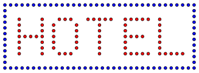
<!-- 7 -->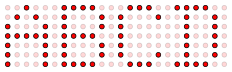
<!-- 234567 -->

<!-- 234567 -->**LED** = *Light Emitting Diode*
<!-- 234567 -->

<!-- 234567 -->

<!-- 234567 -->diode électroluminescente
<!-- 234567 -->

<!-- 34567 -->

<!-- 34567 -->**Enseignes** : assemblages de LED pour créer des motifs fixes
<!-- 34567 -->

<!-- 567 -->

<!-- 567 -->**Afficheurs** : assemblages de LED
<!-- 567 -->

<!-- 67 -->

<!-- 67 -->pour transmettre des informations variables
<!-- 67 -->

</section>

<section>
<!-- A -->
<h1 class="en_tete">MOOC collaboratif du RESCIF</h1>
<!-- 23 -->
<!-- 3 -->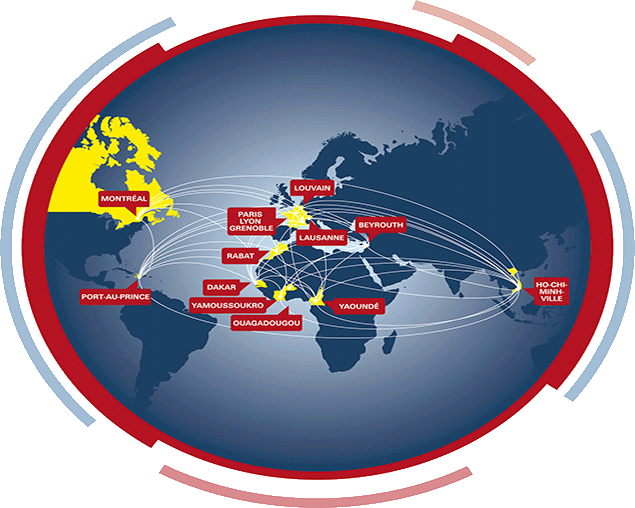
</section>

<section>
<!-- A -->
<h1 class="en_tete">Quatre enseignants</h1>

Pierre-Yves Rochat

Yves Tiecoura

Mamadou Lamine Ndiaye

Alain Tiédeu

</section>

<section>
<!-- A -->
<h1 class="en_tete">Plan du MOOC</h1>
<!-- 23 -->

<!-- 23 -->* 6 semaines
<!-- 3 -->* 6 vidéos d'environ 10 minutes
<!-- 23 -->

<!-- 4 -->
<!-- 5 -->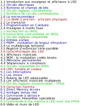
</section>

<section>
<!-- A -->
<h1 class="en_tete">Quatre filières</h1>
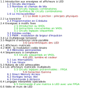
<!-- 2345 -->

<!-- 2354 -->* Enseignes et afficheurs à LED
<!-- 2345 -->

<!-- 345 -->

<!-- 354 -->* Microcontrôleurs
<!-- 345 -->

<!-- 45 -->

<!-- 45 -->* Systèmes logiques
<!-- 45 -->

<!-- 5 -->

<!-- 5 -->* Physique
<!-- 5 -->

</section>

<section>
<!-- A -->
<h1 class="en_tete">Cours orienté vers la pratique</h1>
</section>

<section>
<!-- A -->
<h1 class="en_tete">Expériences à distance</h1>
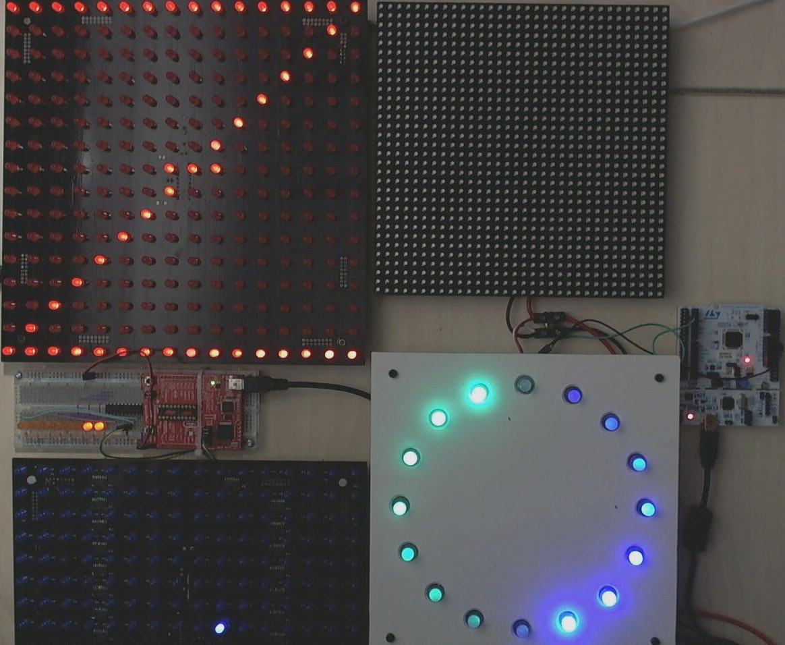

<!-- 234 -->* En libre service 24h/24
<!-- 34 -->* Votre programme s'exécute
<!-- 4 -->* Vous recevez une vidéo

</section>

<section>
<!-- A -->
<h1 class="en_tete">Forum</h1>
<!-- 2 -->
</section>

<section>
<!-- A -->
<h1 class="en_tete">Evaluations hebdomadaires</h1>
<!-- 23 -->

<!-- 23 -->* Une évalutation par semaine
<!-- 3 -->* Certificat auprès de Coursera
<!-- 23 -->

</section>

<section>
<!-- A -->
<h1 class="en_tete">Invitation à l'entrepreneuriat</h1>
<!-- 23 -->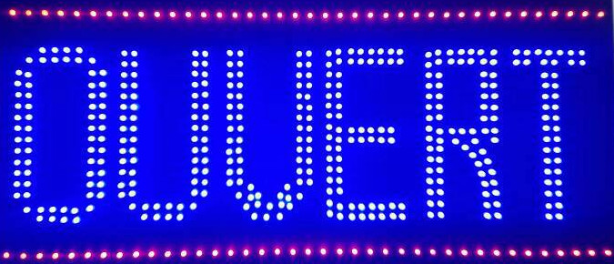
<!-- 3 -->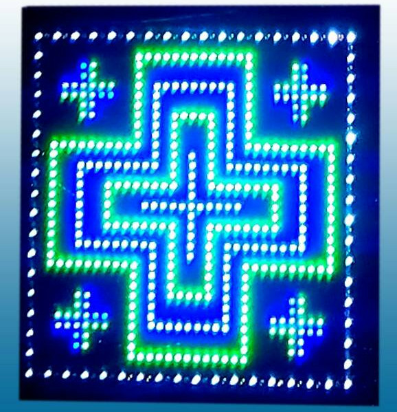
</section>

<section>
<!-- A -->
<h1 class="en_tete">Invitation à l'entrepreneuriat</h1>
<!-- 4 -->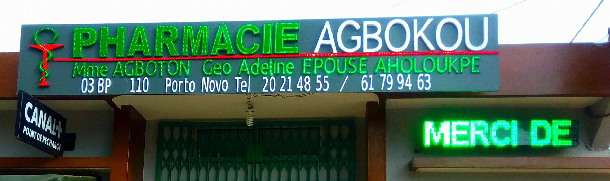
<!-- 234 -->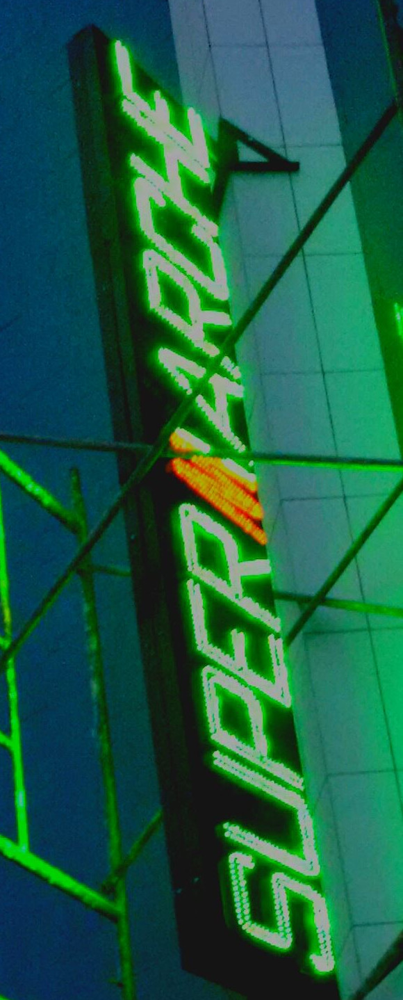
<!-- 34 -->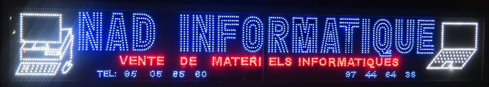
</section>

<section>
<!-- A -->
<h1 class="en_tete">Enseignes et afficheurs à LED</h1>
</section>

