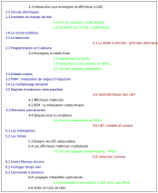
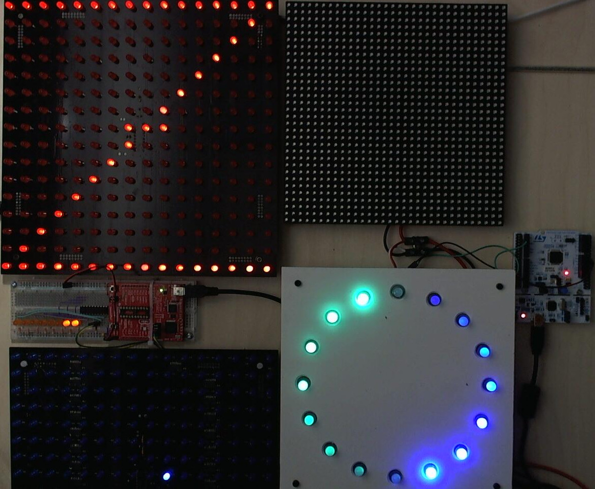

# MOOC Enseignes et afficheurs à LED

## Introduction ##

Une LED, c'est une diode électroluminescente, ou diode lumineuse, en anglais Light Emitting Diode, LED.

J’ai vu une LED pour la première fois de ma vie dans les années 1970, je m’en souviens, c’était lors d’une séance du club d’électronique de Lausanne, fondé par Jean-Daniel Nicoud. Vous le connaissez peut-être : nous avons créé ensemble en 2013 le MOOC Comprendre les microcontrôleurs. J’étais alors parmi les plus jeunes du club et nous avions rêvé alors de tapisser une paroi avec des LED pour remplacer les télévisions, à l’époque faites avec d'encombrants tubes cathodiques. Nos enseignants nous ont alors rappelés à la réalité... la technologie n'était pas encore mure. Il a fallu attendre quelques dizaines d'années, mais la réalité a maintenant dépassé tous nos rêves !

Aujourd’hui, les LED sont surtout devenues tellement peu coûteuses qu’on n’hésite pas à les utiliser dans presque toutes les applications où on a besoin de lumière. Les LED illuminent les nuits d’une bonne partie de l’humanité, depuis les lampes solaires des villages les plus reculés de l'Afrique jusqu’au murs et aux ponts lumineux des villes chinoises.

Le but de ce cours est de vous donner les bases permettant de comprendre et de réaliser des enseignes et des afficheurs à LED, depuis la petite enseigne OUVERT que vous pourrez vendre au boutiquier de votre quartier jusqu'aux murs de LED des salles de spectacles.

## L'équipe ##

Nous sommes quatre enseignants à vous présenter ce MOOC :

* Pierre-Yves Rochat, chargé de cours à l’EPFL, École Polytechnique Fédérale de Lausanne, en Suisse
* Yves Tiecoura, professeur à l'INP-HB, Institut National Polytechnique - Houphouët Boigny, à Yamoussoukro, en Côte d'Ivoire
* Mamadou Lamine Ndiaye, professeur à l'ESP, Ecole Supérieure Polytechnique, à Dakar, au Sénégal
* Alain Tiedeu, professeur à l'ENSPY, Ecole Nationale Supérieure Polytechnique de Yaoundé, au Cameroun

{ width=80% }

## Plan du cours ##

Chaque semaine, six vidéos de cours vous seront présentées. Voici un plan du cours, mettant en évidence des filières :

{ width=100% }

Le sujet principal du cours est bien les enseignes et afficheurs à LED. Quelques sujets sont spécifiques à ce domaine, notés en noir. Mais vous voyez en couleur trois groupes de leçons.

Noté en bleu, la filière les microcontrôleurs est essentielle pour comprendre et réaliser des enseignes et afficheurs à LED. Bien que nous ayons déjà publié un MOOC sur ce sujet, ces leçons résument ce qu'il faut savoir concernant les microcontrôleurs en lien avec les enseignes et afficheurs à LED. Ces leçons seront présentées par Pierre-Yves Rochat et Yves Tiecoura.

Noté en vert, la filière systèmes logiques va vous être très utile pour comprendre l'architecture des afficheurs matriciels. Elle inclut le langage VHDL, utilisé pour la description et le synthèse de circuits logiques même très complexes. Sa dernière leçon montrera comment les circuits logiques programmables de type FPGA prennent le relai lorsque le débit des microcontrôleurs ne suffit plus pour piloter de grandes matrices de LED. Ces leçons seront présentées par Mamadou Lamine Ndiaye.

Noté en rouge, la filière physique est plus informative. Mais n'est-il pas intéressant de comprendre un peu comment fonctionne une LED ? Les leçons sur la lumière vont aussi nous aider à utiliser au mieux les LED en fonction de la vision humaine. Ces leçons seront présentées par Alain Tiedeu.

Toutes ces leçons apparaissent un ordre progressif, les filières étant entremêlées. Les concepts enseignés dans une leçon trouveront leurs applications dans les leçons suivantes. Mais si vous être déjà familier avec certains domaines, vous pourrez vous concentrer sur les autres.

## Mise en pratique ##

Tout au long des 6 semaines de ce cours, nous vous proposerons de mettre en pratique ce qui sera enseigné. En partant d'un simple chenillard composé de huit LED, nous irons jusqu’au rubans de LED adressables et aux afficheurs matriciels multicolores.

Bien entendu, nous vous encourageons à vous procurer du matériel pour l'expérimentation. Mais nous vous proposons aussi des expériences à distance, particulièrement utiles à ceux qui n’auraient pas de se procurer le matériel nécessaire. Vous pourrez librement soumettre vos programmes et recevoir une vidéo montrant l'effet produit lors de leur exécution.

Voici quelques expériences que vous aurez à disposition :

{ width=80% }

## Forum ##

Un forum est à disposition de tous les participants. Nous vous invitions à le consulter et à poser vos questions lorsque ce sera nécessaire. C'est aussi un lieu pour faire connaissance les uns avec les autres. N'hésitez pas à y partager vos expériences et vos réalisations !

## Évaluations ##

Chaque semaine, une évaluation vous sera proposée, vous permettant de tester vos connaissances. Ceux qui auront réussi avec succès chacune de ces évaluations pourrons obtenir un certificat par Coursera.

Nous vous souhaitons un très bon cours ! Nous nous réjouissons de voir votre progression et de vous rencontrer dans le forum.

