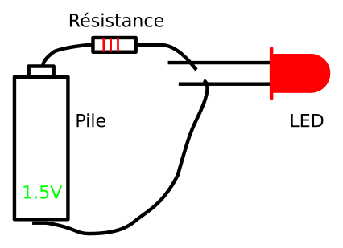

% Circuits électriques
% [Pierre-Yves Rochat](mailto:pyr@pyr.ch), EPFL
% rév 2016/05/11

## Électrons libres et courant électrique ##

On se souvient que la matière est composée d’**atomes**. Les atomes ont un noyau, composé de protons et de neutrons, ainsi qu’un nuage d’électrons, constitués en couches successives.

{ width=8cm }

Dans certains les matériaux, les électrons de la dernière couche sont capables de se déplacer d’un atome à l’autre. On parle d’**électrons libres**. Ce mouvement est généralement désordonné. Lors qu’il est ordonné, on parle de **courant électrique**.

Les électrons ayant une charge négative, ils se **déplacent** du *moins* vers le *plus*. Ils se déplacent lentement, de l’ordre de quelques centimètres par heure.

Le courant électrique se déplace conventionnellement du *plus* vers le *moins* : on a découvert le courant électrique avant de connaître l’existence des atomes et des électrons ! Le courant électrique se **propage** très rapidement, à une vitesse proche de la vitesse de la lumière, qui est de 300’000 km par seconde.

Les matériaux qui permettent ce phénomène du courant électrique sont appelés **conducteurs**. Il s’agit principalement des métaux, dont le cuivre et l’aluminium sont les plus couramment utilisés.

## Tension électrique ##

En présence d’une *force électromotrice*, appelée aussi **tension électrique**, un courant va se produire dans un conducteur. Par exemple, on trouve une tension entre les deux bornes d’une pile électrique. En établissant un **circuit électrique**, du courant va pouvoir circuler.

Nous verrons plus tard ce qu’est une LED (*Light-Emitting Diode*, diode électroluminescente ou diode lumineuse). En attendant, réalisons le montage ci-dessous. Le courant électrique produit par la pile va circuler à travers la résistance et la LED, qui va émettre alors de la lumière.

{ width=9cm }

Les électriciens et les électroniciens ont l’habitude de dessiner des **schémas** en utilisant des symboles. Ils ne ressemblent pas toujours à la forme des composants utilisés ! Voici le schéma correspondant au montage ci-dessus :

{ width=9cm }

## Unités électriques ##

La **tension électrique** s’exprime en **Volt**, noté V. Une pile ordinaire a une tension d’environ 1,5 V. Dans beaucoup de pays, la tension fournie dans les maisons est de 230 V. Elle est de 115 V aux USA. Notons qu’il ne s’agit pas d’une tension continue, mais d’une tension alternative, dont la fréquence est de 50 alternances par seconde (50 Hz, 60 Hz aux USA).

En dessus de 25 V, une tension électrique est **dangereuse** pour le corps humain. En effet, l’eau se trouvant le corps est légèrement conductrice, vu qu’elle n’est pas pure. Or le cœur est très sensible aux courants électriques qui le traverse.

Dans les enseignes et afficheurs à LED, la tension est généralement inférieure à 25 V, sauf bien entendu au niveau de l’alimentation électrique. Toutes les précautions doivent donc être prises dans ce cas.

La tension électrique se mesure toujours entre deux points. Souvent, un point est considéré comme un point de référence. Il s’appelle la **masse** (*ground*). On peut alors dire, par abus de langage, que la tension *en un point* à telle valeur : c’est en fait la tension entre ce point et la masse.

Comme la tension se mesure entre deux point, c’est facile de la mesurer sans modifier le circuit. L’appareil s’appelle un voltmètre. Les multi-mètres proposent toujours cette fonction.

Le **courant électrique** s’exprime en **Ampère**, noté A.

Le courant qui traverse une LED ne dépasse généralement pas 10 mA. Mais une enseigne composée de plusieurs milliers de LED peux nécessiter des courants importants de quelques dizaines d’Ampère.

Le choix du diamètre d’un fil électrique ne dépend pas de la tension, mais du courant qui le traverse. Il faudra donc dimensionner correctement les fils. Par exemple, un fils de cuivre de 1 mm² de section n’est pas suffisant pour un courant dépassant 16 A. Sur les circuits imprimés, le cuive a une épaisseur d'environ 35 microns. Il faut donc bien dimentionner la largeur des pistes en fonction du courant.

La mesure du courant nécessite de couper le circuit et d’y insérer l’appareil de mesure. C’est la raison pour laquelle la mesure directe du courant est beaucoup plus rare. On préférera une mesure indirecte.

## Résistance électrique ##

Dans le schéma ci-dessous, on voit un circuit électrique réalisé avec une source de tension et une **résistance**.

{ width=12cm }

Le courant électrique est le même en tout point de ce circuit : I~1~ = I~2~. Ce courant est d’autant plus grand que la résistance est petite : c’est la loi d’Ohm.

**I = U / R** , avec :

* U : la tension électrique, exprimée en Volt [V]
* I : le courant électrique, exprimé en Ampère [A]
* R : la résistance électrique, exprimée en Ohm [Ω]

Voici les deux autres expressions de la loi d’Ohm :

* **U = R × I**
* **R = U / I**

On utilisera très souvent cette loi, par exemple pour calculer les résistances qui sont presque toujours associées aux LED.

## Énergie et puissance ##

On comprend intuitivement qu’une pile contient de l’**énergie** électrique. Une certaine quantité de cette énergie va être transformée en chaleur dans la résistance. Notons que le rendement est alors de 100% ! La **puissance** est la quantité d’énergie par unité de temps :

**P = U × I** , avec P : la puissance, exprimée en Watt [W]

Dans notre premier montage avec la LED, une partie de l’énergie électrique est transformée en énergie lumineuse, le reste étant transformé en chaleur. Mais alors qu’une ampoule à incandescence a un rendement qui dépasse rarement 2%, une LED peut avoir un rendement qui approche les 30%.

## Montage en parallèle ##

Dans le schéma ci-dessous, deux résistances ont été montée *en parallèle*. La tension aux bornes de chaque résistance est la tension de la pile :

U = U~1~ = U~2~ = R~1~ × I~1~ = R~2~ × I~2~

Quel est alors la valeur du courant I ? On admet facilement que les électrons ne peuvent pas *sortir* du fils. C'est la loi des noeuds de Kirchhoff, qui dit que la somme des intensités des courants qui entrent par un nœud est égale à la somme des intensités des courants qui sortent du même nœud.

On a donc I = I~1~ + I~2~

I~1~ et I~2~ peuvent être calculés par la loi d'Ohm.

Dans un montage en parallèle, on peut donc dire que les courants s'ajoutent.

{ width=10cm }

## Montage en série ##

Dans le schéma ci-dessous, deux résistances ont été montée *en série* : le courant passe par R~1~, puis par R~2~.

{ width=12cm }

Le courant à travers les deux résistances est le même. I~1~ = I~2~ = I. On peut calculer la tension aux bornes de chaque résistance :

U~1~ = R~1~ × I~1~ et U~2~ = R~2~ × I~2~

Or la loi des mailles de Krichhoff dit que dans une maille quelconque d'un réseau, la somme algébrique des différences de potentiel le long de la maille est nulle.

On a donc U~1~ + U~2~ = 5 V

La résolution de ces équations donne I~1~ = I~2~ = 5 V / (R~1~ + R~2~) = 1 mA

Dans un montage en série, on peut donc dire que les tensions s'ajoutent.

