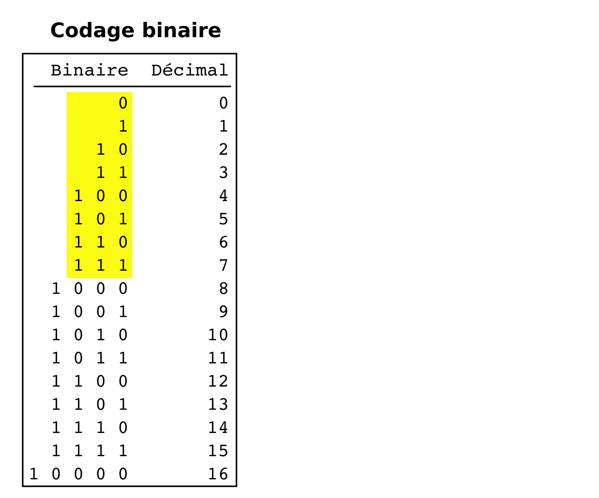
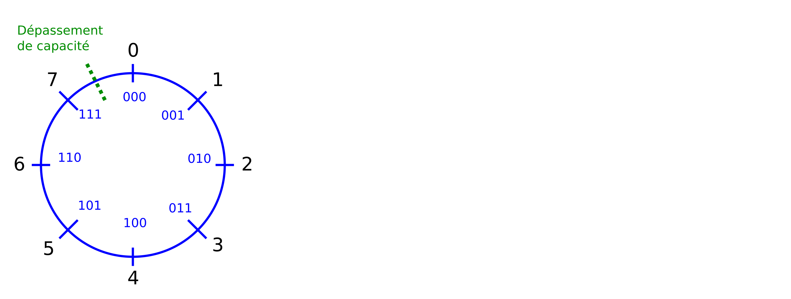
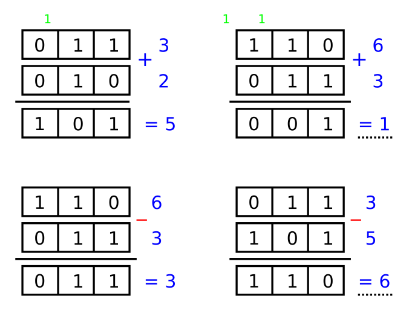
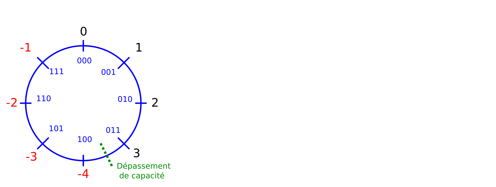
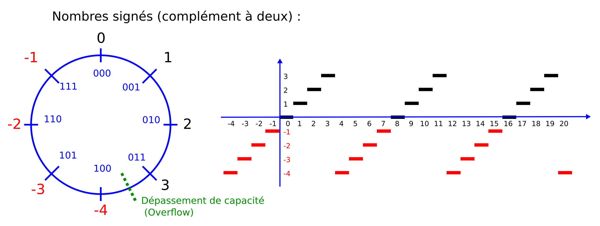
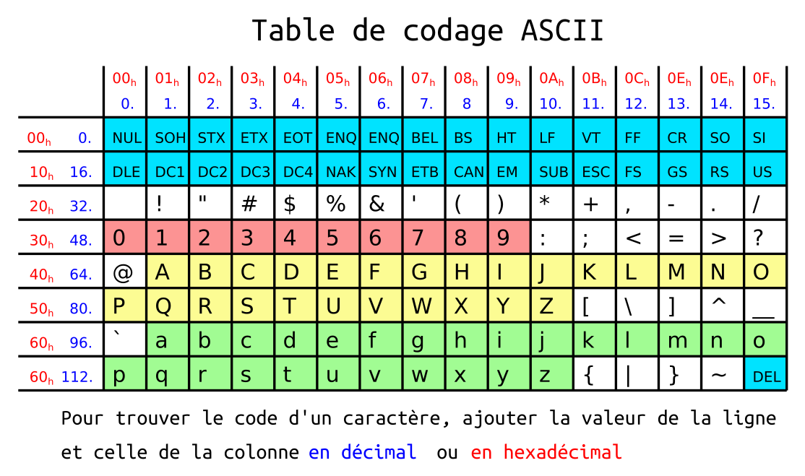

<!-- DIAPORAMA -->
<!-- version originale : 29'989 octets -->
<!-- version 2015/12/25 avec Pre-DIA : 9'331 octets -->

<!-- Page de titre -->
<section class="page_de_garde">

Enseignes et afficheurs à LED

Nombres et champs de bits

Dr. Yves Tiecoura

</section>

<!-- Page bienvenue plein écran-->
<section>
<!-- def A -->
<!-- def A -->
<!-- def A -->

<!-- def A -->**Enseignes et afficheurs à LED** | Nombres et champs de bits
<!-- def A -->

<!-- A -->
<h1 class="en_tete">Nombres et champs de bits</h1>

Dr. Yves Tiecoura

</section>

<!-- Page bienvenue, demi-->
<section>
<!-- A -->
<h1 class="en_tete">Nombres et champs de bits</h1>

* Symboles binaires
* Numération binaire
* Arithmétique modulaire
* Nombres signés
* Types en C
* Hexadécimal
* Codage des caractères 

</section>

<!-- Page BITS -->
<section>
<!-- A -->
<h1 class="en_tete">Nombres et champs de bits</h1>

<!-- 12345 -->* LED éteinte ou allumée
<!-- 2345 -->* Faux ou Vrai
<!-- 345 -->* 0 ou 1
<!-- 45 -->* 0 V ou + 5 V 

<!-- 5 -->

<!-- 5 -->* Ex :  1 0 0 1 0 0 1 0 
<!-- 5 -->

</section>

<!-- Page Numération, 2 images ++ -->
<section>
<h1 class="en_tete">Numération binaire</h1>
<!-- A -->
<!-- 1 -->
<!-- 23 -->
<!-- 3 -->

<!-- 3 -->2 1 6 6 4 1 2 8 1 0 2 4 _____ 1 0 0 1 1 0 1 0 0 1 0 b = 1 2 3 4
<!-- 3 -->

</section>

<!-- Page demi, modulaire -->
<section>
<!-- A -->
<h1 class="en_tete">Nombres de taille limitée</h1>

<!-- 123 -->* Les mathématiciens travaillent avec des nombre arbitrairement grands.  
<!-- 23 -->* Les circuits électroniques ont toujours une taille limitée !  
<!-- 3 -->* Quelle sont les contraintes liées à cette limite de taille ?
</section>

<!-- Page modulaires, x images ++ -->
<section>
<!-- A -->
<h1 class="en_tete">Nombres entiers modulaires</h1>

<!-- 2345 -->

<!-- 2345 -->&nbsp;&nbsp;&nbsp;&nbsp;Table de l'addition : 
<!-- 2345 -->&nbsp;&nbsp;&nbsp;&nbsp;0 + 0 = 0, retenue 0 
<!-- 2345 -->&nbsp;&nbsp;&nbsp;&nbsp;0 + 1 = 1, retenue 0 
<!-- 2345 -->&nbsp;&nbsp;&nbsp;&nbsp;1 + 0 = 1, retenue 0 
<!-- 2345 -->&nbsp;&nbsp;&nbsp;&nbsp;1 + 1 = 0, retenue 1
<!-- 2345 -->

<!-- 3 -->
<!-- 45 -->
<!-- 5 -->

<!-- 5 --> Dépassement de capacité
<!-- 5 -->

</section>

<!-- Page roue pos -->
<section>
<!-- A -->
<h1 class="en_tete">Nombres entiers modulaires</h1>

<!-- 2 -->

</section>

<section>
<!-- A -->
<h1 class="en_tete">Nombres entiers modulaires</h1>

<!-- 2 -->

</section>

<!-- Page taille limitée, demi -->
<section>
<!-- A -->
<h1 class="en_tete">Nombres de taille limitée</h1>

* Peut-on représenter des nombres négatifs ?

</section>

<!-- Page roue pos-neg -->
<section>
<!-- A -->
<h1 class="en_tete">Nombres entiers modulaires</h1>

</section>

<!-- Page roue pos-neg -->
<section>
<!-- A -->
<h1 class="en_tete">Nombres entiers modulaires</h1>

</section>

<section>
<!-- A -->
<h1 class="en_tete">Nombres entiers modulaires</h1>

<!-- 2 -->
</section>

<!-- Page C -->
<section>
<!-- A -->
<h1 class="en_tete">Types en C</h1>

*Type :*  
char  : 
signed char  : 
unsigned char : 
int : 
signed int : 
unsigned int : 
long int : 
signed long int : 
unsigned long int :

  
nombre de 8 bits (signé ou non, selon les réglages du compilateur) 
nombre de 8 bits signé 
nombre de 8 bits positif 
nombre généralement de 16 bits (signé ou non) 
nombre de 16 bits signé 
nombre de 16 bits positif 
nombre généralement de 32 bits (signé ou non) 
nombre de 32 bits signé 
nombre de 32 bits positif

</section>

<section>
<!-- A -->
<h1 class="en_tete">Types en C, version C99</h1>

*Type :*  
uint8_t  : 
int8_t  : 
uint16_t : 
int16_t : 
uint32_t : 
int32_t :

  
nombre de 8 bits positifs 
nombre de 8 bits signé 
nombre de 16 bits positif 
nombre de 16 bits signé 
nombre de 32 bits positif 
nombre de 32 bits signé

*Magnitude :*  
0 … 255 
-128 … +127 
0 … 65'635 
-32'768 … +32'767 
0 … 4'294'967'295 
-2'147'483'648 … +2'147'483'647 

</section>

<!-- Page hexa, demi -->
<section>
<!-- A -->
<h1 class="en_tete">Hexadécimal</h1>

* Le binaire est parfait pour les machines
<!-- 23 -->* …mais malcommode pour les humains !
<!-- 3 -->* L'hexadécimal est plus pratique.

</section>

<!-- Page hexa exemple -->
<section>
<!-- A -->
<h1 class="en_tete">Nombres entiers modulaires</h1>

Le nombre décimal 23456 :

<!-- 2345 -->
<!-- 12 -->
<!-- 3 -->
<!-- 45 -->
<!-- 5 -->

<!-- 5 -->Notation du langage C :  **0x5BA0**
<!-- 5 -->

</section>

<!-- Page ASCII -->
<section>
<!-- A -->
<h1 class="en_tete">Codage des caractères</h1>

</section>

<!-- Page conclusion, demi-->
<section>
<!-- A -->
<h1 class="en_tete">Nombres et champs de bits</h1>

* Symboles binaires
* Numération binaire
* Arithmétique modulaire
* Nombres signés
* Types en C
* Hexadécimal
* Codage des caractères 

</section>

 

 
