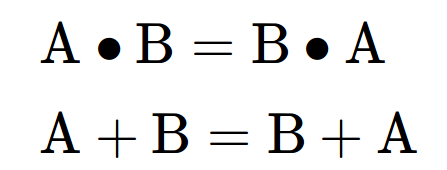
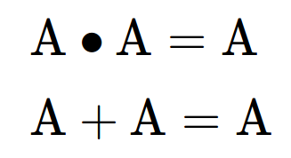
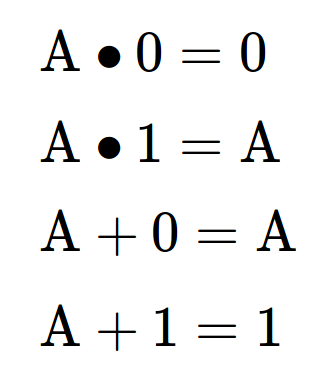
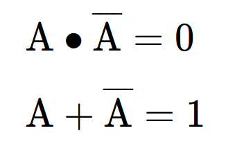
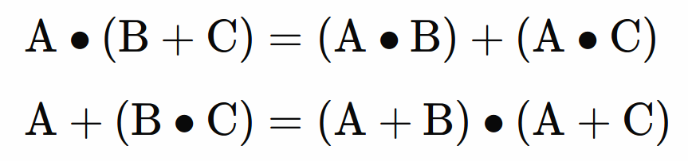
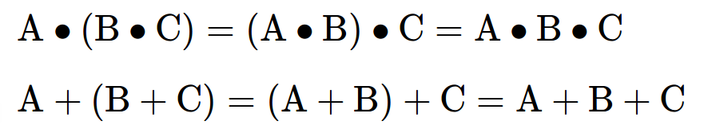

<!-- DIAPORAMA -->

<!-- Page de titre -->
<section class="page_de_garde">

<!-- Contenu : -->

Enseignes et afficheurs à LED

Circuits logiques combinatoires

Dr. Mamadou Lamine Ndiaye

</section>

<!-- Page bienvenue plein écran-->
<section>
<!-- I -->
<h1 class="en_tete">Circuits logiques combinatoires</h1>
<!-- def A -->
<!-- def A -->
<!-- def A -->

<!-- def A -->**Enseignes et afficheurs à LED** | Circuits logiques combinatoires
<!-- def A -->

<!-- A -->
<!-- Contenu : -->

Dr. Mamadou Lamine Ndiaye

</section>

<!-- Page bienvenue demi-->
<section>
<!-- A -->
<h1 class="en_tete">Circuits logiques combinatoires</h1>

* Éléments de base des systèmes logiques

* Algèbre de BOOLE
* Portes logiques

* Expression mathématique d’une fonction logique

* Propriétés de l’Algèbre de BOOLE

</section>

<!-- Page sys-log, 2 arriveée -->
<section>
<!-- A -->
<h1 class="en_tete">Éléments de base des systèmes logiques</h1>

Codage des informations dans les circuits numériques :

* 2 niveaux de tension
* 2 états logiques
* système binaire : **0** et **1**

<!-- 2 -->

<!-- 2 -->*Exemple en technologie TTL :*
<!-- 2 -->
<!-- 2 -->* 0 correspond à une tension entre 0 et 0,8 V
<!-- 2 -->* 1 correspond à une tension entre 2,4 et 5 V
<!-- 2 -->

</section>

<!-- Page Boole, 2 arriveée -->
<section>
<!-- A -->
<h1 class="en_tete">Algèbre de BOOLE</h1>

* Outil mathématique pour représenter les systèmes logiques
* Conçue autour d'**opérateurs logiques** de base:

<!-- 2 -->

<!-- 2 -->* Le **NON** logique *(complément logique)*
<!-- 2 -->* Le **OU** logique *(addition logique)*
<!-- 2 -->* Le **ET** logique *(multiplication logique)*
<!-- 2 -->

</section>

<!-- Page porte NON-->
<section>
<!-- A -->
<h1 class="en_tete">Porte NON</h1>

</section>

<!-- Page porte OU-->
<section>
<!-- A -->
<h1 class="en_tete">Porte OU</h1>

</section>

<!-- Page porte ET-->
<section>
<!-- A -->
<h1 class="en_tete">Porte ET</h1>

</section>

<!-- Page porte NAND-->
<section>
<!-- A -->
<h1 class="en_tete">Porte NAND</h1>

</section>

<!-- Page porte NOR-->
<section>
<!-- A -->
<h1 class="en_tete">Porte NOR</h1>

</section>

<!-- Page porte XOR-->
<section>
<!-- A -->
<h1 class="en_tete">Porte OU-exclusif</h1>

</section>

<!-- Page schéma XOR-->
<section>
<!-- A -->
<h1 class="en_tete">Porte OU-exclusif</h1>

</section>

<!-- Page fonction logique -->
<section>
<!-- A -->
<h1 class="en_tete">Expression mathématique d’une fonction logique</h1>

</section>

<!-- Page vide, pour éventuelle plein écran-->
<section>
<!-- A -->
<!-- I -->
<h1 class="en_tete">Expression mathématique d’une fonction logique</h1>
</section>

<!-- Page table vérité, 4 arrivée -->
<section>
<!-- A -->
<!-- I -->
<h1 class="en_tete">Expression mathématique d’une fonction logique</h1>

</section>
<section>
<!-- A -->
<!-- I -->
<h1 class="en_tete">Expression mathématique d’une fonction logique</h1>

</section>
<section>
<!-- A -->
<!-- I -->
<h1 class="en_tete">Expression mathématique d’une fonction logique</h1>

</section>
<section>
<!-- A -->
<h1 class="en_tete">Expression mathématique d’une fonction logique</h1>

</section>

<!-- Page vide, pour éventuelle plein écran-->
<section>
<!-- A -->
<!-- I -->
<h1 class="en_tete">Propriété de l'algèbre de Boole</h1>
</section>

<!-- Page propriétés 1, 4 entrées-->
<section>
<!-- A -->
<h1 class="en_tete">Propriété de l'algèbre de Boole</h1>

* Commutativité

<!-- 234 -->

<!-- 234 -->* Idempotence
<!-- 234 -->

<!-- 234 -->
<!-- 34 -->

<!-- 34 -->* Constantes
<!-- 34 -->

<!-- 34 -->
<!-- 4 -->

<!-- 4 -->* Complémentation
<!-- 4 -->

<!-- 4 -->
</section>

<!-- Page propriétés 2, 3 entrées-->
<section>
<!-- A -->
<h1 class="en_tete">Propriété de l'algèbre de Boole</h1>

* Distributivité

<!-- 23 -->

<!-- 23 -->* Associativité
<!-- 23 -->

<!-- 23 -->
<!-- 3 -->

<!-- 3 -->* De Morgan
<!-- 3 -->

<!-- 3 -->
</section>

<!-- Page conclusion demi-->
<section>
<!-- A -->
<h1 class="en_tete">Circuits logiques combinatoires</h1>

* Éléments de base des systèmes logiques

* Algèbre de BOOLE
* Portes logiques

* Expression mathématique d’une fonction logique

* Propriétés de l’Algèbre de BOOLE

</section>

