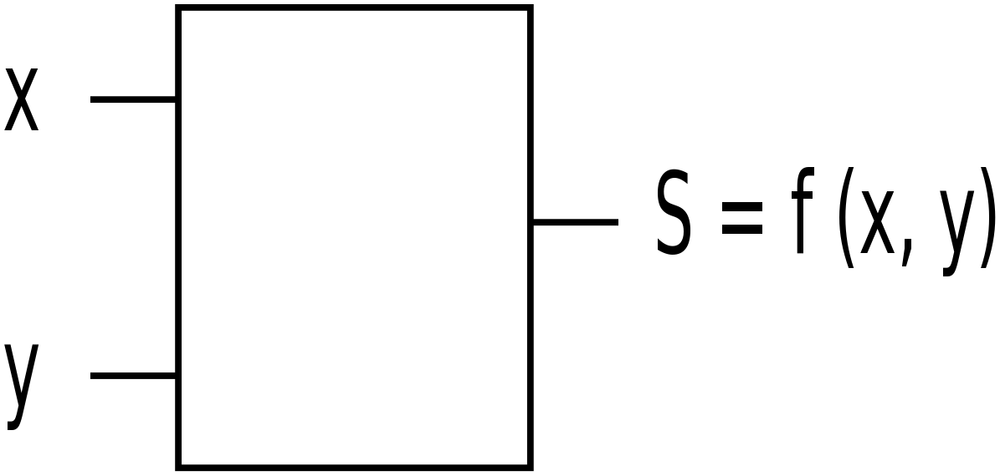
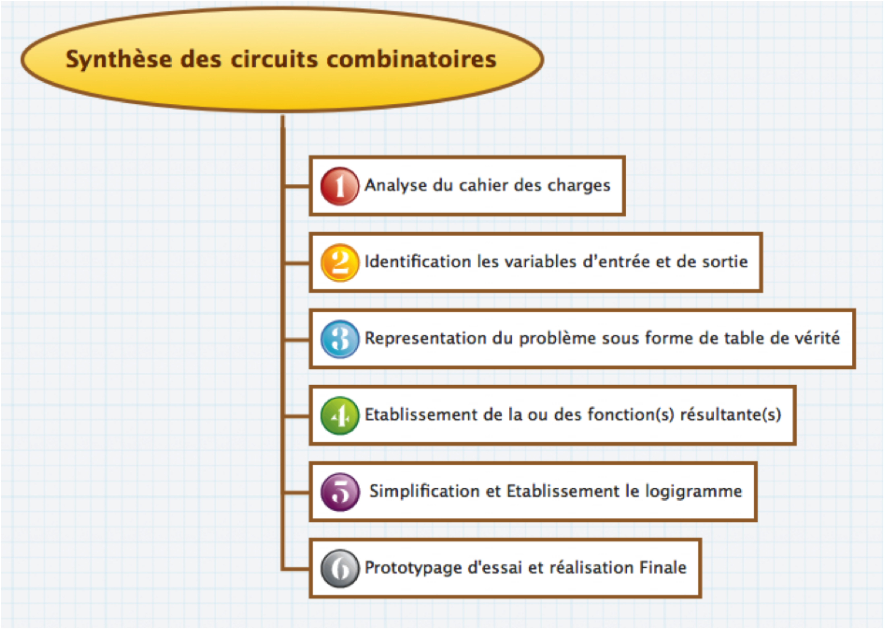
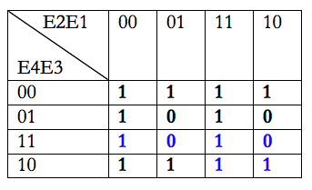
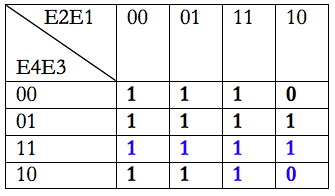
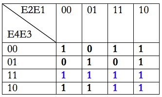
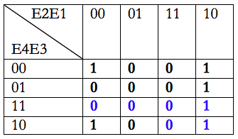
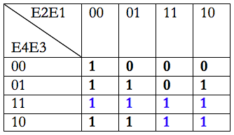
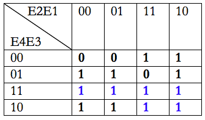

<!-- DIAPORAMA -->

<!-- Page de titre -->
<section class="page_de_garde">

<!-- Contenu : -->

Enseignes et afficheurs à LED

Synthèse de circuits combinatoires

Docteur Mamadou Lamine Ndiaye

</section>

<!-- Page bienvenue plein écran-->
<section>
<h1 class="en_tete">Synthèse de circuits combinatoires</h1>

**Enseignes et afficheurs à LED** | Synthèse de circuits combinatoires

<!-- Contenu : -->

Mamadou Lamine Ndiaye

</section>

<!-- Page bienvenue demi-->
<section>
<h1 class="en_tete">Synthèse de circuits combinatoires</h1>

**Enseignes et afficheurs à LED** | Synthèse de circuits combinatoires

<!-- Contenu : -->

* Simplification des fonctions logiques
* Simplification Algébrique
* Simplification par Tableau de KARNAUGH
* Diagramme temporel
* Exemple : décodeur 7 segments

</section>

<!-- Page Système combinatoire -->
<section>
<h1 class="en_tete">Système combinatoire</h1>

**Enseignes et afficheurs à LED** | Synthèse de circuits combinatoires

<!-- Contenu : -->

</section>

<!-- Page Méthodologie -->
<section>
<h1 class="en_tete">Méthodologie de synthèse</h1>

**Enseignes et afficheurs à LED** | Synthèse de circuits combinatoires

<!-- Contenu : -->

</section>

<!-- Page Simplification, 4 entrées -->
<section>
<h1 class="en_tete">Simplification des fonctions logiques</h1>

**Enseignes et afficheurs à LED** | Synthèse de circuits combinatoires

<!-- Contenu : -->

**Simplification algébrique**

</section>

<section>
<h1 class="en_tete">Simplification des fonctions logiques</h1>

**Enseignes et afficheurs à LED** | Synthèse de circuits combinatoires

<!-- Contenu : -->

**Simplification algébrique**

* Regroupement des termes ayant des variables communes et mises en facteur

</section>

<section>
<h1 class="en_tete">Simplification des fonctions logiques</h1>

**Enseignes et afficheurs à LED** | Synthèse de circuits combinatoires

<!-- Contenu : -->

**Simplification algébrique**

* Regroupement des termes ayant des variables communes et mises en facteur
* Réplication de termes existants

</section>

<section>
<h1 class="en_tete">Simplification des fonctions logiques</h1>

**Enseignes et afficheurs à LED** | Synthèse de circuits combinatoires

<!-- Contenu : -->

**Simplification algébrique**

* Regroupement des termes ayant des variables communes et mises en facteur
* Réplication de termes existants
* Suppression de termes superflus

</section>

<!-- Page Simplification, 2 images -->
<section>
<h1 class="en_tete">Simplification des fonctions logiques</h1>

**Enseignes et afficheurs à LED** | Synthèse de circuits combinatoires

<!-- Contenu : -->

</section>

<section>
<h1 class="en_tete">Simplification des fonctions logiques</h1>

**Enseignes et afficheurs à LED** | Synthèse de circuits combinatoires

<!-- Contenu : -->

</section>

<!-- Page KARNAUGH,  -->
<section>
<h1 class="en_tete">Simplification par Tableau de KARNAUGH</h1>

**Enseignes et afficheurs à LED** | Synthèse de circuits combinatoires

<!-- Contenu : -->

* Forme particulière de la table de vérité

</section>

<section>
<h1 class="en_tete">Simplification par Tableau de KARNAUGH</h1>

**Enseignes et afficheurs à LED** | Synthèse de circuits combinatoires

<!-- Contenu : -->

* Forme particulière de la table de vérité
* Recherche de groupements 

</section>
<section>
<h1 class="en_tete">Simplification par Tableau de KARNAUGH</h1>

**Enseignes et afficheurs à LED** | Synthèse de circuits combinatoires

<!-- Contenu : -->

* Forme particulière de la table de vérité
* Recherche de groupements 

* regrouper les cases adjacentes successivement contenant des 1
* la taille d’un groupe est une puissance de 2^k^ (8,4,2,1...)
* on cherche toujours le groupement maximal

</section>

<section>
<h1 class="en_tete">Simplification par Tableau de KARNAUGH</h1>

**Enseignes et afficheurs à LED** | Synthèse de circuits combinatoires

<!-- Contenu : -->

* Forme particulière de la table de vérité
* Recherche de groupements 

* regrouper les cases adjacentes successivement contenant des 1
* la taille d’un groupe est une puissance de 2^k^ (8,4,2,1...)
* on cherche toujours le groupement maximal
* le résultat d’un groupement est le produit des variables constantes
* le résultat final est la somme des résultats des groupements
* une même case peut appartenir à deux groupements différents

</section>

<!-- Page KARNAUGH schéma,  -->
<section>
<h1 class="en_tete">Simplification par Tableau de KARNAUGH</h1>

**Enseignes et afficheurs à LED** | Synthèse de circuits combinatoires

<!-- Contenu : -->

* Somme des produits

</section>

<section>
<h1 class="en_tete">Simplification par Tableau de KARNAUGH</h1>

**Enseignes et afficheurs à LED** | Synthèse de circuits combinatoires

<!-- Contenu : -->

* Produit des sommes

</section>

<section>
<h1 class="en_tete">Simplification par Tableau de KARNAUGH</h1>

**Enseignes et afficheurs à LED** | Synthèse de circuits combinatoires

<!-- Contenu : -->

* Somme des produits

* Produit des sommes

</section>

<!-- Page Diagramme temporel  -->
<section>
<h1 class="en_tete">Diagramme temporel</h1>

**Enseignes et afficheurs à LED** | Synthèse de circuits combinatoires

<!-- Contenu : -->

</section>

<!-- Page Diagramme temporel  -->
<section>
<h1 class="en_tete">Diagramme temporel</h1>

**Enseignes et afficheurs à LED** | Synthèse de circuits combinatoires

<!-- Contenu : -->

</section>

<!-- Page 7 segments 1  -->
<section>
<h1 class="en_tete">Décodeur 7 segments</h1>

**Enseignes et afficheurs à LED** | Synthèse de circuits combinatoires

<!-- Contenu : -->

</section>

<!-- Page 7 segments 2  -->
<section>
<h1 class="en_tete">Décodeur 7 segments</h1>

**Enseignes et afficheurs à LED** | Synthèse de circuits combinatoires

<!-- Contenu : -->

</section>

<!-- Page 7 segments 3  -->
<section>
<h1 class="en_tete">Décodeur 7 segments</h1>

**Enseignes et afficheurs à LED** | Synthèse de circuits combinatoires

<!-- Contenu : -->

</section>

<!-- Page 7 segments 4  -->
<section>
<h1 class="en_tete">Décodeur 7 segments</h1>

**Enseignes et afficheurs à LED** | Synthèse de circuits combinatoires

<!-- Contenu : -->

</section>

<!-- Page Sx  -->
<section>
<h1 class="en_tete">Décodeur 7 segments</h1>

**Enseignes et afficheurs à LED** | Synthèse de circuits combinatoires

<!-- Contenu : -->

</section>

<!-- Page Sx  -->
<section>
<h1 class="en_tete">Décodeur 7 segments</h1>

**Enseignes et afficheurs à LED** | Synthèse de circuits combinatoires

<!-- Contenu : -->

</section>
<!-- Page Sx  -->
<section>
<h1 class="en_tete">Décodeur 7 segments</h1>

**Enseignes et afficheurs à LED** | Synthèse de circuits combinatoires

<!-- Contenu : -->

</section>
<!-- Page Sx  -->
<section>
<h1 class="en_tete">Décodeur 7 segments</h1>

**Enseignes et afficheurs à LED** | Synthèse de circuits combinatoires

<!-- Contenu : -->

</section>
<!-- Page Sx  -->
<section>
<h1 class="en_tete">Décodeur 7 segments</h1>

**Enseignes et afficheurs à LED** | Synthèse de circuits combinatoires

<!-- Contenu : -->

</section>
<!-- Page Sx  -->
<section>
<h1 class="en_tete">Décodeur 7 segments</h1>

**Enseignes et afficheurs à LED** | Synthèse de circuits combinatoires

<!-- Contenu : -->

>
</section>
<!-- Page Sx  -->
<section>
<h1 class="en_tete">Décodeur 7 segments</h1>

**Enseignes et afficheurs à LED** | Synthèse de circuits combinatoires

<!-- Contenu : -->

</section>
<!-- Page Sx  -->
<section>
<h1 class="en_tete">Décodeur 7 segments</h1>

**Enseignes et afficheurs à LED** | Synthèse de circuits combinatoires

<!-- Contenu : -->

</section>

<!-- Page conclusion demi-->
<section>
<h1 class="en_tete">Synthèse de circuits combinatoires</h1>

**Enseignes et afficheurs à LED** | Synthèse de circuits combinatoires

<!-- Contenu : -->

* Simplification des fonctions logiques
* Simplification Algébrique
* Simplification par Tableau de KARNAUGH
* Diagramme temporel
* Exemple : décodeur 7 segments

</section>

 

 
