<!-- DIAPORAMA -->

<!-- Page de titre -->
<section class="page_de_garde">

<!-- Contenu : -->

Enseignes et afficheurs à LED

Synthèse de circuits combinatoires

Dr. Mamadou Lamine Ndiaye

</section>

<!-- Page bienvenue plein écran-->
<section>
<!-- I -->
<h1 class="en_tete">Synthèse de circuits combinatoires</h1>
<!-- def A -->
<!-- def A -->
<!-- def A -->

<!-- def A -->**Enseignes et afficheurs à LED** | Synthèse de circuits combinatoires
<!-- def A -->

<!-- A -->
<!-- Contenu : -->

Dr. Mamadou Lamine Ndiaye

</section>

<!-- Page bienvenue demi-->
<section>
<!-- A -->
<h1 class="en_tete">Synthèse de circuits combinatoires</h1>

* Simplification des fonctions logiques :

* Simplification algébrique
* Simplification par tableau de KARNAUGH

* Diagramme temporel
* Synthèse d'un décodeur 7 segments

</section>

<!-- Page Système combinatoire -->

<section>
<!-- A -->
<h1 class="en_tete">Système combinatoire</h1>

</section>

<!-- Page Méthodologie -->
<section>
<!-- A -->
<h1 class="en_tete">Méthodologie de synthèse</h1>

* Analyse du cahier des charges
<!-- 23456 -->* Identification des variables d’entrées et de sorties
<!-- 3456 -->* Représentation du problème sous forme de table de vérité
<!-- 456 -->* Établissement de la ou des fonctions résultantes
<!-- 56 -->* Simplification et établissement de logigramme
<!-- 6 -->* Prototypage d’essai et réalisation finale

</section>

<!-- Page Simplification, 4 entrées -->
<section>
<!-- A -->
<h1 class="en_tete">Simplification des fonctions logiques</h1>
</section>

<section>
<!-- A -->
<h1 class="en_tete">Simplification des fonctions logiques</h1>

**Simplification algébrique**

* Regroupement des termes ayant des variables communes et mises en facteur
<!-- 23 -->* Réplication de termes existants
<!-- 3 -->* Suppression de termes superflus

</section>

<!-- Page Simplification, 2 images -->
<section>
<!-- A -->
<h1 class="en_tete">Simplification algébrique</h1>
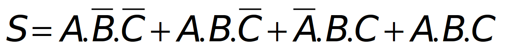
<!-- 2 -->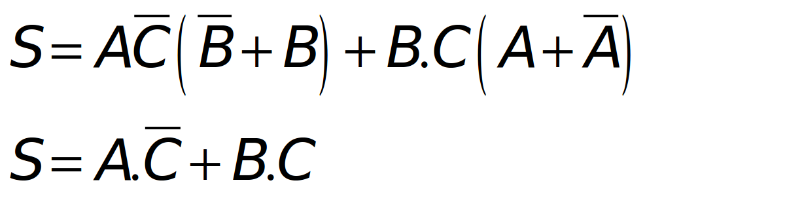
</section>

<!-- Page KARNAUGH,  8 entrées -->
<section>
<!-- A -->
<h1 class="en_tete">Simplification par Tableau de KARNAUGH</h1>

* Forme particulière de la table de vérité

<!-- 2345678 -->

<!-- 2345678 -->* Recherche de groupements :
<!-- 2345678 -->

<!-- 345678 -->

<!-- 345678 -->* regrouper les cases adjacentes successivement contenant des 1
<!-- 45678 -->* la taille d’un groupe est une puissance de 2 : (1, 2, 4, 8, ...)
<!-- 5678 -->* on cherche toujours le groupement maximal
<!-- 678 -->* le résultat d’un groupement est le produit des variables constantes
<!-- 78 -->* le résultat final est la somme des résultats des groupements
<!-- 8 -->* une même case peut appartenir à deux groupements différents
<!-- 345678 -->

</section>

<!-- Page KARNAUGH sp,  3 entrées -->
<section>
<!-- A -->
<h1 class="en_tete">Simplification par Tableau de KARNAUGH</h1>

* Somme des produits

<!-- 23 -->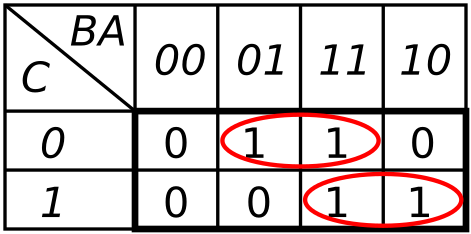
<!-- 23 -->
<!-- 3 -->
</section>

<!-- Page KARNAUGH sp,  3 entrées -->
<section>
<!-- A -->
<h1 class="en_tete">Simplification par Tableau de KARNAUGH</h1>

* Produit des sommes

<!-- 23 -->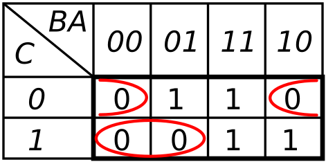
<!-- 23 -->
<!-- 3 -->
</section>

<!-- Page KARNAUGH sp + ps  -->
<section>
<!-- A -->
<h1 class="en_tete">Simplification par Tableau de KARNAUGH</h1>

* Somme des produits

* Produit des sommes

</section>

<!-- Page Diagramme temporel, 2 images  -->
<section>
<!-- A -->
<h1 class="en_tete">Diagramme temporel</h1>

<!-- 2 -->
</section>

<!-- Page 7 segments vide  -->
<section>
<!-- A -->
<h1 class="en_tete">Synthèse d'un  décodeur 7 segments</h1>
</section>

<!-- Page 7 segments 1  -->
<section>
<!-- A -->
<h1 class="en_tete">Synthèse d'un  décodeur 7 segments</h1>

</section>

<!-- Page 7 segments 1  -->
<section>
<!-- A -->
<h1 class="en_tete">Synthèse d'un  décodeur 7 segments</h1>

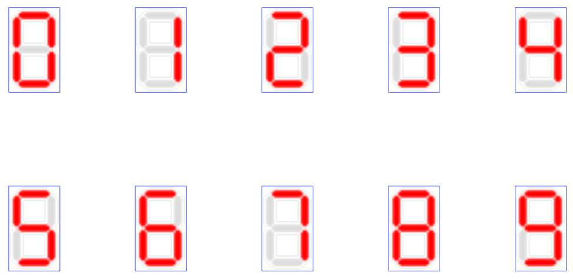
</section>

<!-- Page formules  -->
<section>
<!-- A -->
<h1 class="en_tete">Synthèse d'un décodeur 7 segments</h1>

<!-- 2 -->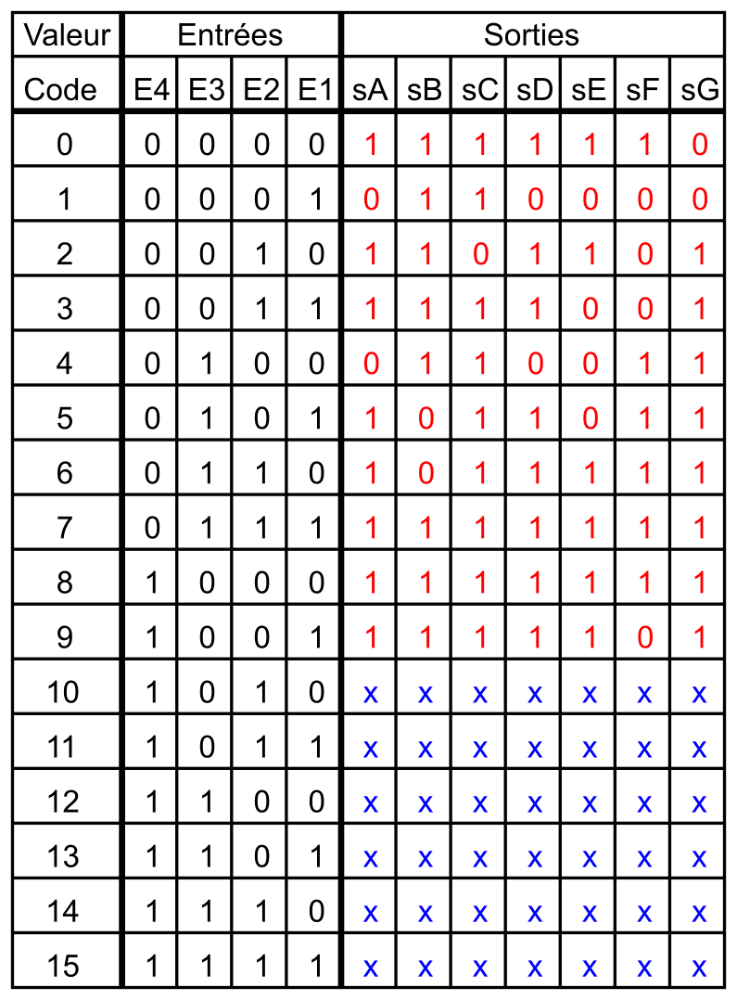
</section>

<!-- Page 7 segments ABCD  -->
<section>
<!-- A -->
<h1 class="en_tete">Synthèse d'un  décodeur 7 segmentss</h1>

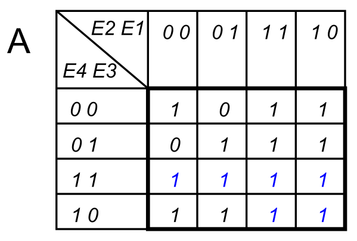
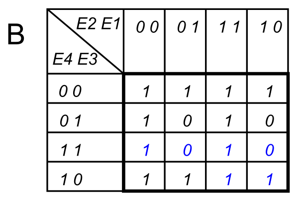
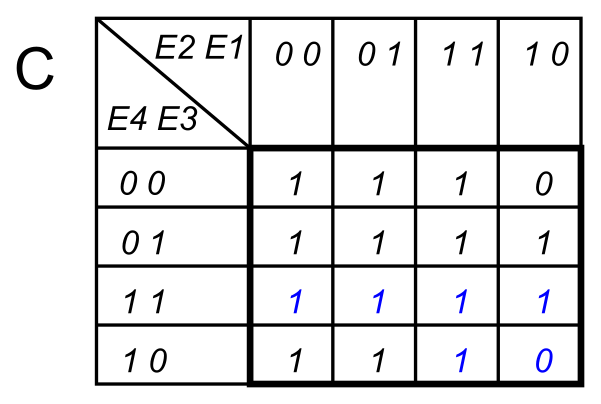

</section>

<!-- Page 7 segments EFG  -->
<section>
<!-- A -->
<h1 class="en_tete">Synthèse d'un décodeur 7 segments</h1>

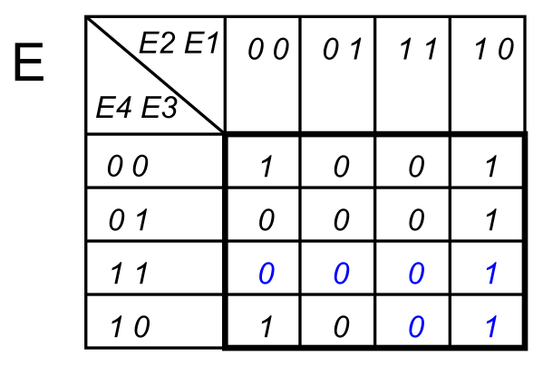
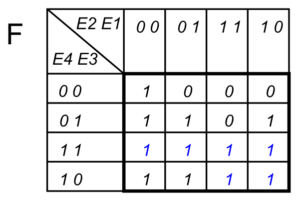
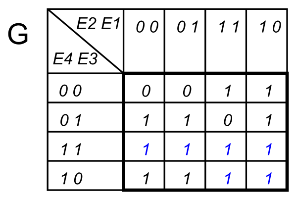
</section>

<!-- Page Sa  -->
<section>
<!-- A -->
<h1 class="en_tete">Synthèse d'un décodeur 7 segments</h1>

<!-- 23 -->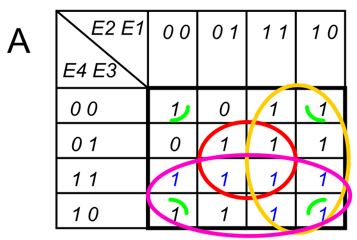
<!-- 3 -->
</section>

<!-- Page formules  -->
<section>
<!-- A -->
<h1 class="en_tete">Synthèse d'un décodeur 7 segments</h1>

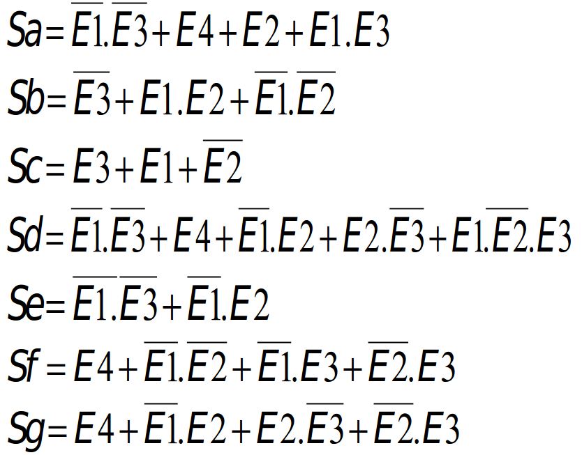
</section>

<!-- Page conclusion demi-->
<section>
<!-- A -->
<h1 class="en_tete">Synthèse de circuits combinatoires</h1>

* Simplification des fonctions logiques :

* Simplification algébrique
* Simplification par tableau de KARNAUGH

* Diagramme temporel
* Synthèse d'un décodeur 7 segments

</section>

 

 
