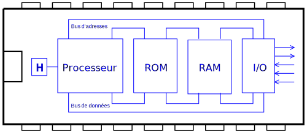
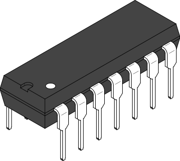
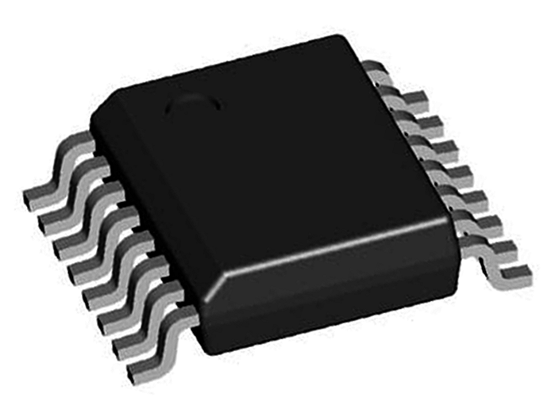
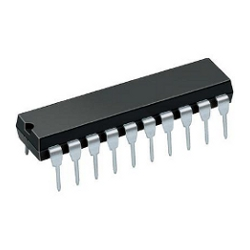
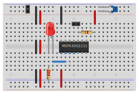
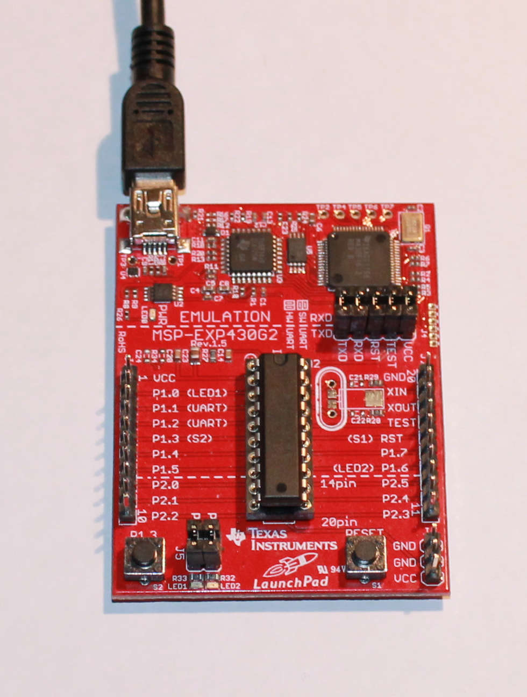

<!-- DIAPORAMA -->

<section class="page_de_garde">

Enseignes et afficheurs à LED

Le microcontrôleur

Pierre-Yves Rochat

</section>

<section>
<!-- def A -->
<!-- def A -->
<!-- def A -->

<!-- def A -->**Enseignes et afficheurs à LED** | Le microcontrôleur
<!-- def A -->

<!-- A -->
<h1 class="en_tete">Le microcontrôleur</h1>

Pierre-Yves Rochat

</section>

<section>
<!-- A -->
<h1 class="en_tete">Le microcontrôleur</h1>

* Système informatique
* Le microcontrôleur
* De nombreuses familles
* Schéma de mise en œuvre
* Programmation

</section>

<section>
<!-- A -->
<h1 class="en_tete">Système informatique</h1>

* Un processeur
<!-- 234 -->* Une mémoire morte (ROM)
<!-- 34 -->* Une mémoire vive (RAM)
<!-- 4 -->* Des entrées-sorties (I/O)

</section>

<section>
<!-- A -->
<h1 class="en_tete">Le microcontrôleur</h1>

<!-- 2 -->* Un microcontrôleur est un circuit intégré contenant un système informatique

</section>

<section>
<!-- A -->
<h1 class="en_tete">De nombreuses familles de microcontrôleurs</h1>

* De nombreux fabricants

<!-- 234567 -->
<!-- 234567 -->
<!-- 234567 -->
<!-- 234567 -->
<!-- 234567 -->
<!-- 34567 -->

<!-- 34567 -->* Mémoire morte de 1 ko à des Mo
<!-- 4567 -->* Mémoire vive de quelques octets à des centaines de ko
<!-- 567 -->* De quelques broches à des centaines de broches d’entrées-sorties
<!-- 34567 -->

<!-- 67 -->
<!-- 67 -->
<!-- 67 -->
<!-- 7 -->
</section>

<section>
<!-- A -->
<h1 class="en_tete">Un exemple de microcontrôleur : le MSP430G2553</h1>

</section>

<section>
<!-- A -->
<h1 class="en_tete">Mise en œuvre matérielle et logicielle</h1>

* Un composant électronique
<!-- 23456 -->* ⇒ mise en œuvre matérielle
<!-- 3456 -->* ⇒ compétence d’un électronicien !

<!-- 456 -->

<!-- 456 -->* Un système informatique programmable
<!-- 56 -->* ⇒ mise en œuvre logicielle
<!-- 6 -->* ⇒ compétence d’un informaticien !
<!-- 456 -->

</section>

<section>
<!-- A -->
<h1 class="en_tete">Schéma de mise en œuvre</h1>

</section>

<section>
<!-- A -->
<h1 class="en_tete">Exemple de montage</h1>

</section>

<section>
<!-- A -->
<h1 class="en_tete">Exemple de montage</h1>

</section>

<section>
<!-- A -->
<h1 class="en_tete">Programmation d’un microcontrôleur</h1>

<!-- 23 -->
<!-- 3 -->
</section>

<section>
<!-- A -->
<h1 class="en_tete">Le microcontrôleur</h1>

* Système informatique
* Le microcontrôleur
* De nombreuses familles
* Schéma de mise en œuvre
* Programmation

</section>

