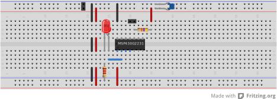
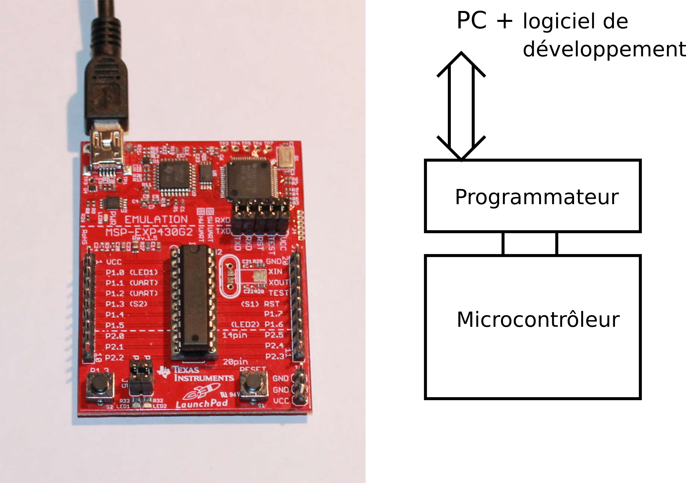

% Introduction au microcontrôleur
% [Pierre-Yves Rochat](mailto:pyr@pyr.ch), EPFL
% rév 2016/07/09

Pour commander des enseignes ou des afficheurs à LED, c’est très souvent un **microcontrôleur** qui est utilisé. Voyons de quoi il s’agit.

## Système informatique ##

Nous sommes tous familiers avec les systèmes informatiques, à commencer par nos ordinateurs de bureau et nos *smartphones*. À l’intérieur de tout système informatique se trouvent au moins :

* Un **processeur**, qui exécute les instructions. Il est cadencé par une horloge (H).
* Une **mémoire morte** (ROM : *Read Only Memory*) qui contient des instructions. Son contenu est permanent : il reste intact lorsque le système n’est plus alimenté.
* Une **mémoire vive** (RAM : *Random Access Memory*, qui permet de stocker des données. Son contenu est perdu lorsque le courant est coupé.
* Des circuits d’**entrée-sortie** (I/O : *Input/Output*). Ce sont les circuits qui permettent l’interaction avec l’extérieur : clavier, souris, écran, mémoire externe, imprimante, etc.

Des lignes électriques, appelées *bus* relient ces éléments entre eux. Voici un schéma-bloc d’un système informatique :

{ width=90% }

## Microcontrôleur ##

Un **microcontrôleur** est aussi un système informatique. Sa particularité est qu’il est contenu dans un seul circuit intégré. L’architecture est la même que celle présentée sur la figure. Par rapport à une carte mère d’ordinateur, les éléments qui constituent un microcontrôleur sont généralement plus simples, moins performants, leur capacité est plus limitée :

* La mémoire morte contient généralement de un à quelques centaines de kilooctets.
* Le processeur est cadencé à des fréquences de quelques mégahertz ou dizaines de mégahertz. Il ne consomme généralement qu’une fraction de watt. Son jeu d’instructions est plus simple.
* La mémoire vive est généralement très limitée : de quelques centaines d’octets (ou en anglais *byte*, abrégé “B”) à quelques dizaines de kilooctets selon les modèles.
* Les circuits d’entrée-sortie sont simplement des entrées logiques, pour lire une valeur binaire, comme par exemple un interrupteur, ainsi que des sorties logiques, capables de fournir quelques milliampères, par exemple pour commander une LED.

L’intérêt des microcontrôleurs est leur coût très faible, souvent moins d’un euro, leur consommation de courant limitée à quelques milliampères et leur taille très réduite, vu qu’il s’agit d’un seul circuit intégré. Ils sont donc utilisés dans de très nombreuses applications.

Bien que des microcontrôleurs existent depuis les années 1970, ils se sont développés de manière spectaculaire depuis quelques années. Les microcontrôleurs actuels contiennent de la mémoire __*flash*__, qui facilite l’écriture du programme qui doit s’exécuter.

Alors qu’il était encore complexe et coûteux de mettre en œuvre un microcontrôleur au début des années 2000, cette tâche est maintenant beaucoup plus simple et ne nécessite que du matériel très peu coûteux. Il est possible de les programmer alors qu’ils sont soudés sur leur circuit définitif, au moyen de quelques fils. Les microcontrôleurs sont donc devenus des composants électroniques incontournables, modifiant profondément la manière de concevoir les circuits électroniques.

## De nombreuses familles ##

Beaucoup de fabricants proposent des microcontrôleurs (Microchip-Atmel, Texas-Instrument, NXP, ST-micro, Cypress, etc.). Chaque fabricant offre souvent plusieurs familles de microcontrôleurs (PIC, dsPIC chez Microchip, AVR, AVR32, ARM chez Atmel, MSP430, MSP432 chez Texas Instruments, etc.) Chaque famille comporte souvent des dizaines, voire des centaines de modèles, qui diffèrent les uns des autres principalement par les tailles mémoires (RAM et ROM) et le nombre de broches d’entrée-sortie.

À titre d’exemple, le processeur MSP430G2253 de Texas Instruments contient :

* Un processeur 16 bits, avec une centaine d’instructions, cadencé au maximum à 16 MHz, avec 16 registres de 16 bits.
* Une mémoire morte de type *flash* (technologie similaire à celle des clés USB) de 16 ko. Cette mémoire peut être effacée et écrite un très grand nombre de fois.
* Une mémoire vive de 512 o.
* 16 broches d’entrée-sorties. Huit d’entres-elles peuvent être connectées à un convertisseur analogique-numérique de 10 bits de résolution. Certaines de ces broches ont également d’autres fonctions spécifiques (génération de signaux, capture d’événements, utilisation d’un quartz, etc.).

Les microcontrôleurs de la famille MSP430G sont disponibles dans plusieurs boîtiers, dont le DIL20 (*Dual-In-Line* 20 pins), facile à mettre en œuvre. Voici son brochage :

{ width=35% }

## Mise en œuvre matérielle et logicielle ##

Un microcontrôleur est à la fois un **composant électronique** et un **système informatique**. Il nécessite donc une mise en œuvre **matérielle** et une mise en œuvre **logicielle**. En d’autres termes, il est à la frontière entre l’électronique et l’informatique. De ce fait, il nécessite les compétences d’un électronicien et d’un informaticien !

## Schéma de mise en œuvre ##

Chaque broche est désignée par un ou plusieurs noms. Identifions les trois groupes de broches indispensables à la réalisation d’un premier montage fonctionnel à microcontrôleur :

* les alimentations : Gnd et +3 V
* les broches de programmation : Rst et TEST
* les broches d’entrées-sorties pour l’application proprement dite, c’est-à-dire toutes les autres broches.

Les microcontrôleurs sont presque toujours réalisés en technologie **CMOS** et nécessitent une alimentation unique. Les MSP430 acceptent une tension comprise entre 1,8 et 3,6 V. Deux piles AA ou AAA de 1,5 V montées en série peuvent donc convenir. La borne négative de l’alimentation est souvent désignée par *Gnd* (*Ground* : masse). C’est la broche 20 du MSP430G2553. La borne positive est notée *3 V*, c’est la broche 1.

La fonction *Rst* ou *Reset* est câblée sur la broche 16. Le *Rst* est une entrée du circuit. Notez la barre sur son nom : cela signifie que cette entrée est active à 0. On le note aussi parfois avec le signe barre oblique (ou *slash*) `/` précédant le nom : */Rst*. C’est une bonne habitude de mettre en évidence qu’un signal est actif à 0. Il sera nécessaire de fixer à l’état 1 la broche *RST* pour le fonctionnement normal du microcontrôleur. C’est une résistance reliée au *+3 V* qui joue ce rôle. On parle de résistance de tirage (en anglais *pull-up* : tirer vers le haut). Une valeur d’environ 47 kΩ convient dans ce cas.

La programmation des MSP430 peut se faire par l’intermédiaire de deux signaux : le *RST* et un signal nommé *TEST* (broche 17). Il n’est pas nécessaire de comprendre le rôle exact de ce signal. Il est généré par le logiciel de programmation qui s’exécute sur un ordinateur, par exemple *Code Composer Studio* ou *Energia*. Il est transmis par un programmateur, par exemple celui inclus dans le *LaunchPad MSP430*.

Les autres broches du MSP430G2553 sont des entrées-sorties. Elles sont regroupées en 2 ports : P1 et P2. Ces deux ports sont complets : ils comportent chacun 8 broches. D’autres versions du MSP430 sont proposées en boîtier à 14 broches (DIL 14). Dans ce cas, les broches P2.0 à P2.5 n’existent pas.

Un microcontrôleur est un composant électronique. Il va trouver sa place dans un schéma électronique pour sa mise en œuvre :

{ width=50% }

Ce schéma est très simple. En plus du microcontrôleur, on y trouve une LED, connectée à la broche *P1.0*, avec sa résistance de limitation du courant reliée en série vers la masse. Notez la présence d’un condensateur de découplage entre le + et le -. Les électroniciens savent qu’il est utile pour filtrer l’alimentation. On peut dire qu’il est une petite réserve de charges électriques. Sa valeur est souvent de 100 nF. Il sera placé le plus près possible du circuit intégré.

L’entrée *Reset* est maintenue à l’état logique *1* par une résistance reliée à l’alimentation positive, appelée résistance de tirage. Les signaux *Reset* et *Test* sont reliés à un connecteur, comportant aussi des broches pour l’alimentation. C’est par ce connecteur que le microcontrôleur pourra être programmé.

## Réalisation d’un montage à microcontrôleur ##

L’assemblage de composants électroniques se fait le plus souvent sur un circuit imprimé (**PCB** : *Printed Circuit Board*). Pour des montages de test, il est possible d’utiliser des techniques de montage sans soudure, tels que les plaques d’expérimentation, appelées en anglais *breadboard*.

Voici un exemple de montage :

{ width=90% }

Notez qu’un MSP430G2231 a été utilisé dans cet exemple, avec seulement 14 broches.

## Programmation d’un microcontrôleur ##

La programmation d’un microcontrôleur se fait à travers ses broches de programmation. Un **programmateur** doit être utilisé, au moins pour la première programmation.

Dans le cas du MSP430G, la carte LaunchPad contient un programmateur capable de générer les signaux *Reset* et *Test* nécessaires à la programmation.

{ width=60% }

Il est aussi possible de programmer un microcontrôleur sans utiliser un programmateur. Dans ce cas, le microcontrôleur doit déjà avoir initialement été programmé avec un programme appelé *Bootloader*, contenu dans une partie de la mémoire du microcontrôleur. Ce programme est capable de recevoir un programme de l’extérieur et de le programmer dans une autre partie de la mémoire.

L’exemple le plus connu est la carte Arduino :

{ width=40% }

