<!-- DIAPORAMA -->

<!-- Page de titre -->
<section class="page_de_garde">

Enseignes et afficheurs à LED

La diode à jonction : principes physiques

Prof. Alain Tiedeu

</section>

<!-- Page bienvenue plein écran-->
<section>
<!-- I -->
<h1 class="en_tete">La diode à jonction : principes physiques</h1>
<!-- def A -->
<!-- def A -->
<!-- def A -->

<!-- def A -->**Enseignes et afficheurs à LED** |  La diode à jonction : principes physiques
<!-- def A -->

<!-- A -->

Prof. Alain Tiedeu

</section>

<!-- Page bienvenue, demi-->
<section>
<!-- A -->
<h1 class="en_tete">La diode à jonction : principes physiques</h1>

* Modèle de Bohr
* Niveaux d'énergie
* Semi-conducteurs intrinsèques
* Dopage N et P
* Jonction PN
* La diode à jonction

</section>

<!-- Page Bohr, 6 entrées -->
<section>
<!-- A -->
<h1 class="en_tete">Modèle simplifié de l’atome : modèle de Bohr</h1>

* Noyau central

<!-- 23456 -->

<!-- 23456 -->* Électrons  sur trajectoires circulaires formant des couches autour du noyau
<!-- 23456 -->

<!-- 3456 -->

<!-- 3456 -->* Nombre  maximal d’électrons sur une couche  de numéro n = 2n^2^
<!-- 3456 -->

<!-- 456 -->

<!-- 456 -->* Distribution des électrons de l’intérieur vers l’extérieur (n croissant)
<!-- 456 -->

<!-- 56 -->

<!-- 56 -->* Couche la plus externe est appelée **couche de valence**.  Elle contient les électrons qui participent aux liaisons
<!-- 56 -->

<!-- 6 -->

<!-- 6 -->* Si électron quitte l’atome et devient **libre**, il passe dans la couche de conduction
<!-- 6 -->

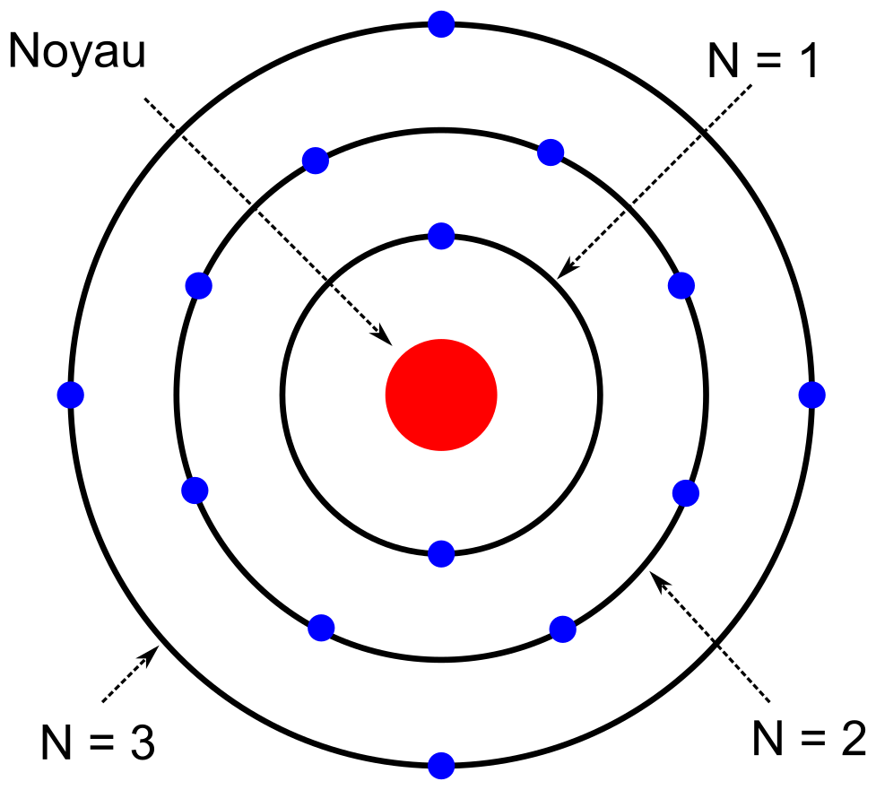
</section>

<!-- Page Energie, 5 entrées -->
<section>
<!-- A -->
<h1 class="en_tete">Modèle de Bohr : niveaux d'énergie</h1>

* Couche n correspond à un niveau d’énergie E~n~

<!-- 2345 -->

<!-- 2345 -->* Un électron passe d’un niveau d’énergie inférieur à un niveau d’énergie supérieur en recevant de l’énergie
<!-- 2345 -->

<!-- 345 -->

<!-- 345 -->* Il fait l’inverse en émettant de l’énergie
<!-- 345 -->

<!-- 45 -->

<!-- 45 -->* Énergie émise ou énergie reçue est égale à la différence d’énergie entre les 2 niveaux
<!-- 45 -->

<!-- 5 -->

<!-- 5 -->* Énergie peut être émise par l’électron ou donnée à l’électron sous plusieurs formes
<!-- 5 -->

</section>

<!-- Page Intrinsèque 1, 3 + 2 entrées -->
<section>
<!-- A -->
<h1 class="en_tete">Semi-conducteur intrinsèque</h1>

* Elément de la colonne IV du tableau de classification périodique des éléments

<!-- 23 -->

<!-- 23 -->* Intrinsèque = à l’état « pur »
<!-- 23 -->

<!-- 3 -->

<!-- 3 -->* 4 électrons de valence
<!-- 3 -->

<!-- 3 -->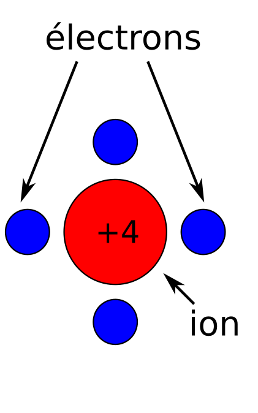
</section>

<!-- Page Intrinsèque 1, suite -->
<section>
<!-- A -->
<h1 class="en_tete">Semi-conducteur intrinsèque</h1>

* Elément de la colonne IV du tableau de classification périodique des éléments

* Intrinsèque = à l’état « pur »

* 4 électrons de valence

* Dans le cristal, les 4 électrons sont engagés dans des liaisons covalentes avec les 4 voisins

<!-- 2 -->

<!-- 2-->* Il n’y a donc pas d’électron libre et par conséquent pas de courant électrique
<!-- 2 -->

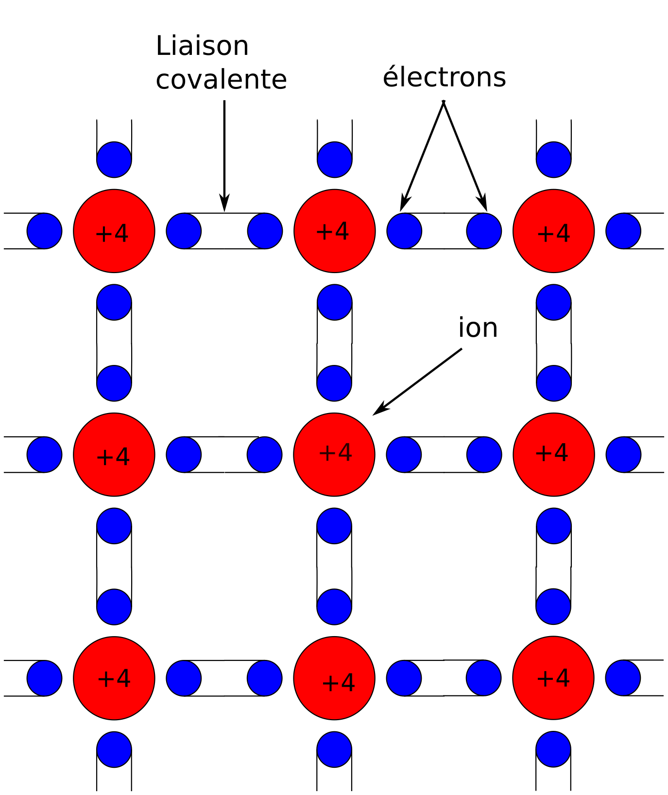
</section>

<!-- Page Intrinsèque 2, 6 entrées -->
<section>
<!-- A -->
<h1 class="en_tete">Conduction intrinsèque</h1>

* Communiquer de l’énergie à l’atome par un moyen quelconque (lumière, élévation de  la température, etc…)

<!-- 23456 -->

<!-- 23456 -->* Électrons de couche de valence s’en échappent,  passent dans la couche de conduction et deviennent **libres**
<!-- 23456 -->

<!-- 3456 -->

<!-- 3456 -->* Leur départ laisse une charge positive de même valeur absolue appelée **trou**
<!-- 3456 -->

<!-- 456 -->

<!-- 456 -->* Une **paire électron-trou libre** est née !
<!-- 456 -->

<!-- 56 -->

<!-- 56 -->* Charges positives et négatives se déplacent et créent un **courant électrique** dans le cristal
<!-- 56 -->

<!-- 6 -->

<!-- 6 -->* Nombre de paires électron-trou : 10^-13^ par atome *(très faible)*
<!-- 6 -->

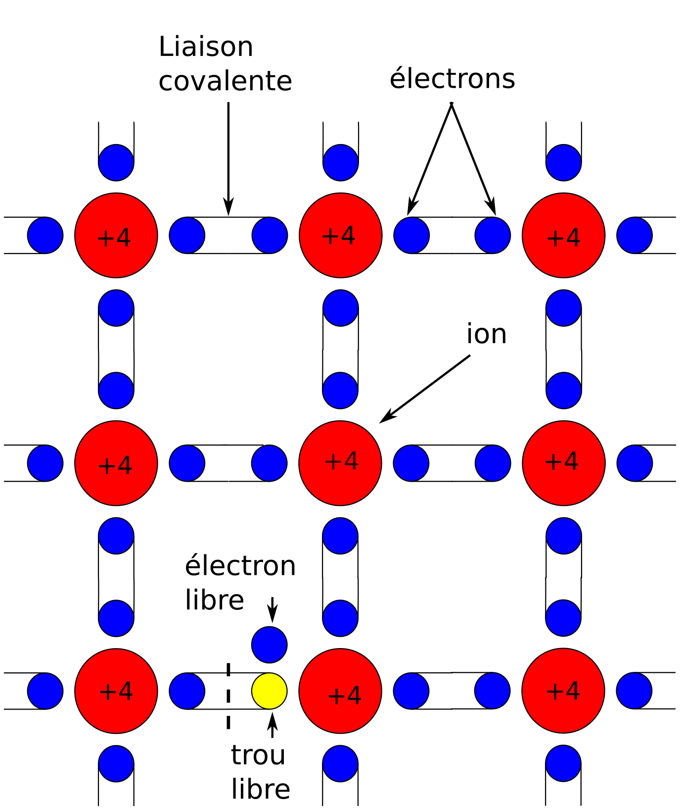
</section>

<!-- Page Dopé N 2, 9 entrées -->
<section>
<!-- A -->
<h1 class="en_tete">Semi-conducteur dopé de type N</h1>

* Injecter un élément de **valence 5** en faible quantité (10^-6^ par atome)

<!-- 23456789 -->

<!-- 23456789 -->* Le cristal est **dopé N**
<!-- 23456789 -->

<!-- 3456789 -->

<!-- 3456789 -->* Surplus d’électrons : certains sont d’office libres (10^-6^ /atome)
<!-- 3456789 -->

<!-- 456789 -->

<!-- 456789 -->* Paires électron-trou libres également présents
<!-- 456789 -->

<!-- 56789 -->

<!-- 56789 -->* Conduction dans 1 atome de cristal assurée par :
<!-- 56789 -->

<!-- 6789 -->

<!-- 6789 -->* 10^-13^ trous  (conduction intrinsèque)
<!-- 6789 -->

<!-- 789 -->

<!-- 789 -->* 10^-13^  électrons (conduction intrinsèque)
<!-- 789 -->

<!-- 89 -->

<!-- 89 -->* 10^-6^  électrons (conduction **extrinsèque**)
<!-- 89 -->

<!-- 9 -->

<!-- 9 -->* Conduction extrinsèque **largement dominante** !
<!-- 9 -->

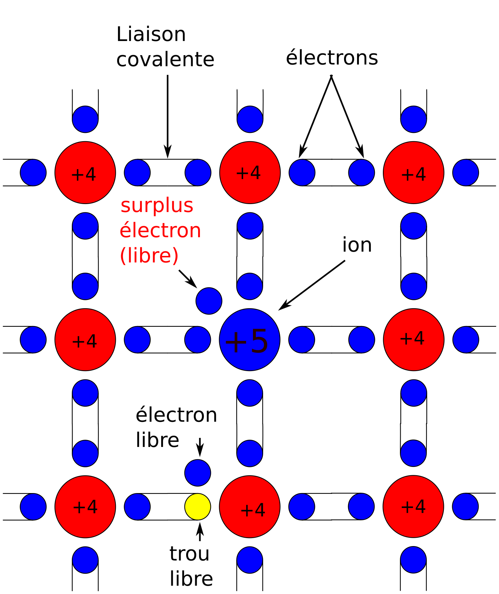
</section>

<!-- Page Dopé P 2, 9 entrées -->
<section>
<!-- A -->
<h1 class="en_tete">Semi-conducteur dopé de type P</h1>

* Injecter un élément de **valence 3** en faible quantité (10^-6^ par atome)

<!-- 23456789 -->

<!-- 23456789 -->* Le cristal est **dopé P**
<!-- 23456789 -->

<!-- 3456789 -->

<!-- 3456789 -->* Surplus de trous : certains sont d’office libres (10^-6^ /atome)
<!-- 3456789 -->

<!-- 456789 -->

<!-- 456789 -->* Paires électron-trou libres également présents
<!-- 456789 -->

<!-- 56789 -->

<!-- 56789 -->* Conduction dans 1 atome de cristal assurée par :
<!-- 56789 -->

<!-- 6789 -->

<!-- 6789 -->* 10^-13^ trous  (conduction intrinsèque)
<!-- 6789 -->

<!-- 789 -->

<!-- 789 -->* 10^-13^  électrons (conduction intrinsèque)
<!-- 789 -->

<!-- 89 -->

<!-- 89 -->* 10^-6^  trous (conduction **extrinsèque**)
<!-- 89 -->

<!-- 9 -->

<!-- 9 -->* Conduction extrinsèque **largement dominante** !
<!-- 9 -->

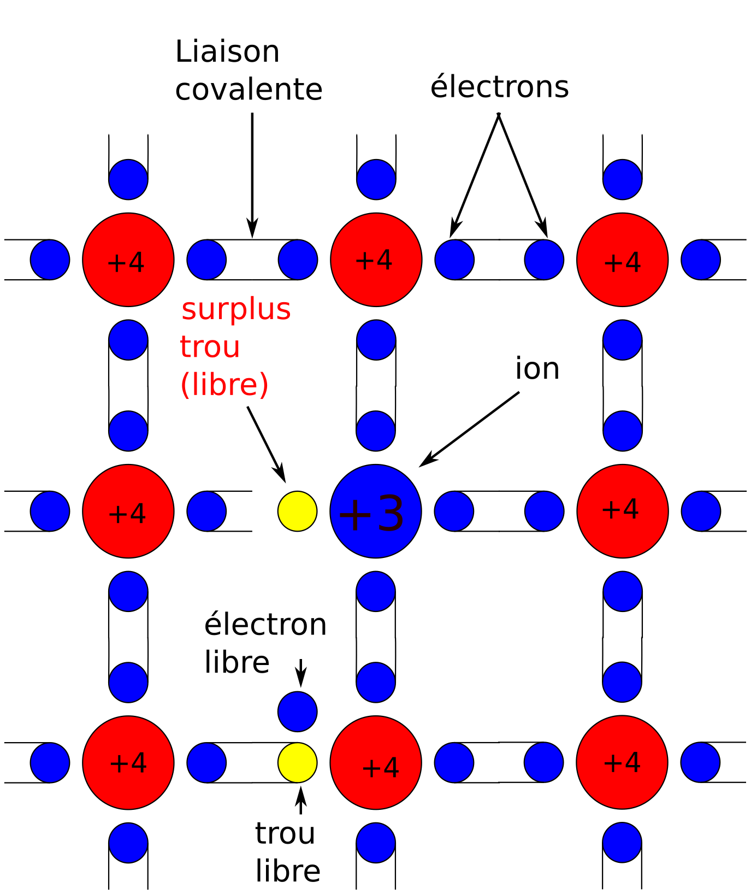
</section>

<!-- Page Jonction, 8 entrées -->
<section>
<!-- A -->
<h1 class="en_tete">Jonction PN</h1>

* **Mise en contact** de semi-conducteurs dopés P et N
<!-- 2345678 -->* Porteurs de charges de natures différentes **s’attirent**
<!-- 345678 -->* **Diffusion** de porteurs de charges
<!-- 45678 -->* **Neutralisation** mutuelle
<!-- 5678 -->* Zones de **déplétion**
<!-- 678 -->* **Champ électrique** (barrière de potentiel)
<!-- 78 -->* Champ **opposé** au passage des porteurs majoritaires
<!-- 8 -->* MAIS : **favorise** le passage des porteurs minoritaires

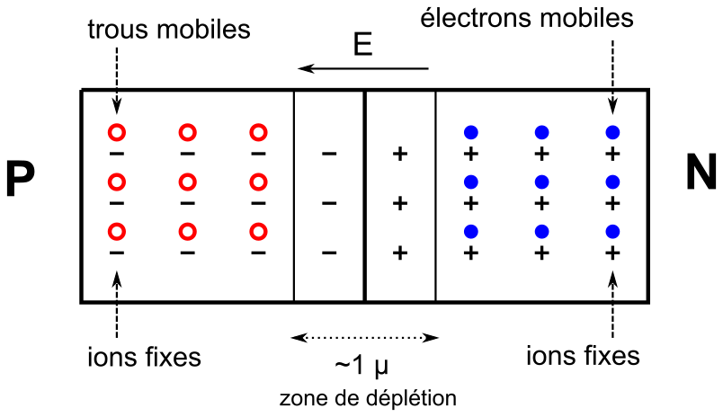
</section>

<!-- Page Diode, 2 entrées -->
<section>
<!-- A -->
<h1 class="en_tete">La diode à jonction</h1>

* Lorsqu’on soumet la jonction PN à une différence de potentiel, on réalise une **diode à jonction**

<!-- 2 -->

<!-- 2 -->* Caractéristique de la diode
<!-- 2 -->

</section>

<!-- Page Caractéristique, 4 entrées -->
<section>
<!-- A -->
<h1 class="en_tete">Caractéristique de la diode à jonction</h1>

* Caractéristique c’est  la relation entre le courant qui traverse la diode et la tension à ses bornes

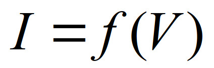
<!-- 234567 -->

<!-- 234567 -->* Par application à la jonction de :
<!-- 234567 -->

<!-- 34567 -->

<!-- 34567 -->L’équation fondamentale de la dynamique
<!-- 34567 -->

<!-- 4567 -->

<!-- 4567 -->La loi de conservation de l’énergie
<!-- 4567 -->

<!-- 567 -->
<!-- 567 -->

<!-- 567 -->La relation
<!-- 567 -->

<!-- 67 -->

<!-- 67 -->* On obtient  l’équation différentielle qui régit le courant
<!-- 67 -->

<!-- 7 -->

<!-- 7 -->* La  résolution de l’équation donne :
<!-- 7 -->

<!-- 7 -->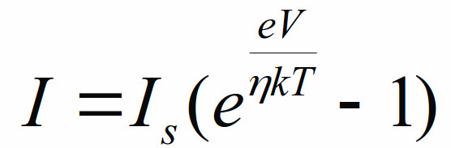
<!-- 7 -->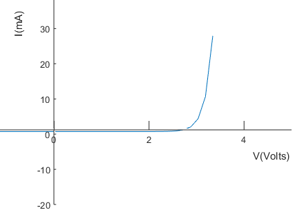
</section>

<!-- Page Caractéristique, 4 entrées -->
<section>
<!-- A -->
<h1 class="en_tete">Caractéristique de la diode à jonction</h1>

* Avec la partie négative :
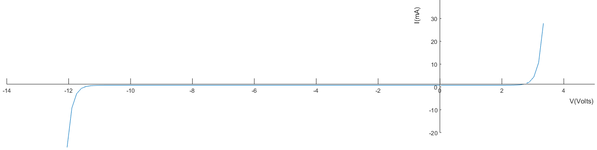

</section>

<!-- Page Caractéristique 2, 7 entrées -->
<section>
<!-- A -->
<h1 class="en_tete">Caractéristique de la diode à jonction</h1>

* Réaliser le circuit ci-contre :

<!-- 234567 -->

<!-- 234567 -->* Relever dans un tableau la valeur de I pour chaque valeur de U
<!-- 234567 -->

<!-- 34567 -->

<!-- 34567 -->* Tracer
<!-- 34567 -->

<!-- 4567 -->

<!-- 4567 -->* *Commentaires* :
<!-- 4567 -->

<!-- 567 -->

<!-- 567 -->* Allure semblable à celle de la courbe théorique
<!-- 567 -->

<!-- 67 -->

<!-- 67 -->* Points particuliers: **Vz**, **Us**, **Uo**
<!-- 67 -->

<!-- 7 -->

<!-- 7 -->* Notions de **Passante** et **Non passante**
<!-- 7 -->

<!-- 34567 -->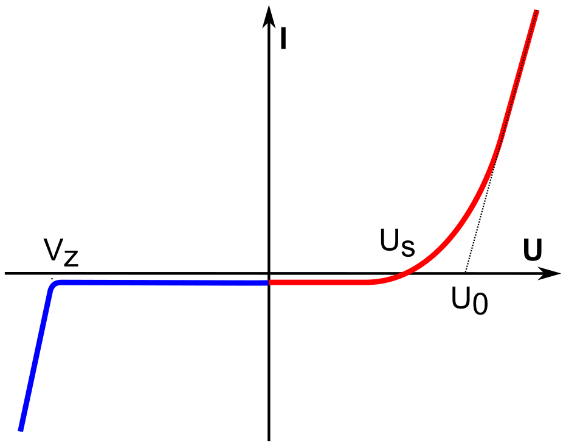
</section>

<!-- Page conclusion demi-->
<section>
<!-- A -->
<h1 class="en_tete">La diode à jonction : principes physiques</h1>

* Modèle de Bohr
* Niveaux d'énergie
* Semi-conducteurs intrinsèques
* Dopage N et P
* Jonction PN
* La diode à jonction

</section>

