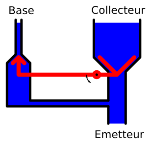
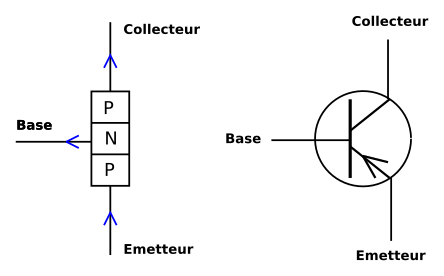

% Introduction au transistor
% [Yves Tiecoura](mailto:tiecouray@yahoo.fr), INP-HB Yamoussoukro
% rév 2015/11/11

## Une invention de premier plan ##

Pour réaliser des enseignes et afficheurs à LED, il est très souvent nécessaire d'utiliser l'élément le plus emblématique de l'électronique : le transistor.

La mise au point de ce dispositif à semi-conducteur a marqué une étape importante dans l’évolution de l’électronique  et de l’humanité en général. Bien que son invention date de 1948, ses inventeurs, William Schockley, John Bardeen et Walter Houster Brattain ont reçu en 1956 le prix Nobel de physique pour leurs travaux.

Le transistor est utilisé en électronique comme amplificateur ou comme interrupteur. Les premiers transistors étaient fabriqués avec du Germanium, mais par la suite, c'est le Silicium qui a été principalement utilisé. D'autres matériaux semi-conducteurs sont utilisée pour certaines applications, tels l'Arsenure de Galium (GaAs).

## Présentation ##

Le transistor se présente sous la forme d’un composant à trois broches, désignées par __*base*__, __*collecteur*__ et __*émetteur*__. Le mot *transistor* signifie *trans-résistance*, qui met en évidence qu'une résistance peut varier. La figure suivante montre le transistor comme un tri-pôle. 

Dans un transistor, la valeur de la résistance __Rce__ entre le collecteur et l’émetteur varie en fonction du courant  __Ib__ qui circule entre la base et l'émetteur. Une augmentation du courant de base provoque une diminution de la résistance __Rce__, ce qui permet une augmentation du courant __Ic__  qui circule entre le collecteur et l’émetteur. C'est ce qu'on appelle l'*effet transistor*.

Cette similitude avec un système hydraulique aide à comprendre le principe :

On sait que  U = R • I (Loi d'Ohm). Une variation du petit courant __Ib__  provoque une variation du grand courant __Ic__.

Dans certaines conditions, cette variation est linéaire  :

Ic = Beta • Ib 

Ce coefficient Beta est appelé *facteur d'amplification du transistor*. Sa valeur est largement supérieure à 1, souvent 100 ou plusieurs centaines.

Il faut noter que le courant de base doit toujours rester petit pour éviter la destruction du transistor. Une résistance sur la base est généralement utilisée pour limiter ce courant.

## Structure d'un transistor ##

Pour mieux comprendre le fonctionnement du transistor, regardons sa structure interne. Un transistor est construit à partir d'un morceau de silicium de type N (dopé négativement) dans lequel sont diffusées des impuretés de type P. Il s'agit là d'un transistor de type __NPN__. La figure suivante montre le principe de la constitution d'un transistor NPN, ainsi que le symbole utilisé.

Pour obtenir  un transistor de type __PNP__, ce sont des impuretés de type N qui sont diffusées dans une lame de silicium de type P.

## Les jonctions et modes de fonctionnement ##

On appelle *jonction* le contact entre une zone de silicium dopé N et une zone de silicium dopé P. Deux *jonctions* sont créées dans un transistor, une jonction base-émetteur __Jbe__ et une jonction base-collecteur __Jbc__. 

Une jonction est dite *polarisée en direct* lorsque la tension entre zone P et la zone N est supérieure à 0,7 Volt (tension de seuil). Dans le cas contraire, on dit qu'elle est polarisée en inverse.

Le transistor a trois modes de fonctionnement intéressants :

* le mode bloqué
* le mode amplificateur
* le mode saturé

Dans toutes  les applications liées aux enseignes et afficheurs à LED, nous allons utiliser les transistors en mode de commutation, c'est-à-dire soit bloqué, soit saturé. Le transistor fonctionne alors comme un interrupteur, pour allumer ou éteindre des LED.

Le transistor est en mode bloqué lorsque la jonction base-émetteur n'est pas polarisée en direct. C'est le cas où la tension base-émetteur est inférieure à la tension de seuil. Aucun courant ne circule alors entre le collecteur et l'émetteur : Ic = 0

Lorsque la tension base-émetteur dépasse la tension de seuil, le transistor va conduire. Etant donné que le facteur d'amplification Beta du transistor est généralement important, le courant du collecteur va rapidement n'être limité que par la charge se trouvant dans le circuit du collecteur. On dit alors que le transistor est saturé.

Voici un montage fréquemment utilisé pour les enseignes à LED. Un transistor est utilisé en commutation pour allumer ou éteindre une LED. La résistance dans la base limite le courant de base. Elle est calculée de telle manière que le courant produit par un état logique "1" soit suffisant pour saturer le transistor.

## Caractéristiques des transistors ##

Il existe des milliers de modèles de transistors sur le marché ! Ils se présentent dans des boîtiers de tailles et de formes très différentes, dont voici quelques exemples :

Aujourd'hui, les boîtiers sont souvent prévus pour le montage en surface sur les circuits imprimés (SMD : Surface Mounted Device = Composants Montés en Surface) :

Comment choisir un transistor adapté à une application particulière ? Les fabricants de semi-conducteurs donnent beaucoup de valeurs dans les *data sheets* décrivant leurs composants.

Voici les paramètres généralement les plus important à prendre en compte :

#### Le courant maximum dans le collecteur Icmax

La taille du transistor et la dimension de ses broches déterminent ce courant maximal, pouvant aller de quelques mA jusqu'à plusieurs dizaines d'Ampères.

#### La tension maximale entre la base et le collecteur Vbcmax

Au dessus d'une certaine valeur de la tension entre la base et le collecteur, la jonction base-collecteur risque en effet de se détériorer. Cette valeur est rarement en dessous de 10V et peut aller jusqu'à des centaines de Volt.

#### La puissance maximale dissipable par le transistor

En effet, même lorsqu'il est saturé, la résistance entre le collecteur et l'émetteur n'est pas nulle. L'effet Joule se produit donc dans un transistor, produisant de la chaleur. Les transistors *de puissance* ont des boîtiers conçus spécialement à cet effet. Cette valeur varie de quelques centaines de mW jusqu'à des centaines de Watt.

#### La fréquence maximale de fonctionnement

Le fabricant indique également la fréquence maximale de fonctionnement du transistor. Elle s'exprime généralement en Mhz, voire davantage.

