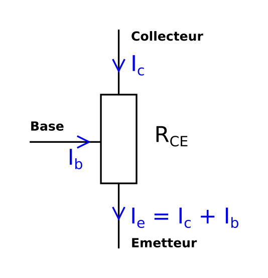
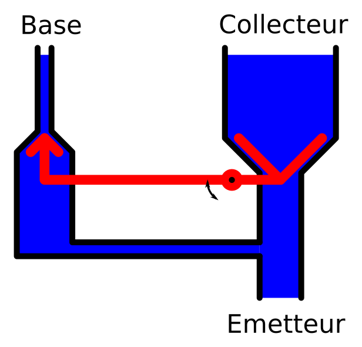
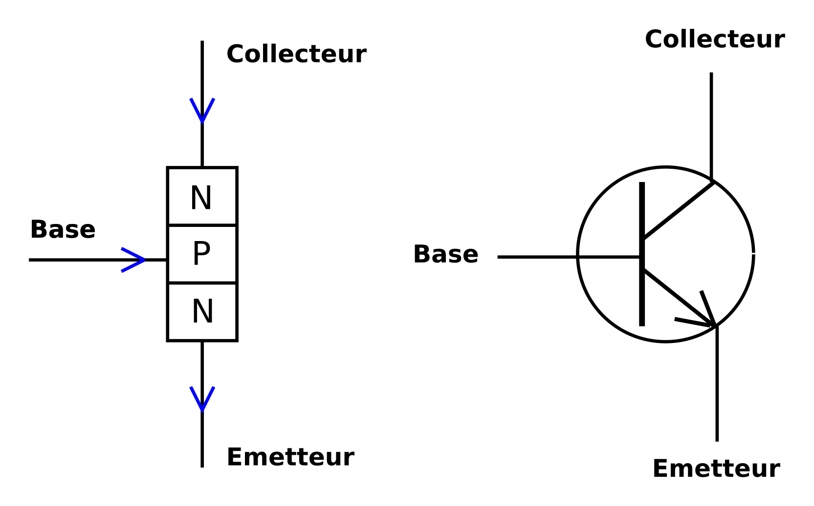
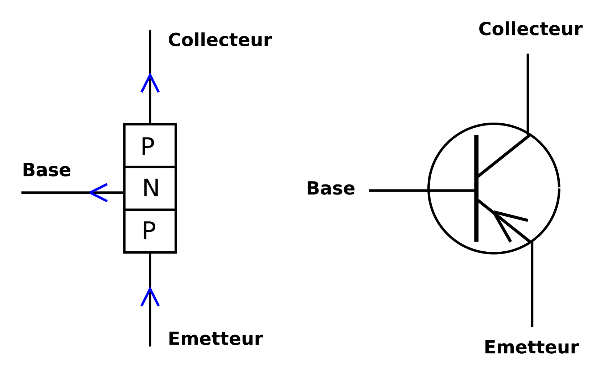
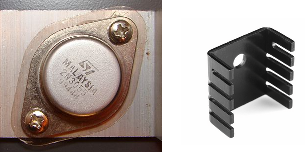

<!-- DIAPORAMA -->

<!-- Page de titre -->
<section class="page_de_garde">

Enseignes et afficheurs à LED

Le transistor

Dr. Yves Tiecoura

</section>

<!-- Page bienvenue plein écran-->
<section>
<h1 class="en_tete">Le transistor</h1>
<!-- def A -->
<!-- def A -->
<!-- def A -->

<!-- def A -->**Enseignes et afficheurs à LED** |  Le transistor
<!-- def A -->

<!-- A -->

Dr. Yves Tiecoura

</section>

<!-- Page bienvenue, demi-->
<section>
<!-- A -->
<h1 class="en_tete">Le transistor</h1>

* Une invention de premier plan
* Présentation du transistor
* Structure du transistor
* Les jonctions et modes de fonctionnement
* Caractéristiques des transistors

</section>

<!-- Page Invention, 4 arrivées -->
<section>
<!-- A -->
<h1 class="en_tete">Une invention de premier plan</h1>

* Inventé en 1948 par John Bardeen, William Schockley et Walter Houster Brattain
<!-- 23 -->* Une étape importante dans l’évolution de l’électronique et de l’humanité en général

<!-- 3 -->

**Enseignes et afficheurs à LED** |  Le transistor

</section>

<section>
<!-- A -->
<h1 class="en_tete">Une invention de premier plan</h1>

* Inventé en 1948 par John Bardeen, William Schockley et Walter Houster Brattain
* Une étape importante dans l’évolution de l’électronique et de l’humanité en général
* Un dispositif à semi-conducteur, généralement du Silicium
<!-- 23 -->* Utilisé comme amplificateur ou comme interrupteur

<!-- 3 -->

</section>

<!-- Page Présentation 3 arrivées -->
<section>
<!-- A -->
<h1 class="en_tete">Présentation du transistor</h1>

* Tri-pôle : Base, collecteur et émetteur
<!-- 3456 -->* Transistor ~ *Trans-résistance*
<!-- 456 -->* I~b~ << I~c~ <!-- -->
<!-- 56 -->* Une variation de I~b~ provoque une variation de I~c~
<!-- 6 -->* **I~c~ = &beta; • I~b~**, avec &beta; : facteur d’amplification, &beta; > 100

<!-- 23456 -->
</section>

<!-- Page robinet -->
<section>
<!-- A -->
<h1 class="en_tete">Présentation du transistor</h1>

* Similitude avec un système hydraulique :

</section>

<!-- Page Structure   arrivées -->
<section>
<!-- A -->
<h1 class="en_tete">Structure d’un transistor</h1>

* Silicium
<!-- 234 -->* Dopé P, dopé N

<!-- 3 -->
<!-- 4 -->
</section>

<section>
<!-- A -->
<h1 class="en_tete">Structure d’un transistor</h1>

* Silicium
* Dopé P, dopé N
* Transistors NPN et PNP

</section>

<!-- Page Jonction, -->
<section>
<!-- A -->
<h1 class="en_tete">Jonctions</h1>

* Deux Jonctions J~be~ et J~bc~
<!-- 23 -->* Polarisation directe, > 0,7V
<!-- 3 -->* Polarisation inverse, < 0,7V

</section>

<!-- Page Mode de fonctionnement, -->
<section>
<!-- A -->
<h1 class="en_tete">Mode de fonctionnement</h1>

* Mode bloqué
<!-- 23 -->* Mode amplificateur
<!-- 3 -->* Mode saturé

</section>

<!-- Page commande LED, -->
<section>
<!-- A -->
<h1 class="en_tete">Commande d’une LED</h1>

</section>

<!-- Page boitiers, -->
<section>
<!-- A -->
<h1 class="en_tete">Boîtiers</h1>

<!-- 23 -->

<!-- 23 -->**SMD** = Surface Mounted Device

<!-- 3 -->
</section>

<!-- Page Paramètres, 4 arrivées-->
<section>
<!-- A -->
<h1 class="en_tete">Paramètres du transistor</h1>

* Le courant maximum dans le collecteur **I~c~max**
<!-- 2345 -->* La tension maximale entre la base et le collecteur **V~bc~max**
<!-- 345 -->* La puissance maximale dissipable par le transistor **P max**

<!-- 45 -->
<!-- 5 -->
</section>

<section>
<!-- A -->
<h1 class="en_tete">Paramètres du transistor</h1>

* Le courant maximum dans le collecteur **I~c~max**
* La tension maximale entre la base et le collecteur **V~bc~max**
* La puissance maximale dissipable par le transistor **P max**
* La fréquence maximale de fonctionnement **F max**

</section>

<!-- Page conclusion, demi-->
<section>
<!-- A -->
<h1 class="en_tete">Le transistor</h1>

* Une invention de premier plan
* Présentation du transistor
* Structure du transistor
* Les jonctions et modes de fonctionnement
* Caractéristiques des transistors

</section>

