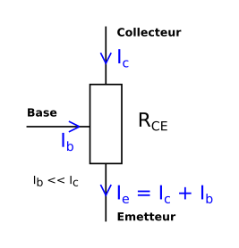
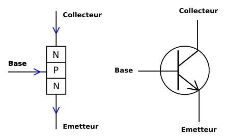
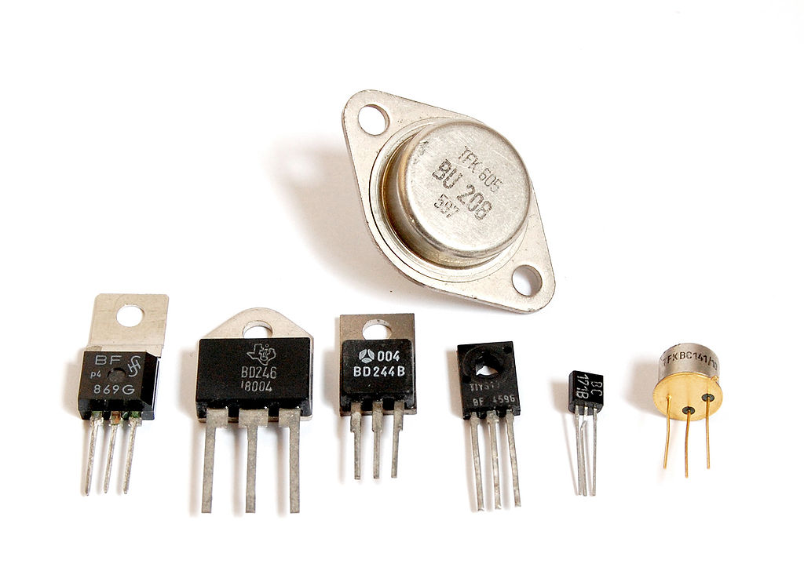
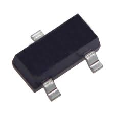

% Introduction au transistor
% [Yves Tiecoura](mailto:tiecouray@yahoo.fr), INP-HB Yamoussoukro
% rév 2015/11/11

## Une invention de premier plan ##

Pour réaliser des enseignes et afficheurs à LED, il est très souvent nécessaire d’utiliser l’élément le plus emblématique de l’électronique : le transistor.

La mise au point de ce dispositif à semi-conducteur a marqué une étape importante dans l’évolution de l’électronique et de l’humanité en général. Son invention date de 1948 et ses inventeurs, William Schockley, John Bardeen et Walter Houster Brattain ont reçu le prix Nobel de physique pour leurs travaux en 1956.

Le transistor est utilisé en électronique comme amplificateur ou comme interrupteur. Les premiers transistors étaient fabriqués avec du germanium, mais par la suite, c’est le silicium qui a été principalement utilisé. D’autres matériaux semi-conducteurs sont utilisé pour certaines applications, tel l’arséniure de gallium (GaAs).

## Présentation ##

Le transistor se présente sous la forme d’un composant à trois broches, désignées par __base__, __collecteur__ et __émetteur__. *Transistor* est un mot-valise formé par la fusion des mots de la locution anglaise *transfert resistor* ou *transrésistance* en français. Il est appelé ainsi, car il transfère un courant à travers une résistance. La figure suivante montre le transistor comme un tripôle.

Dans un transistor, la valeur de la résistance `Rce` entre le collecteur et l’émetteur varie en fonction du courant `Ib` qui circule entre la base et l’émetteur. Une augmentation du courant de base provoque une diminution de la résistance `Rce`, ce qui permet une augmentation du courant `Ic` qui entre dans le collecteur. C’est ce qu’on appelle l’*effet transistor*.

Cette similitude avec un système hydraulique aide à comprendre le principe :

{ width=35% }

On sait que `U = R × I` (Loi d’Ohm). Une variation du petit courant `Ib` provoque une variation du grand courant `Ic`.

Dans certaines conditions, cette variation est linéaire :

`Ic = β × Ib`

Ce coefficient `β` (bêta) est appelé *facteur d’amplification du transistor*. Sa valeur est largement supérieure à 1, souvent quelques centaines. C’est une grandeur sans dimension, c’est-à-dire d’unité un. <!-- voir http://www.bipm.org/fr/publications/si-brochure/section2-2-3.html -->

Il faut noter que le courant de base doit toujours rester petit pour éviter la destruction du transistor. Une résistance sur la base est généralement utilisée pour limiter ce courant.

## Structure d’un transistor ##

Pour mieux comprendre le fonctionnement du transistor, regardons sa structure interne. Un transistor est construit à partir d’un morceau de silicium de type N (dopé négativement) dans lequel sont diffusées des impuretés de type P. Il s’agit là d’un transistor de type NPN. La figure suivante montre le principe de la constitution d’un transistor NPN, ainsi que le symbole utilisé.

Pour obtenir un transistor de type PNP, ce sont des impuretés de type N qui sont diffusées dans une lame de silicium de type P.

## Les jonctions et modes de fonctionnement ##

On appelle *jonction* le contact entre une zone de silicium dopé N et une zone de silicium dopé P. Deux *jonctions* sont créées dans un transistor, une jonction base-émetteur `Jbe` et une jonction base-collecteur `Jbc`.

Une jonction est dite *polarisée en direct* lorsque la tension entre zone P et la zone N est supérieure à 0.7 V (tension de seuil). Dans le cas contraire, on dit qu’elle est polarisée en inverse.

Le transistor a trois modes de fonctionnement intéressants :

* le mode bloqué
* le mode amplificateur
* le mode saturé

Dans toutes les applications liées aux enseignes et afficheurs à LED, nous allons utiliser les transistors en mode de commutation, c’est-à-dire soit bloqué, soit saturé. Le transistor fonctionne alors comme un interrupteur, pour allumer ou éteindre des LED.

Le transistor est en mode bloqué lorsque la jonction base-émetteur n’est pas polarisée en direct. C’est le cas où la tension base-émetteur est inférieure à la tension de seuil. Aucun courant ne circule alors entre le collecteur et l’émetteur : `Ic = 0`.

Lorsque la tension base-émetteur dépasse la tension de seuil, le transistor va conduire. Étant donné que le facteur d’amplification `β` du transistor est généralement important, le courant du collecteur va rapidement n’être limité que par la charge se trouvant dans le circuit du collecteur. On dit alors que le transistor est saturé.

Voici un montage fréquemment utilisé pour les enseignes à LED. Un transistor est utilisé en commutation pour allumer ou éteindre une LED. La résistance connectée à la base limite le courant de base. Elle est calculée de telle manière que le courant produit par un état logique `1` soit suffisant pour saturer le transistor.

## Caractéristiques des transistors ##

Il existe des milliers de modèles de transistors sur le marché ! Ils se présentent dans des boîtiers de tailles et de formes très différentes, dont voici quelques exemples :

Aujourd’hui, les boîtiers sont souvent prévus pour le montage en surface sur les circuits imprimés (SMD : *Surface Mounted Device* = Composants Montés en Surface) :

Comment choisir un transistor adapté à une application particulière ? Les fabricants de semi-conducteurs indiquent un grand nombre de paramètres dans les fiches techniques (*data sheets* en anglais) décrivant leurs composants.

Voici les paramètres généralement les plus importants à prendre en compte :

#### Le courant maximum dans le collecteur `Icmax`

La taille du transistor et la dimension de ses broches déterminent ce courant maximal, pouvant aller de quelques milliampères jusqu’à plusieurs dizaines d’ampères.

#### La tension maximale entre la base et le collecteur `Vbcmax`

Au-dessus d’une certaine valeur de la tension entre la base et le collecteur, la jonction base-collecteur risque de se détériorer. Cette valeur est souvent supérieure à 10 V et peut aller jusqu’à plusieurs centaines de volts.

#### La puissance maximale admissible par le transistor

Même lorsqu’il est saturé, la résistance entre le collecteur et l’émetteur n’est pas nulle et le courant qui traverse le transistor produit donc de la chaleur par effet Joule. Les transistors *de puissance* ont des boîtiers conçus spécialement pour dissiper cette chaleur. La puissance dissipée varie de quelques centaines de milliwatts jusqu’à des centaines de watts.

#### La fréquence maximale de fonctionnement

Le fabricant indique également la fréquence maximale de fonctionnement du transistor. Elle est généralement de l’ordre du mégahertz, voire davantage.
