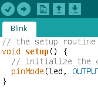

<!-- DIAPORAMA -->

<section class="page_de_garde">

Enseignes et afficheurs à LED

Programmation en C-Arduino

Pierre-Yves Rochat

</section>

<section>
<!-- def A -->
<!-- def A -->
<!-- def A -->

<!-- def A -->**Enseignes et afficheurs à LED** | Programmation en C-Arduino
<!-- def A -->

<!-- A -->
<h1 class="en_tete">Programmation en C-Arduino</h1>

Pierre-Yves Rochat

</section>

<section>
<!-- A -->
<h1 class="en_tete">Programmation en C-Arduino</h1>

* Les 3 significations du mot Arduino
* Structure d’un programme
* Entrées-sorties
* Gestion du temps

</section>

<section>
<!-- A -->
<h1 class="en_tete">Significations du mot Arduino</h1>
<!-- 2345 -->

<!-- 2345 -->* L’Arduino a participé à rendre populaires les microcontrôleurs.
<!-- 2345 -->* Qu’est-ce qui se cache derrière ce nom ?
<!-- 2345 -->

<!-- 345 -->

<!-- 345 -->* une carte à microcontrôleur
<!-- 45 -->* un environnement de développement
<!-- 5 -->* une librairie pour microcontrôleurs (un ensemble de procédures)
<!-- 345 -->

</section>

<section>
<!-- A -->
<h1 class="en_tete">Les cartes Arduino</h1>

<!-- 234 -->

<!-- 234 -->* AVR (ATmega328)
<!-- 234 -->* Connecteur normalisé
<!-- 234 -->* USB (liaison série)
<!-- 234 -->

<!-- 34 -->

<!-- 34 -->* Matériel libre
<!-- 34 -->

<!-- 4 -->

<!-- 4 -->* Nombreux *shields*
<!-- 4 -->

</section>

<section>
<!-- A -->
<h1 class="en_tete">Le logiciel Arduino</h1>

<!-- 2345 -->

<!-- 2345 -->* Ecrit en Java
<!-- 2345 -->* Utilise le compilateur GCC
<!-- 2345 -->

<!-- 345 -->

<!-- 345 -->* Windows
<!-- 345 -->* Linux
<!-- 345 -->* MacOS
<!-- 345 -->

<!-- 45 -->

<!-- 45 -->* Logiciel libre (Open source)
<!-- 45 -->

<!-- 5 -->

<!-- 5 -->* Version pour d'autres microcontrôleurs
<!-- 5 -->

<!-- 5 -->

<!-- 5 -->* Energia pour les MSP430
<!-- 5 -->

</section>

<section>
<!-- A -->
<h1 class="en_tete">La librairie Arduino</h1>
<!-- 2345 -->

<!-- 2345 -->* Un ensemble de procédures (librairie) écrites en C (ou C++)
<!-- 2345 -->* *Wiring*
<!-- 345 -->* Cacher la complexité du microcontrôleur
<!-- 45 -->* Apporter une certaine compatibilité entre différents microcontôleurs
<!-- 2345 -->

<!-- 5 -->

<!-- 5 -->* La structure générale d’un programme
<!-- 5 -->* Les entrées-sorties
<!-- 5 -->* La gestion du temps
<!-- 5 -->

</section>

<section>
<!-- A -->
<h1 class="en_tete">Structure générale d’un programme</h1>

* *pas de* procédure &nbsp; `main()`
<!-- 234 -->* `void setup()`
<!-- 34 -->* `void loop()`

<!-- 4 -->

<!-- 4 -->~~~~~~~ { .c .numberLines startFrom="1" }
<!-- 4 --> void setup() {
<!-- 4 --> }
<!-- 4 -->
<!-- 4 --> void loop() {
<!-- 4 --> }
<!-- 4 -->~~~~~~~
<!-- 4 -->

</section>

<section>
<!-- A -->
<h1 class="en_tete">Organigramme d’un programme Arduino</h1>

<!-- 1 -->
</section>

<section>
<!-- A -->
<h1 class="en_tete">Entrées-sorties</h1>

* `void pinMode(pin, mode)`
<!-- 23 -->* `void digitalWrite(pin, value)`
<!-- 3 -->* `boolean digitalRead(pin)`

</section>

<section>
<!-- A -->
<h1 class="en_tete">Exemple de programme</h1>

~~~~~~~ { .c .numberLines startFrom="1" }
 void setup() {
   pinMode(P1_0, OUTPUT);
   pinMode(P1_3, INPUT);
 }

 void loop() {
   digitalWrite(P1_0, (digitalRead(P1_3));
 }
~~~~~~~

</section>

<section>
<!-- A -->
<h1 class="en_tete">Gestion du temps</h1>

* `int delay(ms)`

<!-- 23 -->

<!-- 23 -->~~~~~~~ { .c .numberLines startFrom="1" }
<!-- 23 --> void setup() {
<!-- 23 -->   pinMode(P1_0, OUTPUT);
<!-- 23 --> }
<!-- 23 -->
<!-- 23 --> void loop() {
<!-- 23 -->   digitalWrite(P1_0, 1);
<!-- 23 -->   delay(500);
<!-- 23 -->   digitalWrite(P1_0, 0);
<!-- 23 -->   delay(500);
<!-- 23 --> }
<!-- 23 -->~~~~~~~
<!-- 23 -->

<!-- 3 -->
</section>

<section>
<!-- A -->
<h1 class="en_tete">Programmation en C-Arduino</h1>

* Les 3 significations du mot Arduino
* Structure d’un programme
* Entrées-sorties
* Gestion du temps

<!-- 2 -->

<!-- 2 -->et de nombreuses librairies !
<!-- 2 -->

</section>

