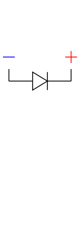
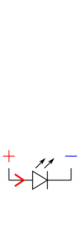
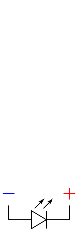
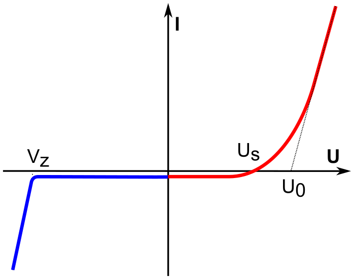
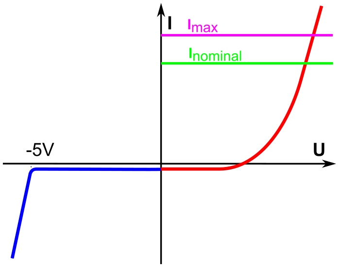
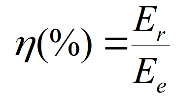
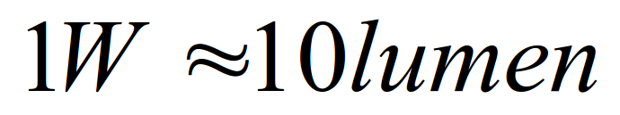
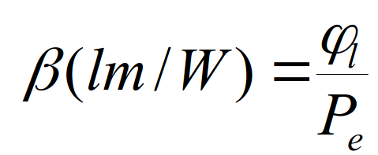

<!-- DIAPORAMA -->

<!-- Page de titre -->
<section class="page_de_garde">

Enseignes et afficheurs à LED

Caractéristiques des LED

Prof. Alain Tiedeu

</section>

<!-- Page bienvenue plein écran-->
<section>
<h1 class="en_tete">Caractéristiques des LED</h1>
<!-- def A -->
<!-- def A -->
<!-- def A -->

<!-- def A -->**Enseignes et afficheurs à LED** |  Caractéristiques des LED
<!-- def A -->

<!-- A -->

Prof. Alain Tiedeu

</section>

<!-- Page bienvenue, demi-->
<section>
<!-- A -->
<h1 class="en_tete">Caractéristiques des LED</h1>

* Polarisation des diodes et LED
* Caractéristiques électriques et lumineuses

* Efficacité
* Durée de vie

</section>

<!-- Page Intro, 5 entrées -->
<section>
<!-- A -->
<h1 class="en_tete">Polarisation des diodes et LED</h1>

* Diode polarisée en **direct** laisse passer le courant (passante)

<!-- 2345 -->

<!-- 2345 -->* Diode polarisée en **inverse** ne laisse pas passer le courant (bloquée)
<!-- 2345 -->

<!-- 2345 -->
<!-- 345 -->

<!-- 345 -->* **LED** = type particulier de diode
<!-- 345 -->

<!-- 345 -->
<!-- 45 -->

<!-- 45 -->* LED polarisée en direct émet de la lumière
<!-- 45 -->

<!-- 45 -->
<!-- 5 -->

<!-- 5 -->* LED polarisée en inverse n’émet pas de lumière
<!-- 5 -->

<!-- 5 -->
</section>

<!-- Page Carac élec, 3 entrées -->
<section>
<!-- A -->
<h1 class="en_tete">Caractéristiques électriques</h1>

* **Caractéristique Courant-tension**  Courant qui traverse la LED en fonction de la tension à ses bornes 
 Semblable à celle que nous avons vue dans la leçon Jonction PN

<!-- 2 -->

<!-- 2 -->* **Tension de seuil direct**  La tension aux bornes d'une LED polarisée en direct dépend :
<!-- 2 -->

<!-- 2 -->

<!-- 2 -->* du composé utilisé (couleur de la LED) 
<!-- 2 -->* de la température de la jonction  (coefficient de température négatif)
<!-- 2 -->

<!-- 2 -->
</section>

<!-- Page Carac élec 2, 3 entrées -->
<section>
<!-- A -->
<h1 class="en_tete">Caractéristiques électriques</h1>

* **Courants directs nominal et maximal**  **Nominal** : prescrit par le fabricant 
 **Maximal** : qui peut traverser la diode sans la détruire 
 Variable selon la LED,  couramment 20 à 25 mA

<!-- 23 -->

<!-- 23 -->* **Puissance maximale**  Liée à la **tension de seuil** et au **courant** qui traverse la diode   Ne doit jamais être dépassée, sinon destruction du composant
<!-- 23 -->

<!-- 23 -->
<!-- 3 -->

<!-- 3 -->* **Tension inverse maximale**  Tension inverse maximale applicable aux bornes de la diode sans la détruire 
<!-- 3 --> Faible, de l’ordre de -5V
<!-- 3 -->

</section>

<!-- Page Carac consomation, 4 entrées -->
<section>
<!-- A -->
<h1 class="en_tete">Consommation</h1>

* Exprimée en **Watt**

<!-- 234 -->

<!-- 234 -->* Relativement faible, typiquement **1/10** de l’énergie consommée  
<!-- 234 --> par ampoule à  incandescence pour même intensité lumineuse émise
<!-- 234 -->

<!-- 34 -->

<!-- 34 -->* Fabrication de **systèmes d’éclairage** sobres (en énergie)
<!-- 34 -->

<!-- 4 -->

<!-- 4 -->* *Exemple* : lampes portables de grande autonomie avec piles de 1,5 V
<!-- 4 -->

</section>

<!-- Page Carac lumin entrées -->
<section>
<!-- A -->
<h1 class="en_tete">Caractéristiques lumineuses</h1>

* **Longueur d’onde **   Détermine la couleur de la lumière émise  Ensemble de longueurs d’onde très proches émises  Faisceau presque monochromatique  Longueur d’onde centrale considérée comme longueur d’onde émise

<!-- 2 -->

<!-- 2 -->* **Flux lumineux**  Exprimé en **lumen**. Dépend :
<!-- 2 -->

<!-- 2 -->

<!-- 2 -->* du courant qui traverse la LED
<!-- 2 -->* de la température de la jonction
<!-- 2 -->

<!-- 2 -->
<!-- 2 -->
</section>

<!-- Page Luminosité, 4 entrées -->
<section>
<!-- A -->
<h1 class="en_tete">Luminosité</h1>

* On atteint aujourd’hui **3'000 millicandela** (mcd) pour une simple LED de 5 mm de diamètre
* Bien davantage pour des LED d'éclairage

<!-- 234 -->

<!-- 234 -->* Le mcd est l’unité de mesure et fait référence à la **lueur d’une bougie**
<!-- 234 -->

<!-- 34 -->

<!-- 34 -->* L’œil étant plus sensible à certaines radiations, parfois les fabricants utilisent cette astuce
<!-- 34 -->

<!-- 4 -->

<!-- 4 -->* Ils utilisent aussi celle de la **concentration** et on a un angle de vue
<!-- 4 -->

</section>

<!-- Page efficacité entrées -->
<section>
<!-- A -->
<h1 class="en_tete">Efficacité</h1>

* η = rapport de l’énergie rayonnée sous forme de lumière à l’énergie

 électrique consommée : **efficacité énergétique**

 *pour une ampoule à incandescence*

<!-- 234 -->

<!-- 234 -->* β = rapport du flux lumineux à la puissance électrique consommée :
<!-- 234 -->

<!-- 234 -->
 **efficacité lumineuse**
<!-- 234 -->

<!-- 234 -->
<!-- 34 -->

<!-- 34 -->* Énergie manquante dissipée sous **forme de chaleur** et évacuée par conduction
<!-- 34 -->

<!-- 4 -->

<!-- 4 -->* Efficacité variable selon la température de la jonction, le courant et la teinte de la LED 
<!-- 4 -->

<!-- 4 -->
</section>

<!-- Page Durée de vie, 4 entrées -->
<section>
<!-- A -->
<h1 class="en_tete">Durée de vie</h1>

* Très grande, peut atteindre **10 ans** (100'000 heures) !

<!-- 234 -->

<!-- 234 -->* Typiquement de l’ordre de **30'000 à 40'000 heures**
<!-- 234 -->

<!-- 34 -->

<!-- 34 -->*  *Pour comparaison* : durée de vie des ampoules à incandescence  de 300 à 1'000 h.
<!-- 34 -->

<!-- 4 -->

<!-- 4 -->* **MAIS** la durée de vie est réduite par :  - Courant élevé utilisé (donc forte luminosité)  - Variation de température
<!-- 4 -->

</section>

<!-- Page conclusion, demi-->
<section>
<!-- A -->
<h1 class="en_tete">Caractéristiques des LED</h1>

* Polarisation des diodes et LED
* Caractéristiques électriques et lumineuses

* Efficacité
* Durée de vie

</section>

