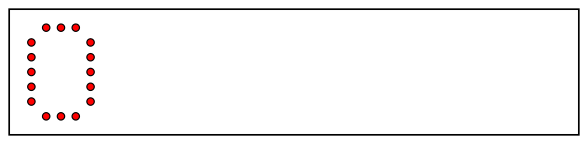
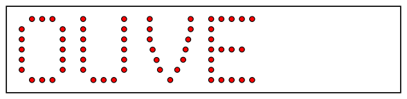
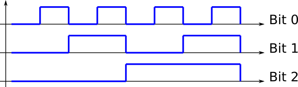

<!-- DIAPORAMA -->

<!-- Page de titre -->
<section class="page_de_garde">

Enseignes et afficheurs à LED

Séquenceur à compteur

Dr. Yves Tiecoura

</section>

<!-- Page bienvenue plein écran-->
<section>
<h1 class="en_tete">Séquenceur à compteur</h1>
<!-- def A -->
<!-- def A -->
<!-- def A -->

<!-- def A -->**Enseignes et afficheurs à LED** |  Séquenceur à compteur
<!-- def A -->

<!-- A -->

Dr. Yves Tiecoura

</section>

<!-- Page bienvenue, demi-->
<section>
<!-- A -->
<h1 class="en_tete">Séquenceur à compteur</h1>

* Animation d'une enseigne
* Compteur binaire
* Logique de décodage des séquences
* Mémoire morte (ROM)
* Réalisation complète

</section>

<!-- Page attrayante, 3 arrivées ++ 6 images -->
<section>
<!-- A -->
<h1 class="en_tete">Une enseigne attrayante</h1>

* Qu'est-ce qui fait qu'une enseigne à LED attire l'oeil ?
<!-- 23456789 -->* Sa forme, les couleurs des LED
<!-- 456789 -->* Mais surtout les animations !

<!-- 39 -->
<!-- 4 -->
<!-- 5 -->
<!-- 6 -->
<!-- 7 -->
<!-- 8 -->
<!-- 9 -->
</section>

<!-- Page séquence 2 images -->
<section>
<!-- A -->
<h1 class="en_tete">Séquence d'animation</h1>

* Diagramme des temps :

<!-- 234 -->

<!-- 34 -->* Graphe d'états :

<!-- 4 -->
</section>

<!-- Page compteur binaire, 3 images -->
<section>
<!-- A -->
<h1 class="en_tete">Compteur par 8</h1>

<!-- 23 -->

<!-- 23 -->* Diagramme des temps :
<!-- 23 -->

<!-- 23 -->
<!-- 3 -->

<!-- 3 -->* Graphe d'états :
<!-- 3 -->

<!-- 3 -->
</section>

<!-- Page Compteur binaire3 images -->
<section>
<!-- A -->
<h1 class="en_tete">Compteur binaire</h1>

<!-- 23 -->
<!-- 3 -->
</section>

<!-- Page séquenceur binaire, 2 images -->
<section>
<!-- A -->
<h1 class="en_tete">Séquenceur binaire</h1>

<!-- 2 -->
</section>

<!-- Page décodage, 4 images -->
<section>
<!-- A -->
<h1 class="en_tete">Séquenceur complet</h1>

<!-- 234 -->
<!-- 34 -->
<!-- 4 -->
</section>

<!-- Page transition-ROM, demi-->
<section>
<!-- A -->
<h1 class="en_tete">Séquenceur complet</h1>

</section>

<!-- Page ROM -->
<section>
<!-- A -->
<h1 class="en_tete">Mémoire morte comme système combinatoire</h1>

<!-- 2 -->
</section>

<!-- Page séq ROM -->
<section>
<!-- A -->
<h1 class="en_tete">Séquenceur à compteur et ROM</h1>

</section>

<!-- Page technologie ROM, 4 arrivées + 2 image -->
<section>
<!-- A -->
<h1 class="en_tete">Technologie ROM</h1>

* ROM = **Read Only Memory**
<!-- 234 -->* PROM = **Programmable** Read Only Memory
<!-- 34 -->* EPROM = **Erasable** Programmable Read Only Memory

<!-- 4 -->

**Enseignes et afficheurs à LED** |  Séquenceur à compteur

</section>

<section>
<!-- A -->
<h1 class="en_tete">Technologie ROM</h1>

* ROM = **Read Only Memory**
* PROM = **Programmable** Read Only Memory
* EPROM = **Erasable** Programmable Read Only Memory
* EEPROM = **Electrically** Erasable Programmable Read Only Memory

<!-- 2 -->
</section>

<!-- Page séq complet, 2 arrivées -->
<section>
<!-- A -->
<h1 class="en_tete">Séquenceur à compteur et ROM</h1>

<!-- 2 -->

<!-- 2 -->* Microcontrôleur !
<!-- 2 -->

</section>

<!-- Page conclusion, demi-->
<section>
<!-- A -->
<h1 class="en_tete">Séquenceur à compteur</h1>

* Animation d'une enseigne
* Compteur binaire
* Logique de décodage des séquences
* Mémoire morte (ROM)
* Réalisation complète

</section>

 

 
