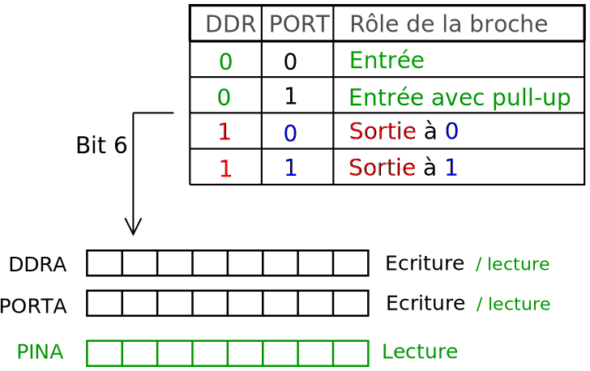
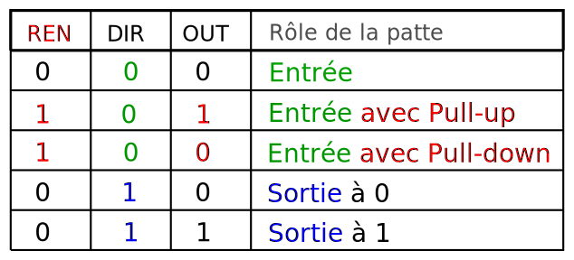
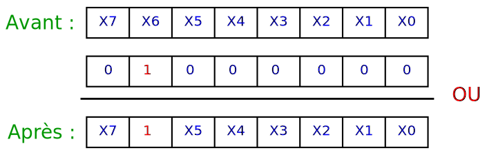
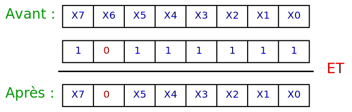

<!-- DIAPORAMA -->

<section class="page_de_garde">

Enseignes et afficheurs à LED

Les entrées-sorties

Pierre-Yves Rochat

</section>

<section>
<!-- def A -->
<!-- def A -->
<!-- def A -->

<!-- def A -->**Enseignes et afficheurs à LED** | Les entrées-sorties
<!-- def A -->

<!-- A -->
<h1 class="en_tete">Les entrées-sorties</h1>

Pierre-Yves Rochat

</section>

<section>
<!-- A -->
<h1 class="en_tete">Les entrées-sorties</h1>

* Rôle des broches en entrée OU en sorties
* Ports et registres sur AVR et MSP430
* Opérations logiques sur champs de bits
* Écritures des constantes

</section>

<section>
<!-- A -->
<h1 class="en_tete">Broches en entrée OU en sorties</h1>

* GPIO : _**G**eneral **P**urpose **I**nput **O**utput_

<!-- 23456 -->

<!-- 23456 -->* Arduino : choix par `pinMode()`
<!-- 23456 -->* Lecture par `digitalRead()`
<!-- 23456 -->* Écriture par `digitalWrite()`
<!-- 3456 -->* Simple... mais pas toujours optimal
<!-- 23456 -->

<!-- 456 -->

<!-- 456 -->* Accès à une seule broche à la fois
<!-- 56 -->* Temps d’exécution important
<!-- 6 -->* Taille mémoire peu optimale
<!-- 456 -->

</section>

<section>
<!-- A -->
<h1 class="en_tete">Rôle des broches</h1>

* Entrée à haute impédance
<!-- 23456 -->* Entrée avec une résistance de tirage vers le haut : *pull-up*
<!-- 456 -->* Entrée avec une résistance de tirage vers le bas : *pull-down*

<!-- 3456 -->
<!-- 56 -->

<!-- 56 -->* Sortie à *0*
<!-- 6 -->* Sortie à *1*
<!-- 56 -->

</section>

<section>
<!-- A -->
<h1 class="en_tete">Les ports et leurs registres</h1>

* Les broches sont regroupées par **ports**
<!-- 2345678 -->* Les ports ont souvent 8 bits, parfois 16 ou 32 bits
<!-- 345678 -->* Un port peut être incomplet sur un modèle donné de microcontrôleur
<!-- 45678 -->* Les noms des ports dépendent des familles de microcontrôleurs

<!-- 5678 -->

<!-- 5678 -->* On accède aux broches et à leur rôle par des **registres**
<!-- 678 -->* **PIC** : PORTA — TRIS
<!-- 78 -->* **AVR** : PORTA — DDRA — PINA
<!-- 8 -->* **MSP430** : P1DIR — P1OUT — P1IN — P1REN
<!-- 5678 -->

</section>

<section>
<!-- A -->
<h1 class="en_tete">Les registres sur les AVR</h1>

* Sur les AVR, les ports s’appellent PORTA, PORTB, ...
<!-- 23456 -->* Les 8 broches du PORTA s’appellent PA0, PA1... PA7

<!-- 3456 -->

<!-- 3456 -->3 registres sont utilisés pour piloter chaque port :
<!-- 3456 -->

<!-- 3456 -->

<!-- 3456 -->* **DDRA** _**D**ata **D**irection **R**egister_
<!-- 456 -->* **PORTA** : registre de sortie
<!-- 56 -->* **PINA** : donne l’état de chaque broche
<!-- 3456 -->

<!-- 6 -->
</section>

<section>
<!-- A -->
<h1 class="en_tete">Les registres sur les MSP430</h1>

* Sur les AVR, les ports s’appellent P1, P2, ...
<!-- 234567 -->* Les 8 broches de P1 s’appellent P1.0, P1.1... P1.7

<!-- 34567 -->

<!-- 34567 -->4 registres sont utilisés pour piloter chaque port :
<!-- 34567 -->

<!-- 34567 -->

<!-- 34567 -->* **P1DIR** _**D**ata **D**irection **R**egister_
<!-- 4567 -->* **P1OUT** : registre de sortie
<!-- 567 -->* **P1IN** : donne l’état de chaque broche
<!-- 67 -->* **P1REN** : enclenche une résistance de tirage
<!-- 34567 -->

<!-- 7 -->
</section>

<section>
<!-- A -->
<h1 class="en_tete">Lecture et écriture sur un port</h1>

* Initialisations : `P1DIR = 0b01000001;`
<!-- 2345678 -->* Lecture : `variable = P1IN;`
<!-- 345678 -->* Écriture : `P1OUT = valeur;`

<!-- 45678 -->

<!-- 45678 -->* Comment agir sur un bit à la fois ?
<!-- 5678 -->* Grâce aux opérateurs logique du C !
<!-- 45678 -->

<!-- 678 -->

<!-- 678 -->* Le **OU** logique : **|**
<!-- 78 -->* Le **ET** logique :  **&**
<!-- 8 -->* L’**inversion** logique : **~**
<!-- 678 -->

</section>

<section>
<!-- A -->
<h1 class="en_tete">Mise à un de bits</h1>

* `P1OUT |= 0b01000000;`

<!-- 23 -->
<!-- 3 -->

<!-- 3 -->* Également sur plusieurs bits : `P1OUT |= 0b01000001;`
<!-- 3 -->

</section>

<section>
<!-- A -->
<h1 class="en_tete">Mise à zéro de bits</h1>

* `P1OUT &= 0b10111111;`

<!-- 23 -->
<!-- 3 -->

<!-- 3 -->* Également sur plusieurs bits : `P1OUT &= 0b10111101;`
<!-- 3 -->

</section>

<section>
<!-- A -->
<h1 class="en_tete">Écriture plus lisibles des constantes</h1>

* `P1OUT |= 64;`
<!-- 23456 -->* `P1OUT |= 0x40;`
<!-- 3456 -->* `P1OUT |= 0b01000000;`
<!-- 456 -->* `P1OUT |= (1<<6);`

<!-- 56 -->

<!-- 56 -->* Avec l’opérateur d’inversion : `P1OUT &=~(1<<6);`
<!-- 56 -->

<!-- 6 -->

<!-- 6 -->* **_Set bit_** : `P1OUT |= (1<<6);`
<!-- 6 -->* **_Clear bit_** : `P1OUT &=~(1<<6);`
<!-- 6 -->

</section>

<section>
<!-- A -->
<h1 class="en_tete">Inversion d’un bit par OU exclusif</h1>

* Le C offre un opérateur pour le OU exclusif : `^`
<!-- 2 -->* `P1OUT ^= (1<<6);` : inverse le bit 6

</section>

<section>
<!-- A -->
<h1 class="en_tete">Utilisations de <code>#define</code></h1>

~~~~~~~~~~~~~~~~ {.C  .numberLines}
 #define ClockSet P1OUT |= (1<<5)
 #define ClockClear P1OUT &=~(1<<5)

 #define LedRougeOn P1OUT |= (1<<0)
 #define LedRougeOff P1OUT &=~(1<<0)
 #define LedRougeToggle P1OUT ^= (1<<0)
~~~~~~~~~~~~~~~~

</section>

<section>
<!-- A -->
<h1 class="en_tete">Les entrées-sorties</h1>

* Rôle des broches en entrée **ou** en sortie
* Ports et registres sur AVR et MSP430
* Opérations logiques sur champs de bits
* Écritures des constantes

</section>

