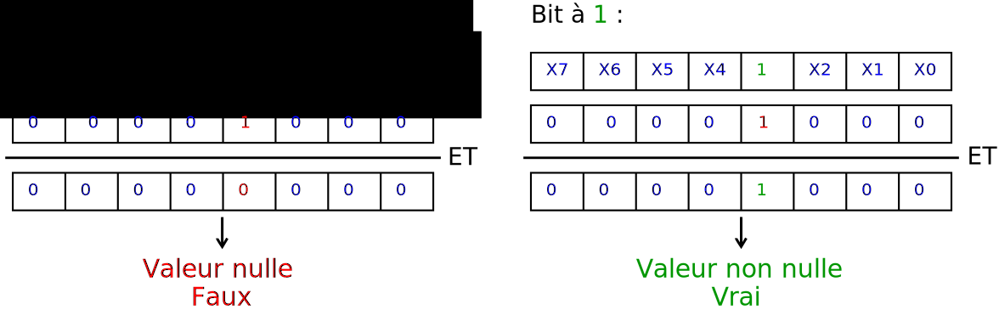

% Entrées-sorties
% [Pierre-Yves Rochat](mailto:pyr@pyr.ch), EPFL
% rév 2016/07/09

## Broches d’entrée-sorties ##

Les microcontrôleurs disposent de broches très souples d’emploi, qui peuvent être des entrées ou des sorties. On les appelle aussi parfois GPIO : _**G**eneral **P**urpose **I**nput **O**utput_. La procédure *Arduino pinMode()* permet de choisir l’usage de chaque broche. Les procédures *digitalRead()* et *digitalWrite()* permettent de lire une valeur d’entrée et d’écrire une valeur sur une sortie.

Ces procédures cachent les registres que chaque fabricant a prévus pour utiliser les broches d’entrée-sortie. Mais il est souvent utile de les connaître, pour utiliser aussi efficacement que possible les entrées-sorties. C’est en particulier le cas lorsqu’il est nécessaire d’accéder à plusieurs sorties en même temps et lorsqu’un temps minimum doit être pris pour ces opérations. Or c’est souvent le cas dans des afficheurs à LED.

## Rôles possibles d’une broche ##

Une broche peut être une entrée ou un sortie, mais regardons plus en détail chacun de ces cas. Pour une sortie, la broche peut prendre l’état *0* ou l’état *1*. Sur certains microcontrôleurs, il est même possible de préciser la *force* de cette sortie, plus précisément la résistance interne des transistors qui commandent l’état *0* et l’état *1*.

Pour une entrée, plusieurs modes sont souvent proposés :

* Entrée à haute impédance. Dans ce cas, l’entrée doit être reliée en permanence à une sortie. Mais lorsque ce n’est pas le cas, la valeur lue peut changer de manière aléatoire, à cause des charges électriques qui peuvent se présenter sur l’entrée.
* Entrée avec une résistance de tirage vers le haut : *pull-up*
* Entrée avec une résistance de tirage vers le bas : *pull-down*

Les résistances de tirage sont utilisées lorsqu’une entrée peut ne pas être relié en permanence à une sortie. C’est le cas lorsqu’un bouton poussoir est utilisé. C’est aussi le cas lorsque des entrées sont reliées à un autre dispositif par l’intermédiaire d’un connecteur, qui peut être débranché.

La figure suivante montre la nécessité d’une résistance de tirage lors de l’utilisation d’un bouton-poussoir.

{ width=80% }

Lorsque le poussoir n’est pas pressé, l’état logique *1* est assuré par une résistance reliée à l’alimentation positive. La résistance peut être externe ou interne au microcontrôleur.

## Les ports et leurs registres ##

Dans un microcontrôleur, les broches d’entrée-sortie sont toujours regroupées dans ce qu’on appelle des **ports**. Il s’agit le plus souvent de ports de 8 bits, mais ils peuvent aussi avoir 16 ou même 32 bits. Parfois, un port n’est pas complet sur un modèle donné de microcontrôleur, pour tenir compte du nombre de broches disponibles sur le boîtier utilisé.

Le nombre, les noms et la fonctionnalité des registres qui pilotent un port dans un microcontrôleur varient avec les familles de microcontrôleurs. Nous regarderons ici le cas de la famille des AVR du fabricant Atmel, dont le plus connu est l’ATmega328 utilisé sur la carte Arduino UNO. Nous verrons également le cas de la famille MSP430.

Sur les AVR, les ports s’appellent PORT A, PORT B, etc. Les 8 broches du PORT A s’appellent PA0, PA1... PA7. Trois registres sont utilisés pour piloter chaque port :

* **DDRA** _**D**ata **D**irection **R**egister_ : registre de direction. C’est le registre qui précise pour chaque broche si elle est une entée ou une sortie.
* **PORTA** : le registre de sortie. Lorsqu’une broche est mise en sortie, c’est ce registre qui précise l’état de la sortie, *0* ou *1*.
* **PINA** : indique à tout moment l’état de chaque broche. Ce n’est pas à proprement parlé un registre, vu qu’il n’est possible que de lire sa valeur.

De la même manière, DDRB, PORTB et PINB sont disponible pour le PORT  B.

Voici un tableau qui indique le rôle d’une broche en fonction des valeurs dans DDRA et dans PORTA d’un AVR :

{ width=60% }

Pour une broche donnée, nous avons quatre combinaisons binaires, qui permettent de choisir entre une entrée à haute impédance, une entrée avec résistance de tirage vers le haut, une sortie à l’état *0* et une sortie à l’état *1*.

Sur le MSP430, les ports s’appellent P1, P2, etc. Les broches sont notées P1.0, P1.1... P1.7. On utilise 4 registres pour le pilotage des entrées-sorties :

* **P1DIR** : le registre de direction. Il est équivalent au DDR des AVR.
* **P1OUT** : le registre de sortie. Il est équivalent au PORT des AVR.
* **P1REN** _**R**esistor **E**nable_ : commande l’enclenchement des résistance de tirage.
* **P1IN** : indique à tout moment l’état de chaque broche.

Voici un tableau qui indique le rôle d’une broche en fonction des valeurs des registres, pour un MSP430 :

{ width=50% }

Le MSP430 dispose donc d’une possibilité de placer une résistance de tirage vers le bas (*pull-down*). C’est la valeur du bit de P1OUT qui détermine si la résistance est vers le haut ou vers le bas.

Seules cinq combinaisons ont été décrites dans ce tableau. Les trois autres combinaisons n’ont pas lieu d’être utilisées.

## Lecture et écriture sur un port ##

Au moment du Reset, les registres DDR ou P1DIR prennent la valeur 0. En d’autre termes, une broche est par défaut une entrée. Rien de plus n’est à effectuer pour l’utiliser comme telle.

Il faudra écrire des *1* dans les bits des registres DDR ou P1DIR correspondant aux broches dont on souhaite qu’elle soient des sorties. Par exemple, l’instruction :

~~~~~~~ { .c }
P1DIR = 0B01000001;
~~~~~~~

permet de mettre les broches P1.0 et P1.6 en sortie.

Il faut noter qu’il est possible de changer à tout moment le rôle d’une broche. Si le choix du mode se fait souvent au début du programme, il existe des cas où le rôle d’une broche change au cours du temps.

Il est possible de connaître la valeur sur les 8 broches d’un port, en lisant PINA sur un AVR ou P1IN sur un MSP430. Cette lecture est possible indépendamment du rôle assigné aux broches, entrées ou sorties. L’instruction :

~~~~~~~ { .c }
variable = P1IN;
~~~~~~~

permet de prendre connaissance des valeurs des 8 broches de P1.

L’instruction :

~~~~~~~ { .c }
P1OUT = valeur;
~~~~~~~

permet de placer une valeur binaire dans chacune des huit broches du port P1. Une seule instruction est nécessaire. L’usage de huit digitalWrite() prendrait davantage de place en mémoire, mais surtout un temps beaucoup long !

Mais comment effectuer une écriture ou une lecture sur une seule broche d’un port, ou encore sur une partie des broches d’un port ? Les opérateurs logiques du langage C permettent de faire facilement ces opérations. 

## Opérations logiques ##

Nous allons avoir besoin de trois opérateurs :

* Le **OU** logique. L’opérateur se note  **|**. Il prend comme opérandes deux valeurs binaires de 8, 16 ou 32 bits. L’opération OU s’effectue entre chacun des bits de même rang des deux opérateurs.
* Le **ET** logique. L’opérateur se note **&**. Il s’applique également entre deux valeurs binaires de 8, 16 ou 32 bits.
* L’**inversion** logique. L’opérateur se note **~**. Il s’applique à une valeur binaire de 8, 16 ou 32 bits. Chaque bit est inversé : *0* devient *1* et *1* devient *0*.

Il ne faut pas confondre les opérateurs |, & et ~ avec les opérateurs || (opérateur ou), && (opérateur et) et ! (opérateur d’inversion), qui agissent non pas sur chacun des bits des opérandes, mais sur des opérandes considérés comme une seule valeur booléenne : fausse (si la valeur est nulle) ou vraie (si le valeur est non nulle).

## Mise à *1* de bits ##

L’opération de mise à *1* d’un ou de plusieurs bits dans un registre s’effectue avec l’opérateur OU. Par exemple, l’instruction :

~~~~~~~ { .c }
P1OUT |= 0b01000000;
~~~~~~~

va mettre à un le bit de rang 6 dans le registre P1OUT. La figure suivante l’explique : 

{ width=60% }

L’opération peut agir sur plusieurs bits. Par exemple, l’instruction :

~~~~~~~ { .c }
P1OUT |= 0b01000001;
~~~~~~~

va mettre les broches P1.0 et P1.6 à *1*, sans toucher les autres bits.

## Mise à *0* de bits ##

C’est l’opérateur ET qui va permettre la mise à *0* d’un ou de plusieurs bits dans un registre. Par exemple, l’instruction :

~~~~~~~ { .c }
P1OUT &= 0b10111111;
~~~~~~~

va mettre à *1* le bit de rang 6 dans le registre P1OUT. La figure suivante l’explique : 

{ width=60% }

Il est possible aussi d’agir sur plusieurs bits :

~~~~~~~ { .c }
P1OUT &= 0b10111110;
~~~~~~~

met à *0* P1.0 et P1.6, sans toucher les autres bits.

## Test de bits ##

Le test d’un bit peut se faire avec l’opérateur ET. Par exemple, pour tester la valeur du bit de rang 3, l’opération :

~~~~~~~ { .c }
P1IN & 0b00001000
~~~~~~~

va rendre une valeur nulle si le bit 3 est à *0* et une valeur non nulle si le bit est à *1*, comme le montre la figure suivante :

{ width=110% }

Comme le C considère une valeur nulle comme fausse et un valeur non nulle comme vraie, l’instruction :

~~~~~~~ { .c }
if (P1IN & 0b00001000)
~~~~~~~

va bien tester si le bit de rang 3 est à 1.

Pour tester si un bit a une valeur nulle, on peut par exemple inverser logiquement le test précédent par l’opérateur *!*  :

~~~~~~~ { .c }
if (!(P1IN & 0b00001000))
~~~~~~~

## Optimisation par les compilateurs ##

Les compilateurs savent utiliser de manière astucieuse les instructions spécifiques des microcontrôleurs. Par exemple, l’instruction de mise à *1* d’un bit unique dans un registre se fera avec un AVR avec l’instruction spécifique *SetBit*. Mais s’il faut agir sur plusieurs bits, une opération OU sera utilisée.

Par contre, sur un MSP430 qui dispose d’une instruction spécifique pour le OU sur plusieurs bits (*multiple SetBit*), c’est systématiquement cette instruction qui sera utilisé par le compilateur.

## Écriture plus lisibles des constantes ##

Écrire les constantes sous forme décimale ne fait pas apparaître facilement les bits concernés dans une opération sur champs de bits. Les notations hexadécimales et binaires sont un peu plus claires. Mais il est plus lisible de composer les valeurs binaires au moyen de l’opérateur de décalage vers la gauche **<<**. Ainsi les quatre notations suivantes sont équivalentes et le compilateur produit le même code pour chacune d’entre elles :

~~~~~~~ { .c }
* P1OUT |= 64; // valeur en décimal
* P1OUT |= 0x40; // valeur en hexadécimal
* P1OUT |= 0b01000000; // valeur en binaire
* P1OUT |= (1<<6); // valeur construite avec l’opérateur de décalage
~~~~~~~
<!-- retour au mode normal pour l’éditeur -->

Mais la dernière écriture est la seule qui met clairement en évidence que c’est le seul bit de rang 6 qui est à *1*.

Pour l’opération de mise à zéro d’un bit, l’opérateur d’inversion **~** va rendre service. Par exemple, la constante 0b10111111 peut être notée comme ~0b01000000. Ce qui permet la syntaxe suivante :

~~~~~~~ { .c }
P1OUT &=~(1<<6);
~~~~~~~

<!-- retour au mode normal pour l’éditeur -->

On pourra se souvenir que :

* **|=** est l’opération de mise à *1* d’un bit (*Set bit* en anglais).
* **&=~** est l’opération de mise à *0* d’un bit (*Clear bit* en anglais).

Exemples :

~~~~~~~ { .c }
P1OUT |= (1<<6); // set bit
P1OUT &=~(1<<6);  // clear bit
~~~~~~~

## Propriété de l’opérateur OU-exclusif ##

En plus des opérateurs OU, ET et l’inversion, l’opérateur OU-exclusif est aussi disponible en C, noté par **^**. Il permet de réaliser le changement de valeur sur une partie des bits d’un champ de bit. Par exemple, l’instruction :

~~~~~~~ { .c }
P1OUT ^= (1<<6);
~~~~~~~

inverse l’état de la broche P1.6 : si elle était à *0*, elle passera à *1*, si elle était à *1*, elle passera à *0*. Le terme anglais *toggle* est souvent utilisé.
<!-- retour au mode normal pour l’éditeur -->

## Utilisation du #define ##

Pour rendre encore plus lisible un programme, on utilisera très souvent la définition de constantes en C par un _**#define**_. Il s’agit plus exactement d’un ordre de traduction donné au pré-compilateur.

Voici quelques exemples :

~~~~~~~ { .c }
#define ClockSet P1OUT |= (1<<5) // active le bit de rang 5, utilisé pour une horloge
#define ClockClear P1OUT &=~(1<<5) // désactive l’horloge

#define Led0On P1OUT |= (1<<0) // allume la LED0
#define Led0Off P1OUT &=~(1<<0) // éteint la LED0
#define Led0Toggle P1OUT ^= (1<<0) // inverse l’état de la LED0
~~~~~~~

