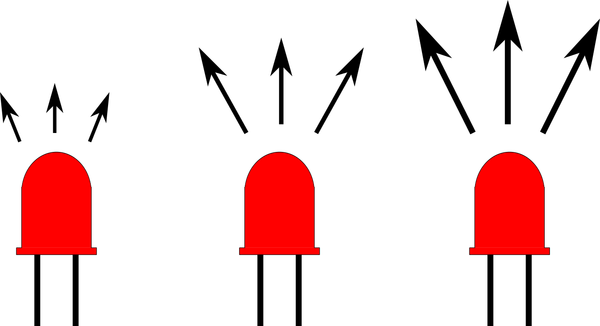
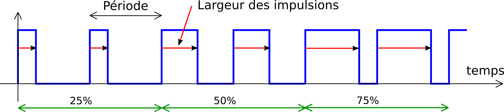
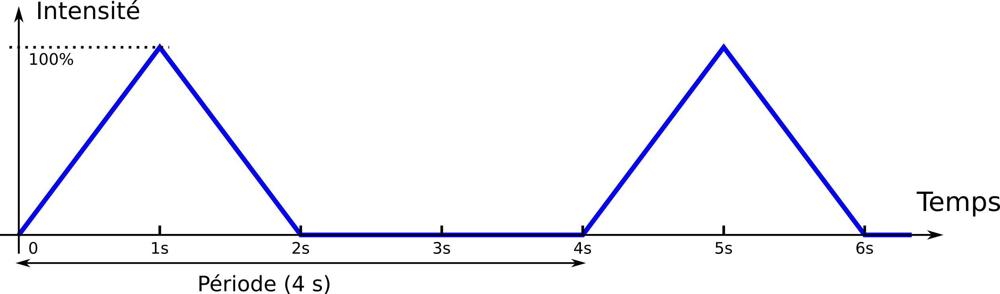
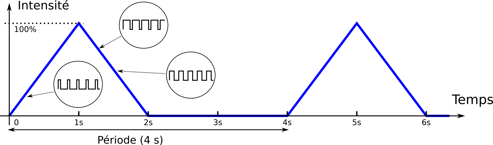
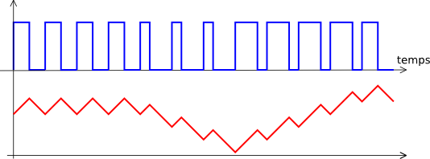
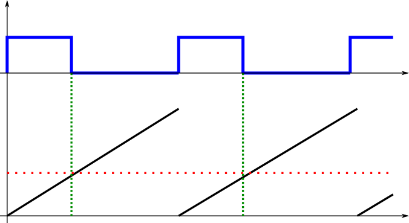
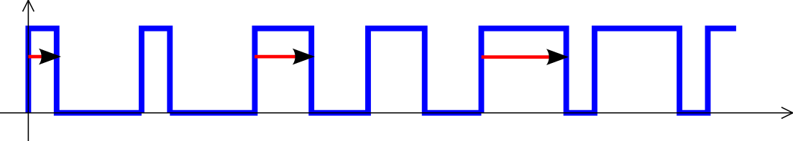

<!-- DIAPORAMA -->

<!-- Page de titre -->
<section class="page_de_garde">

Enseignes et afficheurs à LED

PWM : Modulation de Largeur d’Impulsion

Pierre-Yves Rochat

</section>

<!-- Page bienvenue plein écran-->
<section>
<!-- def A -->
<!-- def A -->
<!-- def A -->

<!-- def A -->**Enseignes et afficheurs à LED** |  PWM
<!-- def A -->

<!-- A -->
<h1 class="en_tete">PWM : Modulation de Largeur d’Impulsion</h1>

Pierre-Yves Rochat

</section>

<!-- Page bienvenue, demi-->
<section>
<!-- A -->
<h1 class="en_tete">PWM : Modulation de Largeur d’Impulsion</h1>

* Principe
* Fréquence
* Programmer un PWM
* Convertisseur numérique-analogique
* Réalisation par des circuits logiques

</section>

<!-- Page variation, 3 arrivées -->
<section>
<!-- A -->
<h1 class="en_tete">Intensité variable</h1>

Comment faire varier l’intensité d’une LED ?

</section>

<section>
<!-- A -->
<h1 class="en_tete">Intensité variable</h1>

Comment faire varier l’intensité d’une LED ?

</section>

<!-- Page pleine-->
<section>
<!-- A -->
<h1 class="en_tete">Autre solution ?</h1>
</section>

<!-- Page clignotement, 2 arrivées -->
<section>
<!-- A -->
<h1 class="en_tete">Intensité variable</h1>

Clignotement

<!-- 2 -->
<!-- 2 -->

<!-- 2 -->... plus rapide
<!-- 2 -->

</section>

<!-- Page : principe -->
<section>
<!-- A -->
<h1 class="en_tete">PWM : principe</h1>

<!-- 2 -->

<!-- 2 -->_**P**ulse **W**idth **M**odulation_ = Modulation de Largeur d’Impulsion
<!-- 2 -->

</section>

<!-- Page fréquences, 4 arrivées -->
<section>
<!-- A -->
<h1 class="en_tete">Quelle fréquence ?</h1>

* Selon les applications du PWM, les fréquences sont très différentes, de quelques Hz à des dizaines de MHz.

<!-- 2345 -->

<!-- 2345 -->Pour des applications visuelles :
<!-- 2345 -->
<!-- 345 -->* L’œil a une fréquence limite de perception du clignotement
<!-- 45 -->* On ne voit pas clignoter un tube fluorescent, à 100 Hz (2 x 50 Hz)
<!-- 5 -->* Les cônes et les bâtonnets n’ont pas la même fréquence limite
<!-- 2345 -->

</section>

<!-- Page programmation, demi, 3 arrivées -->
<section>
<!-- A -->
<h1 class="en_tete">Programmation d’un signal PWM</h1>

Comment programmer des signaux PWM avec un microcontrôleur ?

<!-- 234 -->

<!-- 234 -->* Allumer – attendre
<!-- 34 -->* éteindre – attendre
<!-- 234 -->

<!-- 4 -->

<!-- 4 -->* et répéter !
<!-- 4 -->

</section>

<!-- Page programme par période -->
<section>
<!-- A -->
<h1 class="en_tete";>Programmation par période</h1>

~~~~~~~~~~~~~~~~~~~~~~~~~~~~~~~~~~~~~~~~~~~~~~~~~~~~~~~ {.C  .numberLines}
#define LedOn digitalWrite(P1_0, 1)
#define LedOff digitalWrite(P1_0, 0)
uint16_t pwmLed; // valeur du PWM, 0 à 100

void setup() { // Initialisations
  pinMode(P1_0, OUTPUT); // LED en sortie
  pwmLed = 25; // valeur du PWM.
}

void loop() { // Boucle infinie, durée 10ms => un cycle du PWM à 100 Hz
  LedOn;
  delayMicrosecond(100*pwmLed); // durée de l'impulsion
  LedOff;
  delayMicrosecond(100*(100-pwmLed); // solde de la période
}
~~~~~~~~~~~~~~~~~~~~~~~~~~~~~~~~~~~~~~~~~~~~~~~~~~~~~~~~~~~~~~~~~~~~~~~~~~~~

</section>

<!-- Page plusieurs PWM, 3 arrivées -->
<section>
<!-- A -->
<h1 class="en_tete">Programmer plusieurs PWM</h1>

Comment programmer plusieurs signaux PWM en même temps ?

<!-- 23 -->* Difficile si la boucle principale dure une période complète du PWM
<!-- 3 -->* Plus facile si la boucle principale dure le temps de la plus courte impulsion possible du PWM

</section>

<!-- Page programme plusieurs PWM -->
<section>
<!-- A -->
<h1 class="en_tete";>Programmer plusieurs PW</h1>

~~~~~~~~~~~~~~~~~~~~~~~~~~~~~~~~~~~~~~~~~~~~~~~~~~~~~~~ {.C  .numberLines}
uint8_t pwmLed; // valeur du PWM, 0 à 255 (8 bits)
uint8_t cptPwm; // compteur du PWM

void setup() { // Initialisations
  pinMode(P1_0, OUTPUT); // LED en sortie
  pwmLed = 64; // valeur du PWM. Elle est ici fixe, mais pourrait changer
               // à tout moment en complétant le programme.
  cptPwm = 0; // compteur du PWM
}

void loop() { // Boucle infinie, durée 39us (256 * 39us = ~10ms)
  if ((cptPwm==0) && (pwmLed>0)) LedOn; // seulement pour une valeur positive
  if (cptPwm==pwmLed) LedOff;

  cptPwm++; // passe automatiquement de 255 à 0 (overflow)
  delayMicroseconds(39);
}
~~~~~~~~~~~~~~~~~~~~~~~~~~~~~~~~~~~~~~~~~~~~~~~~~~~~~~~~~~~~~~~~~~~~~~~~~~~

</section>

<!-- Page séquences, demi, 3 arrivées -->
<section>
<!-- A -->
<h1 class="en_tete">Séquences en PWM</h1>

* Comment utiliser ce PWM ?
<!-- 23 -->* Sur des enseignes et afficheurs, on peut créer des séquences.

<!-- 3 -->

<!-- 3 -->* Exemple : LED imitant le repos.
<!-- 3 -->

</section>

<!-- Page séquences, 3 grandes imagess -->
<section>
<!-- A -->
<h1 class="en_tete">Séquences en PWM</h1>

<!-- 2 -->
<!-- 3 -->

**Enseignes et afficheurs à LED** |  PWM

</section>

<!-- Page séquence PWM -->
<section>
<!-- A -->
<h1 class="en_tete";>Séquences en PWM</h1>

~~~~~~~~~~~~~~~~~~~~~~~~~~~~~~~~~~~~~~~~~~~~~~~~~~~~~~~ {.C  .numberLines}
uint16_t pwmLed; // valeur du PWM, 0 à 255 (8 bits,16 bits pour les calculs)
uint16_t cpt10ms = 0; // compteur des cycles, de 0 à 400 (par 10ms, total 4s)
void loop() { // Boucle infinie, durée 39us (256 * 39us = ~10ms)
  if (cptPwm==0) {
    cpt10ms++;
    if (cpt10ms<100) { //première seconde
      pwmLed = cpt10ms * 256 / 100; // droite montante
    } else if (cpt10ms<200) { // deuxième seconde
      pwmLed = 256 - ((cpt10ms-100) * 256 / 100); // droite descendante
    } else {
      pwmLed = 0;
      if ( cpt10ms==400) cpt10ms = 0; // fin des 4 secondes
    }
  }
  if ((cptPwm==0) && (pwmLed>0)) LedOn; // LED allumée si la valeur est positive
  if (cptPwm==pwmLed) LedOff;
  cptPwm++; // passe automatiquement de 255 à 0 (overflow)
  delayMicroseconds(39);
}
~~~~~~~~~~~~~~~~~~~~~~~~~~~~~~~~~~~~~~~~~~~~~~~~~~~~~~~~~~~~~~~~~~~~~~~~~~~

</section>

<!-- Page pleine ADC-->
<section>
<!-- A -->
<h1 class="en_tete">Convertisseur numérique-analogique en PWM</h1>

* Transmettre une information variable vers l’extérieur

<!-- 2 -->

<!-- 2 -->* Conversion Numérique-Analogique DAC  Digital to Analog Converter
<!-- 2 -->

</section>

<section>
<!-- A -->
<h1 class="en_tete">Convertisseur numérique-analogique en PWM</h1>

</section>

<!-- Page logique, demi, 2 arrivées -->
<section>
<h1 class="en_tete">PWM réalisé avec des circuits logiques</h1>

* Comment soulager le microcontrôleur de la génération du PWM ?

<!-- 2 -->

<!-- 2 -->* En utilisant des circuits logiques spécialisés !
<!-- 2 -->

</section>

<!-- Timer, 2 arrivées images -->
<section>
<!-- A -->
<h1 class="en_tete">PWM réalisé avec des circuits logiques</h1>

<!-- 2 -->
</section>

<!-- Page pleine Timer uC, petite image -->
<section>
<!-- A -->
<h1 class="en_tete">C’est le Timer d’un microcontrôleur</h1>

</section>

<!-- Page conclusion, demi-->
<section>
<!-- A -->
<h1 class="en_tete">PWM : Modulation de Largeur d’Impulsion</h1>

* Principe :
* Fréquence :    > 100 Hz pour l’oeil
* Programmer un PWM (occupe le proc.)
* Convertisseur DAC (+ filtre)
* Réalisation par des circuits logiques, inclus dans les microcontrôleurs

</section>

