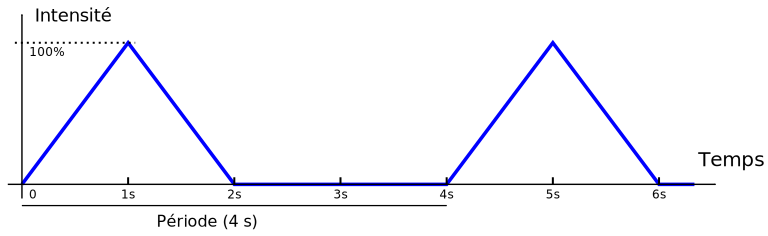
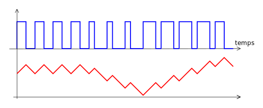

**PWM : Modulation de Largeur d’Impulsion**
===========================================

## [Pierre-Yves Rochat](mailto:pyr@pyr.ch), EPFL

> Document en cours de relecture, version du 2015/07/19

## Varier l’intensité d’une LED ##

Beaucoup d’enseignes à LED se contentent d’allumer et d’éteindre des LED ou des groupes de LED. On pourrait obtenir des effets beaucoup plus intéressants et variés en ayant la possibilité de changer leurs intensités lumineuses.

Comment faire varier l’intensité d’une LED ? On sait que c’est le courant qui la traverse qui produit de la lumière. Faire varier ce courant n’est généralement pas facile. On peut faire varier la tension qui alimente la LED, ou encore la résistance qui limite son courant. Il est aussi possible de  piloter le courant par un transistor, avec un montage adéquat.

Mais il existe une solution très différente et généralement beaucoup plus simple à implémenter. Souvenons-nous du clignotement d’une LED. Que se passe-t-il lorsqu’on augmente la fréquence du clignotement ? À partir d’une certaine fréquence, notre œil commence à ne plus voir qu’un scintillement. En augmentant encore la fréquence, il voit simplement la LED allumée, mais avec une intensité plus faible que si elle était allumée en permanence.

## Le PWM ##

À l’idée de faire clignoter rapidement la LED, ajoutons l’idée de faire varier le temps pendant lequel elle est allumée. On obtient alors la Modulation de Largeur d’Impulsion (MLI) ou Pulse Width Modulation (PWM) en anglais. Regardons la figure suivante :

Le signal a une période constante (donc une fréquence constante). La durée de la partie active du signal varie. Dans la première partie du tracé, 25% de la puissance disponible peut être envoyée à la charge, vu que le signal est à *1* durant 25% du temps alors qu’il est à *0* le reste du temps. De même, la puissance passe à 50% au milieu du tracé et à 75% dans la dernière partie. Il est aussi possible de n’envoyer aucune puissance (0%) en laissant la sortie à *0*, ou toute la puissance (100%) en laissant la sortie à *1*.

Le rapport entre la durée de la partie active du signal et la durée de la période s’appelle le **rapport cyclique** (en anglais *duty cycle*).

## Fréquence du PWM ##

L’usage du PWM est très répandu, avec des applications dans beaucoup de domaines. La commande de moteurs s’effectue très souvent par PWM. Dans ce cas, c’est la nature inductive du moteur qui effectue l’intégration du signal, ainsi que l’inertie mécanique du système.

Dans le cas de la commande de diodes lumineuses, le temps d’allumage et d’extinction est très court. La LED continue à "clignoter" jusqu’à plusieurs dizaines de mégahertz. C’est l’œil humain qui ne voit pas le clignotement. L’œil a une fréquence de perception maximale située vers 75 Hz. C’est bien lui qui effectue l’intégration du signal pour en percevoir une valeur moyenne.

Dans divers domaines de l’électronique, les fréquences des signaux PWM peuvent aller couramment jusqu’à des dizaines de mégahertz. Mais plus la fréquence est élevée, plus les pertes électriques à l’instant des changements de valeurs sont importantes et peuvent conduire à une dissipation importante d’énergie dans les éléments de commutation.

L’œil a une fréquence limite de perception du clignotement. Par exemple, on sait qu’un tube fluorescent (Néon) clignote à 100 Hz, vu qu’il est commandé par du courant alternatif à 50 Hz, et que chaque période a une alternance positive et une alternance négative. Les cellules sensibles de notre œil (les cônes pour la vision en couleur et les batonnets pour la vision périphérique et à faible intensité) n’ont pas la même limite de perception du clignotement.

Pour les enseignes et afficheurs à LED, on vise généralement de fréquences de l’ordre de 100 à 200 Hz. Il’est déjà souvent extrêmement difficile d’envoyer à ces fréquences toutes les informations à l’ensemble des LED, qui peuvent être très nombreuses. Par exemple, les murs de LED capables d’afficher de la vidéo nécessitent des circuits électroniques complexes, qui seront étudiés plus tard dans ce cours.

## Programmation d’un PWM ##

Voici un programme très simple qui génère un signal PWM sur une sortie d’un microcontrôleur :

~~~~~~~ { .c .numberLines startFrom="1" }
#define LedOn digitalWrite(P1_0, 1)
#define LedOff digitalWrite(P1_0, 0)

uint16_t pwmLed; // valeur du PWM, 0 à 100

void setup() { // Initialisations
  pinMode(P1_0, OUTPUT); // LED en sortie
  pwmLed = 25; // valeur du PWM.
}

void loop() { // Boucle infinie, durée 10ms => un cycle du PWM à 100 Hz
  LedOn;
  delayMicrosecond(100*pwmLed); // durée de l'impulsion
  LedOff;
  delayMicrosecond(100*(100-pwmLed)); // solde de la période
}
~~~~~~~
<!-- retour au mode normal pour l'éditeur -->

Le programme a été écrit de telle manière que les valeurs du PWM doivent être choisies entre 0 et 100, elles représentent donc dans ce cas des _pour cents_. Les informaticiens choisissent plus souvent des valeurs dans une plage binaire, comme par exemple de 0 à 255 (8 bits, voir l’exemple suivant).

La fréquence a été choisie ici à 100 Hz. En effet les deux délais de la boucle principale totalisent 100 * 100 us, donc 10 ms.

Après les initialisations de la sortie et de la variable qui contient en permanence la valeur du PWM, la boucle infinie alterne la partie active et la partie inactive du signal. Les attentes sont obtenues par des délais exprimés en us.

Ce programme donne l’impression que la diode lumineuse est à demi intensité, malgré une commande à 25 %. C’est lié au fait que la réponse de l’œil n’est pas linéaire, mais logarithmique. On remarque aussi que le PWM est visible en déplaçant rapidement la diode devant l’œil.

## Génération de plusieurs signaux PWM ##

Le principe du programme que nous venons de voir ne convient pas à la programmation de PWM sur plusieurs sortie. Voici une manière de programmer un PWM qui se prête à gérer plusieurs sorties :

~~~~~~~ { .c .numberLines startFrom="1" }
uint8_t pwmLed; // valeur du PWM, 0 à 255 (8 bits)
uint8_t cptPwm; // compteur du PWM

void setup() { // Initialisations
  pinMode(P1_0, OUTPUT); // LED en sortie
  pwmLed = 64; // valeur du PWM. Elle est ici fixe, mais pourrait changer
               // à tout moment en complétant le programme.
  cptPwm = 0; // compteur du PWM
}

void loop() { // Boucle infinie, durée 39us (256 * 39us = ~10ms)
  if ((cptPwm==0) && (pwmLed>0)) LedOn; // seulement pour une valeur positive
  if (cptPwm==pwmLed) LedOff;

  cptPwm++; // passe automatiquement de 255 à 0 (overflow)
  delayMicroseconds(39);
}
~~~~~~~
<!-- retour au mode normal pour l'éditeur -->

Dans ce cas, la boucle principale dure seulement le temps qui correspond à une fraction de la période du PWM, ici un 256e de la période. L’usage de cette valeur, associée à un compteur de type uint8_t (8 bits non signés), simplifie le programme, en évitant de gérer le retour à zéro, qui s’effectue au moment du dépassement de capacité (overflow).

Voici comment modifier ce programme pour qu’il commande 8 LED, avec 8 valeurs différentes de PWM :

~~~~~~~ { .c .numberLines startFrom="1" }
uint8_t pwmLed[8]; // valeurs des PWM, 0 à 255 (8 bits), pour 8 LED
uint8_t cptPwm; // compteur du PWM

void setup() ...

void LedOn (uint8_t n) ... procédure qui allume une des 8 LED
void LedOff (uint8_t n) ... procédure qui éteint une des 8 LED

void loop() { // Boucle infinie
  for (uint8_t i=0; i<8; i++) {
    if ((cptPwm==0) && (pwmLed[i]>0)) LedOn(i); // allume la LED concernée
    if (cptPwm==pwmLed[i]) LedOff(i); // éteint la LED correspondante
  }

  cptPwm++; // passe automatiquement de 255 à 0 (overflow)
  delayMicrosecond(39); // on pourrait diminuer cette valeur
  // pour tenir compte du temps d'exécution de la boucle for.
}
~~~~~~~
<!-- retour au mode normal pour l'éditeur -->

## Programmation d’une séquence en PWM ##

Dans des applications comme la gestion des moteurs d’un robot mobile, les valeurs du PWM sont calculées à chaque cycle, en fonction des valeurs des capteurs (capteurs de distance, caméras, etc.)

Dans le cas des enseignes et afficheurs à LED, les valeurs sont calculées en fonction du temps qui passe, pour former des séquences. Comment connaître le temps qui s’écoule ? Une des manières consiste simplement à compter les cycles du PWM, qui ont une durée constante.

Prenons un exemple. Pour donner l’impression qu’un appareil est en mode "repos", une LED va avoir son intensité qui varie de la manière suivante :

La séquence est cyclique et dure 4 s. Il imite la respiration d’une personne qui dort. Durant la première seconde, l’intensité augmente jusqu’au maximum. Durant la deuxième seconde, elle diminue jusqu’à zéro, valeur qui reste jusqu’à la fin du cycle.

La courbe se divise en 3 parties. Il est facile d’exprimer l’intensité en fonction du temps dans chacune des parties. Voici comment compléter le programme :

~~~~~~~ { .c .numberLines startFrom="1" }
uint16_t pwmLed; // valeur du PWM, 0 à 255 (8 bits, dans une variable 16 bits pour les calculs)
uint16_t cpt10ms = 0; // compteur des cycles, de 0 à 400 (par 10ms, total 4s)
...
void loop() { // Boucle infinie, durée 39us (256 * 39us = ~10ms)
  if (cptPwm==0) {
    cpt10ms++;
    if (cpt10ms<100) { //première seconde
      pwmLed = cpt10ms * 256 / 100; // droite montante
    } else if (cpt10ms<200) { // deuxième seconde
      pwmLed = 256 - ((cpt10ms-100) * 256 / 100); // droite descendante
    } else {
      pwmLed = 0;
      if ( cpt10ms==400) cpt10ms = 0; // fin des 4 s
    }
  }

  if ((cptPwm==0) && (pwmLed>0)) LedOn; // allume la LED seulement pour une valeur positive
  if (cptPwm==pwmLed) LedOff;

  cptPwm++; // passe automatiquement de 255 à 0 (overflow)
  delayMicroseconds(39);
}
~~~~~~~
<!-- retour au mode normal pour l'éditeur -->

Il est important de contrôler que les variables utilisées ne produisent pas de dépassement de capacité pour les calculs effectués. La variable `pwmLed` a été choisie ici sur 16 bits. Pour la première droite, `cpt10ms` peut aller jusqu’à *99*. Multiplié par *256*, on obtient un nombre inférieur à *65’535* (qui est le nombre maximum que peut représenter un nombre entier de 16 bits). Le contrôle doit être fait pour tous les cas.

## Convertisseur DAC simple ##

Bien que le signal PWM soit un signal binaire (il est soit à *0* soit à *1* à un instant donné), il est porteur d’une valeur analogique. Il suffit en effet de faire l’intégrale du signal pour s’en rendre compte. Il faut pondérer le *1* logique comme la valeur +1 et le *0* logique comme la valeur -1, comme le montre la figure suivante :

Il est donc possible de réaliser un convertisseur numérique-analogique (Digital to Analog Converter, DAC) basé sur un signal PWM. Il doit être suivi par un filtre passe-bas adapté à la fréquence du PWM. Ce filtre peut être un simple filtre R-C.

## Circuits spécialisés ##

Comment générer un signal en PWM avec des circuits logiques ? Il faut utiliser un compteur, piloté par une horloge de fréquence fixe. Un détecteur de 0 permet de signaler le début du cycle. Un comparateur, connecté à un registre qui contient la valeur du PWM, permet de détecter la fin de l’impulsion. Une bascule *Set-Reset* génère le signal.

Les microcontrôleurs contiennent des circuits logiques supplémentaires ressemblant beaucoup à ce schéma. On les appelle des *Timers*. Complétés de circuits logiques dédiés, ils peuvent générer du PWM sans autre programmation que l’initialisation des registres de contrôle qui leur sont associés. Nous en parlerons plus tard dans ce cours.

