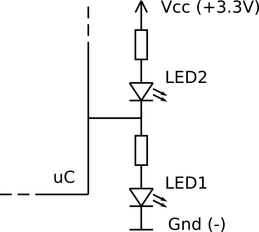
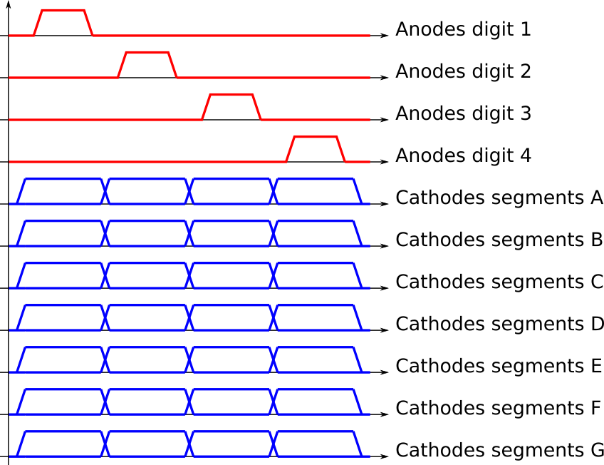

<!-- DIAPORAMA -->

<!-- Page de titre -->
<section class="page_de_garde">

Enseignes et afficheurs à LED

Multiplexage temporel

Pierre-Yves Rochat

</section>

<!-- Page bienvenue plein écran-->
<section>
<h1 class="en_tete">Multiplexage temporel</h1>
<!-- def A -->
<!-- def A -->
<!-- def A -->

<!-- def A -->**Enseignes et afficheurs à LED** | Multiplexage temporel
<!-- def A -->

<!-- A -->

Pierre-Yves Rochat

</section>

<!-- Page bienvenue demi-->
<section>
<!-- A -->
<h1 class="en_tete">Multiplexage temporel</h1>

 >
Étude du multiplexage temporel
à partir de 3 exemples simples :

* Deux LED commandées par  une seule broche
* Charlieplexing
* Afficheurs 7 segments

</section>

<!-- Page : 2 led 1 broche, 5 arrivées-->
<section>
<!-- A -->
<h1 class="en_tete">Commander 2 LED avec 1 broche</h1>

<!-- 2345 -->* Allumer LED1
<!-- 345 -->* Allumer LED2
<!-- 45 -->* Éteindre LED1 et LED2
<!-- 5 -->* Allumer _alternativement_ LED1 et LED2 !

</section>

<!-- Page : 2 led 1 broche, programme, def + 2 arrivées -->
<section>
<!-- A -->
<h1 class="en_tete">Commander 2 LED avec 1 broche</h1>

~~~~~~~~~~~~~~~~~~~~~~~~~~~~~~~~~~~~~~~~~~~~~~~~~~~~~~~ {.C  .numberLines}
 #define SORTIE_1 pinMode(P1_4, OUTPUT); digitalWrite(P1_4, 1)
 #define SORTIE_0 pinMode(P1_4, OUTPUT); digitalWrite(P1_4, 0)
 #define SORTIE_HI_Z pinMode(P1_4, INPUT)

~~~~~~~~~~~~~~~~~~~~~~~~~~~~~~~~~~~~~~~~~~~~~~~~~~~~~~~~~~~~~~~~~~~~~~~~~~~~

</section>

<section>
<!-- A -->
<h1 class="en_tete">Commander 2 LED avec 1 broche</h1>

~~~~~~~~~~~~~~~~~~~~~~~~~~~~~~~~~~~~~~~~~~~~~~~~~~~~~~~ {.C .numberLines startFrom="4"}
void loop() {
  uint8_t i;
  SORTIE_HI_Z ; delay (1000); // LED1 et 2 éteintes pendant 1s
  SORTIE_1 ; delay (1000); // LED1 allumée pendant 1s
  SORTIE_0 ; delay (1000); // LED2 allumée pendant 1s

  for (i=0; i<250; i++) { // 250 x 4ms = 1 s
    SORTIE_1; delay (2); // LED1 allumée
    SORTIE_0; delay (2); // LED2 allumée
  }
}
~~~~~~~~~~~~~~~~~~~~~~~~~~~~~~~~~~~~~~~~~~~~~~~~~~~~~~~~~~~~~~~~~~~~~~~~~~~~

<!-- 2 -->
←  *intensité plus faible*

</section>

<!-- Page demi, 3 arrivées -->
<section>
<!-- A -->
<h1 class="en_tete">Commander 2 LED avec 1 broche</h1>

 >
* Utile ?
<!-- 234 -->* Sauver un projet où il manque une broche...
<!-- 34 -->* Petits microcontrôleurs  (PIC, AVR, …)
<!-- 4 -->* ATtiny85

</section>

<!-- Page Charlieplexing, plein écran + -->
<section>
<!-- A -->
<h1 class="en_tete">Charlieplexing</h1>

<!-- 23 -->

<!-- 23 -->__Charlie Allen__ de la société Maxim Integrated
<!-- 23 -->

<!-- 3 -->

<!-- 3 -->* Anode à 1
<!-- 3 -->* Cathode à 0
<!-- 3 -->* Autre broche en entrée
<!-- 3 -->

</section>

<!-- Page Charlieplexing, 2 arrivées -->
<section>
<!-- A -->
<h1 class="en_tete">Charlieplexing</h1>

* Anode à 1
* Cathode à 0
* Autre broche en entrée

<!-- 2 -->

<!-- 2 -->* **Multiplexage temporel**
<!-- 2 -->* 1 / 6 du temps
<!-- 2 -->* 1 / 6 de l’intensité lumineuse
<!-- 2 -->

</section>

<!-- Page Timing, grand -->
<section>
<!-- A -->
<h1 class="en_tete">Charlieplexing</h1>

* Multiplexage temporel
* 1 / 6 du temps
* 1 / 6 de l’intensité lumineuse

</section>

<!-- Page Timing, demi -->
<section>
<!-- A -->
<h1 class="en_tete">Charlieplexing</h1>

</section>

<!-- Page 7 segments, plein écran + 2 arrivées -->
<section>
<!-- A -->
<h1 class="en_tete">Afficheurs à 7 segments</h1>
<!-- 234 -->
<!-- 34 -->

<!-- 34 -->* Anodes communes
<!-- 4 -->* __*ou*__ cathodes communes
<!-- 34 -->

</section>

<!-- Page 7 segments mux -->
<section>
<!-- A -->
<h1 class="en_tete">Afficheurs à 7 segments multiplexés</h1>

* Anodes communes
* __*ou*__ cathodes communes
* 1 ou plusieurs digits

</section>

<!-- Page 7 segments mux, timing -->
<section>
<!-- A -->
<h1 class="en_tete">Afficheurs à 7 segments multiplexés</h1>

</section>

<!-- Page 7 segments mux, schéma -->
<section>
<!-- A -->
<h1 class="en_tete">Afficheurs à 7 segments multiplexés</h1>

</section>

<!-- Page conclusion demi, 2 arrivées-->
<section>
<!-- A -->
<h1 class="en_tete">Multiplexage temporel</h1>

* 2 LED commandées par une broche
* Charlieplexing
* Afficheurs 7 segments

<!-- 2 -->

<!-- 2 -->* … dans le but de comprendre le principe du **multiplexage temporel**, qui sera utilisé intensivement sur les afficheurs matriciels à LED.
<!-- 2 -->

</section>

