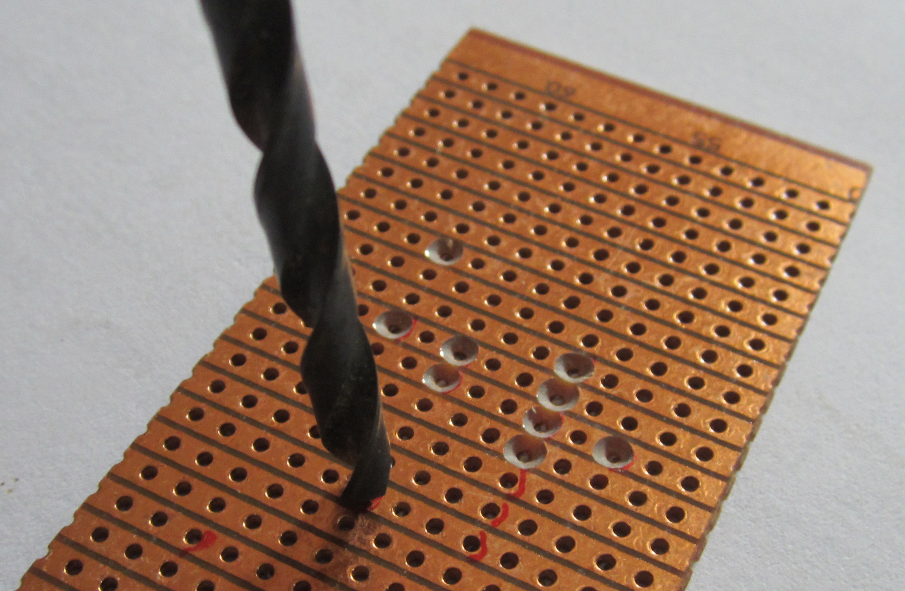

**Réalisation de cartes électroniques**
===========================================

## [Pierre-Yves Rochat](mailto:pyr@pyr.ch), EPFL

> Document en cours de relecture, version du 2016/071/19

## Montages définitifs ##

Les montages électroniques sur plaques d’expérimentation (*Breadboard*) sont utiles pour l’expérimentation. Ils sont un bon moyen pour apprendre l’électronique. Mais ces montages sont éphémères et ne conviennent pas à une réalisation qu’on souhaite conserver.

De nos jours, beaucoup de montages déjà réalisés sont proposés aux amateurs, à commencer par les cartes Arduino. Il est possible de réaliser des enseignes ou des afficheurs à LED en assemblant des modules trouvés sur Internet.

Mais nous souhaitons aller plus loin et être capable de concevoir et réaliser nous-même des cartes électroniques. C’est le sujet de cette leçon.

## Circuits imprimés ##

La technique universellement utilisée pour assembler des composants électroniques est celle des **circuits imprimés** (*Printed Circuit Board*, *PCB*). Son principe est simple : des pistes en cuivres sont déposées sur une plaque isolante, généralement en Epoxy. Des trous entourés de pastilles de cuivre permettent de placer les composants, qui sont soudés sur les pastilles.

image circuit imprimé

Sans entrer en détail dans les techniques de fabrication des circuits imprimés, disons simplement qu’il s’agit de *photo-lithographie*. La plaque d’époxy est recouverte d’une fine couche de cuivre (généralement 35 microns)

La réalisation artisanale de circuits imprimés simples est possible. Certaines écoles sont équipées pour réaliser des circuits simple face, ou même double face.

Nous déconseillons cette technique : elle produit toujours de la pollution. D’autre part, elle ne permet pas de réaliser des circuits de bonne qualité et les trous métalisés manquent. Et sou coût est souvent aussi élevé que la réalisation de circuits par des entreprises spécialisées.

## Logiciels de dessin de circuits imprimés ##

Alors que la réalisation des masques de photo-lithographie se faisait auparavant en collant des bandes noires sur des feuilles transparentes, la conception des circuits imprimés se fait actuellement avec des logiciels dédiés. Ils sont restés longtemps très coûteux et réservés à des professionnels, mais on trouve aujourd’hui d’excellents logiciels de conception de circuits imprimés gratuit et même en logiciel libre (*Open Source*), comme le logiciel KiCad.

Tous les logiciels de conception de circuits imprimés produisent des fichiers standardisés, que les fabricants utilisent pour la fabrication. Le format généralement utilisé est le format Gerber.

Ainsi, il est aujourd’hui à la portés d’un amateur de concevoir un circuit imprimé, d’envoyer les fichiers Gerber à un fabricant et d’obtenir des circuits de très bonne qualité à un prix raisonnable. Il faut noter que le prix dépend principalement de la quantité produite et également du délai de livraison demandé. Trois circuits en production express coûteront plus cher que 100 pièces avec un délai de production de deux semaines.

Les étapes successives pour la conception d’un circuit imprimé sont les suivantes :

* dessin du schéma électronique. On place des *composants*, qu’on relie ensemble.
* l’association composants-modules. On choisit le boîtier pour chaque composant.
* le dessin du circuit imprimé : On place les modules et on dessine les pistes.

Certains logiciels mélangent ces étapes. C’est parfois pratique, mais un peu de rigueur

Voici quelques copies d’écran de la conception d’un circuit de commande d’une enseigne à trois groupes de LED, avec un MSP430G2231 et les transistors de commande.

## Plaques universelles *veroboard* ##

Comme alternative intéressante pour l’amateur, on trouve des circuits imprimés déjà réalisés, avec des trous au pas de 2.54 mm (un dixième de pouces, l’unité la plus utilisée en électronique). Selon les modèles, chaque trou a sa pastille, isolée de autres pastilles. Sur un modèle qui me semble plus intéressant, des bandes de cuivre relient les trous dans une direction.

image vero

Les premières cartes de ce type ont été proposée par la société *Vero*, sous le nom de _**veroboard**_. Ce nom est passé dans le langage courant des électroniciens. Le mot *Protoboard* est aussi souvent utilisé, mais son usage correspond parfois aussi aux plaques d’expérimentations que nous désignons  par *Breadboard*.

Pour utiliser de manière optimale ces plaques, on va :

* disposer les composants de manière à utiliser au maximum les bandes de cuivres existantes
* couper les bandes de cuivre là où c’est nécessaire
* ajouter des fils perpendiculaires aux bandes de cuivre, qui se placent du côté des composants
* utiliser les fragments de pistes libres pour des connexions si nécessaire

Pour faciliter la coupure des piste là où c’est nécessaire, on fera la coupire au niveau d’un trou, en utilisant une mèche comme fraise conique :

## Conception d’un circuit veroboard ##

J’ai souvent remarqué que la réalisation sur veroboard se fait souvent un peu par dépit : *je ne peux pas tirer de circuits imprimés, je bricole un veroboard, vite fait - mal fait...*. Or le veroboard permet de réaliser des cartes très propres si la conception du circuit passe par la même logique que pour un circuit imprimé : l’utilisation d’un logiciel de conception de circuits imprimés.

On va donc dessiner un *circuit imprimé* qui obéit à des règles très précise, correspondant à la géométrie des plaques veroboard :

* tous les trous sont placés sur une grille de 2.54 mm, les composants doivent s’adapter à cette grille.
* toutes les pistes de la face inférieure sont *horizontales* (ce sont le pistes du veroboard)
* si une piste horizontale toit être coupée, il faut réserver un trou pour la coupure
* les *pistes de la face supérieure* sont en fait des fils *verticaux", allant d’un trou à un autre

Une fois la conception faite, la réalisation devient simple :
* imprimer le plan et le coller sur le veroboard
* repérer et marquer les trous sur lesquels des coupures doivent être faites
* fraiser les trous pour les coupures
* placer de souder les fils perpendiculaires aux  pistes
* placer et souder les composants, par ordre de hauteur

Voici en image la réalisation d’un circuit de commande sur veroboard d’une enseigne à trois groupes de LED, avec un MSP430G2231 et les transistors de commande.

