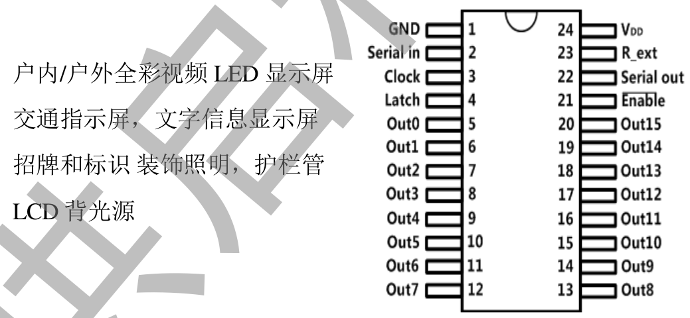

<!-- DIAPORAMA Registres série-parallèle-->

<!-- Page de titre -->
<section class="page_de_garde">

<!-- Contenu : -->

Enseignes et afficheurs à LED

Registres série-parallèle

Pierre-Yves Rochat

</section>

<!-- Page bienvenue plein écran-->
<section>
<!-- def A -->
<!-- def A -->
<!-- def A -->

<!-- def A -->**Enseignes et afficheurs à LED** | Registres série-parallèle
<!-- def A -->

<!-- A -->
<h1 class="en_tete">Registres série-parallèle</h1>

Pierre-Yves Rochat

</section>

<!-- Page bienvenue demi-->
<section>
<!-- A -->
<h1 class="en_tete">Registres série-parallèle</h1>

* Besoin de broches
* Registre série
* Registre série-parallèle
* Le circuit 74HC595
* Sorties à courant constant
* Programmation

</section>

<!-- Page besoin de broches, 5 arrivées -->
<section>
<!-- A -->
<h1 class="en_tete">Besoin de broches</h1>

* Beaucoup de LED...
<!-- 2345 -->* Beaucoup de broches !
<!-- 345 -->* Circuits logiques
<!-- 45 -->* Latch adressables (74HC259)
<!-- 5 -->* Registres série-parallèle (74HC595)

</section>

<!-- Page reg serie, 2 images-->
<section>
<!-- A -->
<h1 class="en_tete">Registres série</h1>

</section>

<section>
<!-- A -->
<h1 class="en_tete">Registres série</h1>

</section>

<!-- Page demi écran-->
<section>
<!-- A -->
<h1 class="en_tete">Registres série-parallèle</h1>

</section>

<!-- Page reg ser-par, 2 images-->
<section>
<!-- A -->
<h1 class="en_tete">Registres série-parallèle</h1>

</section>

<section>
<!-- A -->
<h1 class="en_tete">Registres série-parallèle</h1>

</section>

<!-- Page comparaison timings -->
<section>
<!-- A -->
<h1 class="en_tete">Registres série-parallèle</h1>

</section>

<!-- Page 74HC595, 2 + 1 images-->
<section>
<!-- A -->
<h1 class="en_tete">74HC595</h1>

<!-- 2 -->
</section>

<!-- Page cascade : -->
<section>
<!-- A -->
<h1 class="en_tete">Registres en cascade</h1>

</section>

<!-- Page constant, 4 arrivées-->
<section>
<!-- A -->
<h1 class="en_tete">Registres à sorties à courant constant</h1>

<!-- 234 -->

<!-- 234 -->* TB62701, TLC5905, A6276...
<!-- 34 -->* SUM2016 !
<!-- 234 -->

<!-- 4 -->
</section>

<!-- Page demi écran chinois-->
<section>
<!-- A -->
<h1 class="en_tete">Chinois...</h1>

</section>

<!-- Page programmation, 3 pages-->
<section>
<!-- A -->
<h1 class="en_tete">Programmation</h1>

~~~~~~~ { .c .numberLines startFrom="1" }
#define SortieSerieOn P1OUT |= (1<<0)
#define SortieSerieOff P1OUT &=~(1<<0)

#define ClockSerHaut P1OUT |= (1<<1)
#define ClockSerBas P1OUT &=~(1<<1)

#define ClockParHaut P1OUT |= (1<<2)
#define ClockParBas P1OUT &=~(1<<2)
~~~~~~~
<!-- retour au mode normal pour l’éditeur -->

</section>

<section>
<!-- A -->
<h1 class="en_tete">Programmation</h1>

~~~~~~~ { .c .numberLines startFrom="10" }
void Envoie8bitsSerie (uint8_t valeur) {
  uint16_t i;
  for (i=0; i<8; i++) {
    if (valeur & (1<<i)) {
      SortieSerieOn;
    } else {
      SortieSerieOff;
    }
    ClockSerHaut; ClockSerBas;
  }
  ClockParHaut; ClockParBas;
}
~~~~~~~
<!-- retour au mode normal pour l’éditeur -->

</section>

<section>
<!-- A -->
<h1 class="en_tete">Programmation</h1>

~~~~~~~ { .c .numberLines startFrom="11" }
...
  for (i=0; i<8; i++) {
    if (valeur & (1<<0)) {
      SortieSerieOn;
    } else {
      SortieSerieOff;
    }
    ClockSerHaut; ClockSerBas;
    valeur = valeur >> 1;
...
~~~~~~~
<!-- retour au mode normal pour l’éditeur -->

</section>

<!-- Page conclusion demi-->
<section>
<!-- A -->
<h1 class="en_tete">Registres série-parallèle</h1>
<!-- Contenu : -->

* Besoin de broches
* Registre série
* Registre série-parallèle
* Le circuit 74HC595
* Sorties à courant constant
* Programmation

</section>

 

 
