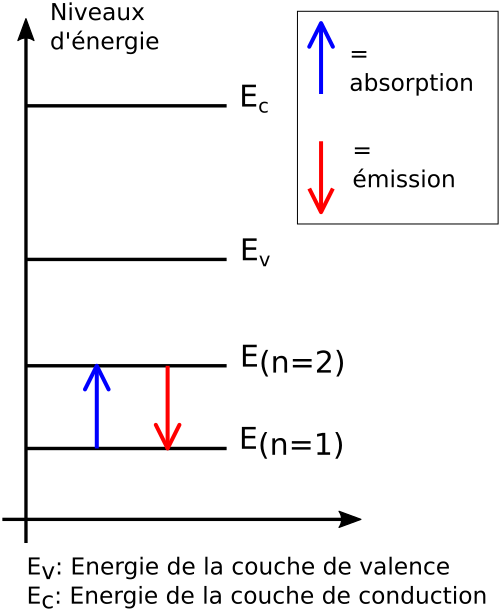
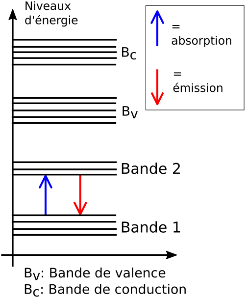
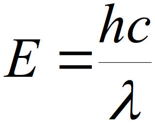
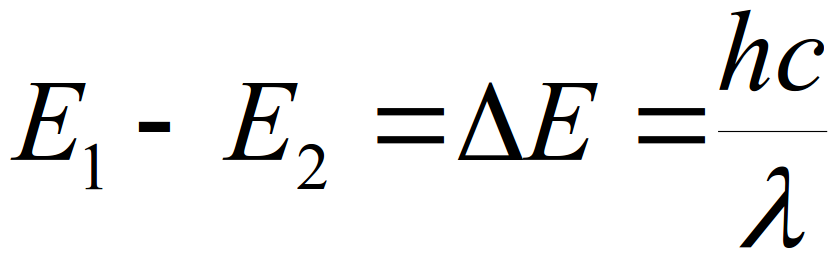
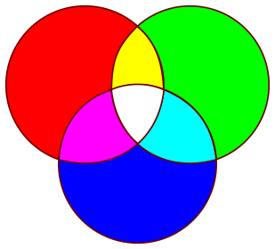
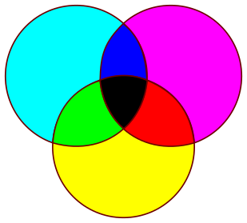
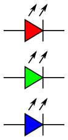
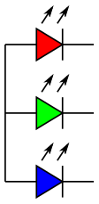
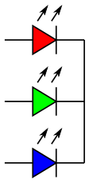
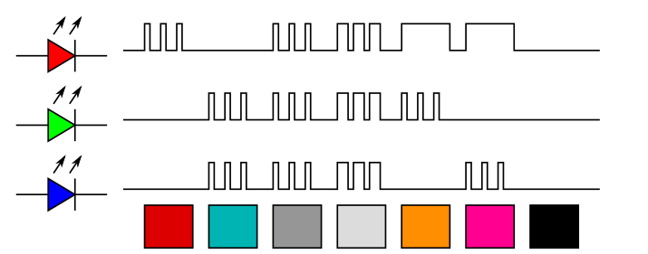

<!-- DIAPORAMA -->

<!-- Page de titre -->
<section class="page_de_garde">

Enseignes et afficheurs à LED

LED, lumière et couleur

Prof. Alain Tiedeu

</section>

<!-- Page bienvenue plein écran-->
<section>
<!-- I -->
<h1 class="en_tete">LED, lumière et couleur</h1>
<!-- def A -->
<!-- def A -->
<!-- def A -->

<!-- def A -->**Enseignes et afficheurs à LED** |  LED, lumière et couleur
<!-- def A -->

<!-- A -->

Prof. Alain Tiedeu
</section>

<!-- Page bienvenue, demi-->
<section>
<!-- A -->
<h1 class="en_tete">LED, lumière et couleur</h1>

* Energie et radiations
* Couleur des radiations
* Applications aux LED

</section>

<!-- Page énergie, 5 entrées -->
<section>
<!-- A -->
<h1 class="en_tete">Transitions énergétiques</h1>

* Rappel des éléments du modèle de Bohr  
* Électron qui reçoit de l’énergie et passe à une couche supérieure : **absorption**  
* Électron qui émet de l’énergie et passe à une couche inférieure: **émission**  
* Naturellement, électron a tendance à re-émettre de l’énergie et passer à la couche inférieure: **émission spontanée**  
* Émission peut être **stimulé**  
* Émission d’énergie se fait **sous forme de lumière**

<!-- 2 -->
</section>

<!-- Page bandes, 5 entrées -->
<section>
<!-- A -->
<h1 class="en_tete">Bandes d'énergie</h1>

* (1 couche => 1 valeur d’énergie) est **approximative** et correspond à atome isolé  
* Pour N (grand)  atomes, ils dépendent les uns des autres  
 => Niveaux d’énergie **entrelacés**  
* On passe des niveaux à des **bandes d’énergie**  
* Les transitions ont lieu entre les **sous-niveaux** des bandes d’énergie

</section>

<!-- Page énergie-lum, 5 entrées -->
<section>
<!-- A -->
<h1 class="en_tete">Relation énergie-lumière</h1>

* Relation de Planck-Einstein lie l’énergie à la longueur d’onde de la lumière manière suivante :

h est la constante de Planck , c la vitesse de la lumière  et  λ la longueur d’onde

<!-- 23 -->

<!-- 23 -->* Pour une transition entre 2 sous-niveaux 1 et 2, on a : 
<!-- 23 -->

<!-- 23 -->
<!-- 23 -->

<!-- 23 -->λ est la longueur d’onde de la lumière émise/reçue
<!-- 23 -->

<!-- 3 -->

<!-- 3 -->* Chaque valeur de  λ correspond à une couleur de lumière
<!-- 3 -->

<!-- 3 -->
</section>

<!-- Page led-lum, 5 entrées -->
<section>
<!-- A -->
<h1 class="en_tete">Application à la LED</h1>

* LED alimentée
* **Courant** passe dans la LED

* **Transitions énergétiques** des électrons dans le matériau de la LED  (l'intensité du courant influence les transitions)

* => **Lumière** de longueur d’onde λ 
* Chaque valeur de  λ correspond à une **couleur** de lumière

</section>

<!-- Page 3 façons, 5 entrées -->
<section>
<!-- A -->
<h1 class="en_tete">Couleur de la radiation émise</h1>

Examinons **trois façons** de déterminer la couleur de la radiation émise :

* **Alliages spéciaux** issus de la recherche,
* **Astuces**
* **Synthèse** de couleurs

</section>

<!-- Page alliage, 5 entrées -->
<section>
<!-- A -->
<h1 class="en_tete">Alliages et couleur de radiation</h1>

* Depuis les années 1960, la recherche a permis  de découvrir des **alliages d'éléments chimiques**  qui, utilisés dans la fabrication des LED  permettent d’émettre des radiations de couleurs  différentes

<!-- 2 -->

<!-- 2 -->* Quelques exemples sont donnés dans ce tableau :
<!-- 2 -->

<!-- 2 -->
</section>

<!-- Page astuces, 5 entrées -->
<section>
<!-- A -->
<h1 class="en_tete">Astuces</h1>

* Etaler plusieurs couches de phosphore de couleurs différentes sur une jonction PN qui aurait produit de la lumière bleue (Nitrure de Gallium-Indium). 
  
Une fraction de la lumière bleue initiale subit l’effet dit « Stokes shift » et est transformée en longueur d’onde plus longue. C’est le principe utilisé dans les ampoules fluorescentes.

* Ajouter Arséniure-Phosphure de Gallium (Rouge)  sur Phosphure de Gallium (Vert).  On obtient du Jaune (cf. synthèse des couleurs)

</section>

<!-- Page synthèse, 5 entrées -->
<section>
<!-- A -->
<h1 class="en_tete">Synthèse de couleurs</h1>

* Synthèse de couleurs
* = obtention d’autres couleurs à partir  des couleurs de base dites **primaires**

<!-- 2345 -->

<!-- 2345 -->* Synthèse **additive** utilise Rouge, Vert, Bleu
<!-- 345 -->* Synthèse **soustractive** utilise Cyan, Magenta, Jaune
<!-- 2345 -->

<!-- 2345 -->

<!-- 2345 -->Synthèse additive
<!-- 2345 -->

<!-- 2345 -->
<!-- 345 -->

<!-- 345 -->Synthèse soustractive
<!-- 345 -->

<!-- 345 --><!-- 2 -->
<!-- 45 -->

<!-- 45 -->* Triplet de LED pour générer les couleurs voulues
<!-- 45 -->* LED **RGB** = *Red Green Blue* 
<!-- 5 -->* LED souvent reliées par l’anode ou par la cathode
<!-- 45 -->

<!-- 45 -->
<!-- 5 -->
<!-- 5 -->
</section>

<!-- Page RGB, 5 entrées -->
<section>
<!-- A -->
<h1 class="en_tete">Synthèse de couleurs avec une LED RGB</h1>

* On peut générer 7 couleurs avec une LED RGB
* Les 3 couleurs de base rouge, vert et bleu
* Les 3 couleurs composées jaune, cyan et magenta
* Le blanc en allumant les 3 LED
* ... et le noir en les éteignant

<!-- 2 -->

<!-- 2 -->* On peut générer toutes les couleurs avec du PWM

<!-- 2 -->
</section>

<!-- Page conclusion, demi-->
<section>
<!-- A -->
<h1 class="en_tete">LED, lumière et couleur</h1>

* Energie et radiations
* Couleur des radiations
* Applications aux LED

</section>

