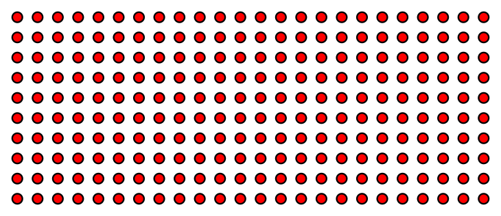

<!-- DIAPORAMA -->

<!-- Page de titre -->
<section class="page_de_garde">

Enseignes et afficheurs à LED

Afficheurs matriciels

Pierre-Yves Rochat

</section>

<!-- Page bienvenue plein écran-->
<section>
<!-- def A -->
<!-- def A -->
<!-- def A -->

<!-- def A -->**Enseignes et afficheurs à LED** | Affichages matriciels
<!-- def A -->

<!-- A -->
<h1 class="en_tete">Afficheurs matriciels</h1>

Pierre-Yves Rochat

</section>

<!-- Page bienvenue, demi-->
<section>
<!-- A -->
<h1 class="en_tete">Afficheurs matriciels</h1>

* Notion de pixel
* Caractéristique des afficheurs
* Matrices de LED
* Commandes par registres
* Programmation
* Génération et rafraîchissement

</section>

<!-- Page bienvenue et nom, demi-->
<section>
<!-- A -->
<h1 class="en_tete">Afficheurs matriciels</h1>

Pierre-Yves Rochat

* Notion de pixel
* Caractéristique des afficheurs
* Matrices de LED
* Commandes par registres
* Programmation
* Génération et rafraîchissement

</section>

<section>
<!-- A -->
<h1 class="en_tete">Notion de pixel</h1>

* **Afficheur** : dispositif électronique permettant de présenter visuellement des données   
<!-- 23456 -->* Affichages matriciels : grille orthonormée
<!-- 3456 -->* Ensemble de **pixels**
<!-- 456 -->* **Résolution** : distance entre un pixel et son plus proche voisin
<!-- 56 -->* *Pitch*. Exemple : **P6** = 6 mm entre chaque pixel
<!-- 6 -->* **Densité** : nombre de pixels par unité de surface

<!-- 23456 -->
</section>

<section>
<!-- A -->
<h1 class="en_tete">Afficheurs à LED</h1>

</section>

<section>
<!-- A -->
<h1 class="en_tete">Commande des LED par des registres</h1>

</section>

<section>
<!-- A -->
<h1 class="en_tete">Programme de commande</h1>

~~~~~~~ { .c .numberLines startFrom="1" }
#define SerClockOn P1OUT |= (1<<4)
#define SerClockOff P1OUT &=~(1<<4)
#define ParClockOn P1OUT |= (1<<5)
#define ParClockOff P1OUT &=~(1<<5)

int main() {
  init(); // initialisations...
  uint8_t i;

  for (i=0; i<16; i++) { // envoie 1 colonne avec 1 pixel allumé
    P2OUT = (1<<(i&7)); // 1 col de 8 px, 1 seul allumé
    SerClockOn; SerClockClear; // envoie un coup d'horloge série
  }
  ParCloclOn; ParClockClear; // envoie un coup d'horloge

  while (1) { // attente infinie
  }
}
~~~~~~~

<!-- 2 -->
</section>

<section>
<!-- A -->
<h1 class="en_tete">Programme de commande</h1>
</section>

<section>
<!-- A -->
<h1 class="en_tete">Générateur de caractères</h1>

~~~~~~~ { .c .numberLines startFrom="1" }
const uint8_t GenCar [] { // tableau des pixels des caractères
  0b01111110, // caractère 'A'
  0b00001001, // Il faut pencher la tête à droite
  0b00001001, // pour voir sa forme !
  0b00001001,
  0b01111110,

  0b01111111, // caractère 'B'
  0b01001001, // Les caractères forment
  0b01001001, // une matrice de 5x7
  0b01001001,
  0b00110110,

  0b00111110, // caractère 'C'
  0b01000001, // Les caractères ont ici
  0b01000001, // une chasse fixe, c'est-à-dire
  0b01000001, // que tous les caractères ont
  0b01000001  // la même largeur en pixels
};
~~~~~~~

</section>

<section>
<!-- A -->
<h1 class="en_tete">Affichage d’un texte</h1>

~~~~~~~ { .c .numberLines startFrom="1" }
char *Texte = "ABC\0"; // texte, terminé par le caractère nul
const char *ptTexte; // pointeur vers le texte à afficher

~~~~~~~

</section>

<section>
<!-- A -->
<h1 class="en_tete">Affichage d’un texte</h1>

~~~~~~~ { .c .numberLines startFrom="3" }
int main(void) {
  init(); // initialisations...
  while(1) { // le texte défile sans fin
    ptTexte = Texte;
    while (*ptTexte!='\0') { // boucle des caractères du texte
      caractere = *ptTexte; // le caractère à afficher
      idxGenCar = (caractere-'A') * 5; // conversion ASCII à index GenCar[]
      for (i=0; i<5; i++) { // envoie les 5 colonnes du caractère
        P2OUT = ~GenCar[idxGenCar++]; // 1 colonne du caractère (actif à 0)
        SerClockSet; SerClockClear; // coup d'horloge série
        ParClockSet; ParClockClear; // coup d'horloge parallèle
        AttenteMs (delai);
      }
      ptTexte++; // passe au caractère suivant
      P2OUT = ~0; // colonne vide, séparant les caractères
      SerClockSet; SerClockClear; // coup d'horloge série
      ParClockSet; ParClockClear; // coup d'horloge parallèle
      AttenteMs (delai);
    }
  }
}
~~~~~~~

</section>
<!-- Page séparer gen-raf, demi-->
<section>
<!-- A -->
<h1 class="en_tete">Séparer génération et rafraîchissement</h1>

* Géométrie pas toujours idéale
<!-- 23 -->* Afficheurs multiplexés
<!-- 3 -->* Génération et rafraîchissement séparés

</section>

<section>
<!-- A -->
<h1 class="en_tete">Mémorisation des pixels</h1>

~~~~~~~ { .c .numberLines startFrom="1" }
#define NbLignes 8
uint16_t Matrice[NbLignes]; // mots de 16 bits, correspondant à une ligne
~~~~~~~

</section>

<section>
<!-- A -->
<h1 class="en_tete">Dessin des points</h1>

~~~~~~~ { .c .numberLines startFrom="1" }
void AllumePoint(int16_t x, int16_t y) {
  Matrice[y] |= (1<<x); // set bit
}

void EteintPoint(int16_t x, int16_t y) {
  Matrice[y] &=~(1<<x); // clear bit
}

#define MaxX 16
#define MaxY NbLignes

void Diagonale() {
  int16_t i;
  for (i=0; i<MaxY; i++) {
    AllumePoint(i*MaxX/MaxY, i);
  }
}
~~~~~~~

<!-- 2 -->
</section>

<section>
<!-- A -->
<h1 class="en_tete">Affichage de la matrice</h1>

~~~~~~~ { .c .numberLines startFrom="1" }
void AfficheMatrice() {
  for (uint16_t x=0; x<MaxX; x++) {
    // Préparation des valeurs qui doivent être envoyées aux 8 registres:
    for (uint16_t y=0; y<MaxY; y++)  {
      if (Matrice[y]&(1<<x)) P2OUT &=~(1<<y); else P2OUT |= (1<<y);
    }
    SerClockSet; SerClockClear; // envoie un coup d'horloge série
  }
  ParClockSet; ParClockClear; // envoie les valeurs sur les LED
}
~~~~~~~

</section>

<section>
<!-- A -->
<h1 class="en_tete">Affichage de la matrice</h1>
</section>

<!-- + simple -->
<section>
<!-- A -->
<h1 class="en_tete">Mémorisation des pixels, autre organisation</h1>

~~~~~~~ { .c .numberLines startFrom="1" }
#define NbColonnes 16
uint8_t Matrice[NbColonnes]; // mots de 8 bits, correspondant à une colonne

~~~~~~~

</section>

<section>
<!-- A -->
<h1 class="en_tete">Affichage de la matrice</h1>

~~~~~~~ { .c .numberLines startFrom="1" }
#define NbColonnes 16
uint8_t Matrice[NbColonnes]; // mots de 8 bits, correspondant à une colonne

void AfficheMatrice() {
  // pour chaque colonne :
  for (uint16_t x=0; x<MaxX; x++) {
    P2OUT = ~Matrice[x]; // une colonne
    // envoie un coup d'horloge série :
    SerClockSet; SerClockClear;
  }
  // envoie les valeur sur les LED :
  ParClockSet; ParClockClear;
}
~~~~~~~

<!-- 2 -->
</section>

<section>
<!-- A -->
<h1 class="en_tete">Animations</h1>

* préparer une image en mémoire
<!-- 2345 -->* envoyer son contenu sur l'afficheur
<!-- 345 -->* attendre le temps nécessaire
<!-- 45 -->* préparer une autre image
<!-- 5 -->* ...

</section>

<!-- Ping -->
<section>
<!-- A -->
<h1 class="en_tete">Ping !</h1>

~~~~~~~ { .c .numberLines startFrom="1" }
void Ping() {
  int16_t x=0;
  int16_t y=0;
  int8_t sensX=1;
  int8_t sensY=1;
  do {
    AllumePoint(x,y);
    AfficheMatrice();
    AttenteMs(DELAI);
    EteintPoint(x,y);
    x+=sensX;
    if(x==(MaxX-1)) sensX=(-1);
    if(x==0) sensX=1;
    y+=sensY;
    if(y==(MaxY-1)) sensY=(-1);
    if(y==0) sensY=1;
  } while (!((x==0)&&(y==0)));
}
~~~~~~~

</section>

<!-- Page conclusion, demi-->
<section>
<!-- A -->
<h1 class="en_tete">Afficheurs matriciels</h1>

* Notion de pixel
* Caractéristique des afficheurs
* Matrices de LED
* Programmation
* Génération et rafraîchissement

</section>

