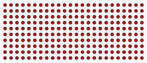
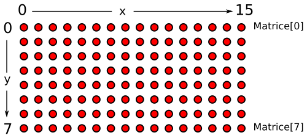
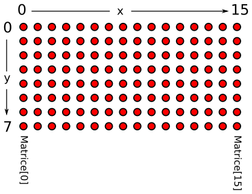

% Afficheurs matriciels
% [Pierre-Yves Rochat](mailto:pyr@pyr.ch), EPFL
% rév 2015/09/16

## Afficheurs et écrans ##

<!--
Comme les afficheurs sont le sujet de ce MOOC, je me demande si tu ne devrais pas prévoir un chapitre d’introduction où tu décris de manière très générale les types d’affichages existants et où tu précises les types qui seront abordés dans le cours et ceux qui ne le seront pas. Peut-être que tu avais prévu de le faire, mais ça ne se voit pas dans la table des matières.
-->

Voici une définition du mot afficheur : dispositif électronique permettant de présenter visuellement des données. Cette définition correspond aussi très bien à ce qu'on appelle un écran. Ce terme “écran” vient de la technique des tubes cathodiques, qui comportaient un écran de phosphore, capable de transformer le faisceau d'électrons en une tache lumineuse.

Depuis plusieurs décennies, les LCD (*Liquid Cristal Display*) dominent ce domaine, tant pour de petits afficheurs que pour des écrans de taille respectable. On parle parfois, par abus de langage, d'écrans à LED pour désigner des écrans LCD rétroéclairés par des LED. Il ne faut pas les confondre avec les écrans à O-LED (LED organiques), qui prennent des parts de marché de plus en plus importantes.

Ces domaines ne sont pas le sujet de notre cours. Nous allons nous concentrer sur les dispositifs réalisés avec des LED indépendantes.

## Notion de pixel ##

Chaque point d'un afficheur ou d'un écran est appelé un *pixel*. Il peut être d'une seule couleur (monochrome) ou capable de prendre plusieurs couleurs (polychrome ou multicolore). Dans le cadre de ce cours, les mots *points* et *pixels* sont synonymes et utilisés indifféremment. *Pixel* est un mot-valise formé par la fusion des mots de la locution anglaise *picture element* ou *élément d'image* en français.

Un afficheur est caractérisé par plusieurs paramètres, dont un des plus importants est le nombre de pixels qu'on indique souvent sous la forme de deux paramètres : le nombre de lignes et le nombre de points par lignes.

Dans le domaine des écrans, les modèles VGA des années 1980 affichaient 480 lignes de 640 points. Aujourd'hui, l'écran d'un ordinateur portable à faible coût peut afficher 800 lignes de 1'280 pixels. Une image vidéo *Full HD* affiche 1'080 lignes de 1'920 pixels.

La taille de l'afficheur est évidemment aussi un paramètre important, sa *hauteur* (on part de l'idée que l'écran est vertical <!-- Quelle importance ? C’est la même chose que l’écran soit horizontal ou vertical. -->) et sa *largeur*.

À partir de la taille et du nombre de pixels, on peut calculer deux autres caractéristiques d'un afficheur :

* Sa *résolution* : C'est la distance entre un pixel et son plus proche voisin. On l'exprime généralement en millimètre. Les fabricants donnent souvent une expression comme P6 ou P10. La lettre P vient du mot *Pitch* (le pas). Il s'agit de la distance entre chaque pixel exprimée en millimètre (mm).
* Sa *densité* : C'est le nombre de pixels par unité de surface. L'unité est généralement exprimée en pixels par mètres carrés (px/m²).

Prenons l'exemple d'un afficheur P6. La distance entre chaque pixel est de 6 mm. On peut donc aligner environ 167 LED sur un mètre. Il faut donc plus de 27'800 LED pour remplir un mètre carré ! En l'absence d'indication contraire, on considère que les résolutions horizontales et verticales sont identiques.

## Afficheurs à LED ##

Un afficheur à LED est donc un ensemble de LED dont il est possible de choisir l'état de chacune d'elles indépendamment des autres.

Les LED sont généralement disposées en lignes et en colonnes : on obtient un afficheur orthogonal.

Si la distance est la même horizontalement et verticalement (en x et y), l'afficheur est orthonormé. La géométrie des LED permet de réaliser toutes sortes d'afficheurs, sans se limiter à une grille orthonormée. Il existe des afficheurs cylindriques, sphériques ou en forme de pyramide ! Plus couramment, on trouve des afficheurs qui prennent une forme dont la signification est connue, comme les afficheurs en forme de croix de pharmacie, très répandus depuis quelques années.

La taille des afficheurs à LED varie de manière considérable : on trouve de petits journaux lumineux intégrés à des médaillons de ceinture, mais il existe aussi des afficheurs vidéos d'une surface de plusieurs dizaines de mètres carrés.

## Commande des LED par des registres ##

Le nombre important de LED d'un afficheur matriciel, même de petite taille, ne permet généralement pas une commande de chaque LED par une broche d'un microcontrôleur. C'est seulement le cas pour de petits afficheurs commandés par _multiplexage temporel_, sujet qui sera abordé plus tard dans ce cours. Dans tous les autres cas, des registres sont utilisés pour commander les LED.

Prenons comme exemple l'afficheur de 8 lignes de 16 LED dont le schéma est indiqué sur la figure ci-dessous. Chacune de ses lignes utilise un registre série-parallèle de 16 bits, il y a donc 8 registres. Les registres séries sont indiqués avec une flèche pointant vers la droite. Les registres parallèles sont indiqués avec une flèche pointant vers le haut. Les entrées des horloges des registres sont indiquées par des triangles.

Les horloges des registres séries sont toutes connectées à la broche P1.4, ce qui implique que les données sont chargées en même temps sur tous ces registres. À chaque coup d'horloge, la valeur présentée à l'entrée est décalée dans le registre. Sur la figure, les valeurs d'entrée sont données par les broches P2.0, P2.1...P2.7.

Une fois les 16 valeurs introduites dans les registres séries, elles sont transférées aux registres parallèles dont les horloges sont toutes connectées à la broche P1.5 du microcontrôleur. Les valeurs ainsi chargées dans les registres parallèles sont immédiatement affichées sur les LED.

<!--
Sur le schéma, pour les 3 registres, la 5e LED depuis la gauche est cul-de-jatte.
-->

Remarquez que les LED n'ont pas de résistances série. Les registres utilisés contiennent des sources de courant ajustables au moyen d'une seule résistance pour tout le registre.

## Programmation ##

Comment écrire le programme qui contrôle ce montage ? On souhaite par exemple faire défiler un texte, pour afficher un journal lumineux. La première idée qui vient à l'esprit est d'utiliser les propriétés du registre pour introduire successivement les colonnes de pixels qui forment chaque caractère. Voici un programme qui pourrait fonctionner. Il se limite pour le moment à envoyer un motif en _dents de scie_ :

<!--
Dans tes programmes, tu utilises des noms comme “SerClockOn” et “SerClockOff”. Le problème avec ce cette façon de faire, c’est qu’on doit réfléchir pour déterminer si tu veux faire une lecture (est-ce que la valeur est ON ?) ou une écriture (mettre la valeur à ON).

Comme ce problème est un classique, la plupart des langages de programmation utilisent les conventions suivantes :

Pour l’écriture : SET, CLEAR, TOGGLE

Pour la lecture : GET

Je pense donc que tes codes seraient plus clairs si tu faisais les remplacements suivants :

SerClockOn ⇒ SerClockSet
SerClockOff ⇒ SerClockClear

Ce problème m’avait donné pas mal de fil à retordre lors du MOOC µcontrôleurs.
-->

~~~~~~~ { .c .numberLines startFrom="1" }
int main() {
  init(); // initialisations...
  uint8_t i;
  while (1) {
    for (i=0; i<16; i++) { // envoie une colonne avec un seul pixel allumé
      P1OUT = (1<<(i&7)); // 1 col de 8 px, 1 seul allumé -> dents de scie
      SerClockOn; SerClockOff; // envoie un coup d'horloge série
	  ParCloclOn; ParClockOff; // envoie un coup d'horloge
    }
  }
}
~~~~~~~
<!-- retour au mode normal pour l'éditeur -->

Pour générer des caractères, il faut disposer d'une table décrivant les positions des pixels des différents caractères.
Voici une manière de les représenter :

~~~~~~~ { .c .numberLines startFrom="1" }
const uint8_t GenCar [] { // tableau des pixels des caractères
  0b01111110, // caractère 'A'
  0b00001001, // Il faut pencher la tête à droite
  0b00001001, // pour voir sa forme !
  0b00001001,
  0b01111110,

  0b01111111, // caractère 'B'
  0b01001001, // Les caractères forment
  0b01001001, // une matrice de 5x7
  0b01001001,
  0b00110110,

  0b00111110, // caractère 'C'
  0b01000001, // Les caractères ont ici
  0b01000001, // une chasse fixe, c'est-à-dire
  0b01000001, // que tous les caractères ont
  0b01000001  // la même largeur en pixels
};
~~~~~~~
<!-- retour au mode normal pour l'éditeur -->

Voici un programme qui affiche un texte :
<!-- Est-ce que tu expliques le concept de pointeur dans le cours ? -->

~~~~~~~ { .c .numberLines startFrom="1" }
char *Texte = "ABC\0"; // texte, terminé par le caractère nul
const char *ptTexte; // pointeur vers le texte à afficher

int main(void) {
  init(); // initialisations...
  while(1) { // le texte défile sans fin
    ptTexte = Texte;
    while (*ptTexte!='\0') { // boucle des caractères du texte
      caractere = *ptTexte; // le caractère à afficher
      idxGenCar = (caractere-'A') * 5; // conversion ASCII à index GenCar[]
      for (i=0; i<5; i++) { // envoie les 5 colonnes du caractère
        P2OUT = ~GenCar[idxGenCar++]; // 1 colonne du caractère (actif à 0)
        SerClockOn; SerClockOff; // coup d'horloge série
        ParClockOn; ParClockOff; // coup d'horloge parallèle
        AttenteMs (delai);
      }
      ptTexte++; // passe au caractère suivant
      P2OUT = ~0; // colonne vide, séparant les caractères
      SerClockOn; SerClockOff; // coup d'horloge série
      ParClockOn; ParClockOff; // coup d'horloge parallèle
      AttenteMs (delai);
    }
  }
}

~~~~~~~
<!-- retour au mode normal pour l'éditeur -->

Dans l'exemple ci-dessus, le texte à afficher est enregistré dans un tableau. L'instruction `const` indique au compilateur que ce tableau peut être stocké en mémoire de programme. Sans cette instruction, il aurait été enregistré en mémoire RAM qui est souvent nettement plus petite que la mémoire de programme. Pour accéder aux caractères de ce texte, un pointeur est utilisé. La déclaration du pointeur s'écrit : `const char *ptTexte;`. Le symbole * indique qu'il s'agit d'un pointeur.

Cette manière d'envoyer les caractères fonctionne, mais présente tellement de limitations qu'elle ne sera jamais utilisée. Par exemple, elle ne peut pas fonctionner si l'ordre des LED est inversé : le texte ne pourra pas être décalé correctement de droite à gauche. Elle est aussi incompatible avec les afficheurs multiplexés.

## Génération et rafraîchissement séparés ##

La bonne manière de programmer un afficheur est de **séparer** complètement la génération de l'image à afficher et l'envoi de cette image sur l'afficheur. La valeur courante de chaque pixel est placée dans une **mémoire**. La partie du logiciel qui prépare les images **écrit** dans cette mémoire. Les procédures qui envoient les informations à l'afficheur **lisent** dans cette mémoire.

Dans notre exemple, l'afficheur a 8 lignes de 16 pixels. Un mot de 16 bits pourra donc stocker une ligne. Voici comment réserver la zone mémoire pour les pixels :

~~~~~~~ { .c }
#define NbLignes 8
uint16_t Matrice[NbLignes]; // mots de 16 bits, correspondant à une ligne
~~~~~~~
<!-- retour au mode normal pour l'éditeur -->

Nous choissons de placer les axes x et y de la manière suivante :

Les procédures permettant d'allumer et d'éteindre un pixel, désigné par ses coordonnées, sont particulièrement simples dans ce cas :

~~~~~~~ { .c .numberLines startFrom="1" }
void AllumePoint(int16_t x, int16_t y) {
  Matrice[y] |= (1<<x); // set bit
}

void EteintPoint(int16_t x, int16_t y) {
  Matrice[y] &=~(1<<x); // clear bit
}

~~~~~~~
<!-- retour au mode normal pour l'éditeur -->

Voici une procédure pour afficher une diagonale en travers de l'afficheur :

~~~~~~~ { .c .numberLines startFrom="1" }
#define MaxX 16
#define MaxY NbLignes

void Diagonale() {
  int16_t i;
  for (i=0; i<MaxY; i++) {
    AllumePoint(i*MaxX/MaxY, i);
  }
}
~~~~~~~
<!-- retour au mode normal pour l'éditeur -->

Mais toutes ces procédures ne vont rien afficher sur les LED ! Il faut encore une procédure qui va placer chaque pixel sur la LED correspondante. Pour l'écrire, il faut garder en mémoire l'organisation matérielle de notre matrice, avec les 8 registres série-parallèles de 16 bits.

~~~~~~~ { .c .numberLines startFrom="1" }
void AfficheMatrice() {
  for (uint16_t x=0; x<MaxX; x++) {
    // Préparation des valeurs qui doivent être envoyées aux 8 registres:
    for (uint16_t y=0; y<MaxY; y++)  {
      if (Matrice[y]&(1<<x)) P2OUT &=~(1<<y); else P2OUT |= (1<<y);
    }
    SerClockOn; SerClockOff; // envoie un coup d'horloge série
  }
  ParClockOn; ParClockOff; // envoie les valeur sur les LED
}
~~~~~~~
<!-- retour au mode normal pour l'éditeur -->

Cette procédure semble compliquée. Une organisation optimisée des données en mémoire pourrait la simplifier :

Voici la définition et la procédure correspondante :

~~~~~~~ { .c .numberLines startFrom="1" }
#define NbColonnes 16
uint8_t Matrice[NbColonnes]; // mots de 8 bits, correspondant à une colonne

void AfficheMatrice() {
  for (uint16_t x=0; x<MaxX; x++) {
    P2OUT = ~Matrice[x];
    SerClockOn; SerClockOff; // envoie un coup d'horloge série
  }
  ParClockOn; ParClockOff; // envoie les valeur sur les LED
}
~~~~~~~
<!-- retour au mode normal pour l'éditeur -->

Non seulement la procédure `AfficheMatrice()` est beaucoup plus simple, mais en plus elle va prendre moins de temps à être exécutée. Dans notre cas, la vitesse ne pose pas de problème. Mais dès que les afficheurs deviennent plus grands, cette question devient cruciale.

De manière générale, on va donc chercher à optimiser l'organisation des pixels en mémoire en vue de simplifier et de rendre plus rapide l'envoi des pixels sur les LED, quitte à compliquer un peu les procédures qui créent les images. <!-- Je ne comprends pas pourquoi on devrait créer des images puisque au contraire on les stocke en mémoire... -->

## Programmer des animations ##

Pour générer des animations sur l'afficheur, il faut :

* préparer une image en mémoire,
* envoyer son contenu sur l'afficheur,
* attendre le temps nécessaire,
* préparer une autre image <!-- C’est le premier point ⇒ donc tu peux enlever celui-ci -->

et ainsi de suite.

Voici un programme complet qui génère une animation graphique sur notre afficheur :

~~~~~~~ { .c .numberLines startFrom="1" }
// Afficheur didactique 16x8
// Les 8 bits sont sur P2
// Usage d'une matrice en bytes
// Ping !

#include <msp430g2553.h>

#define DELAI 100

#define SerClockOn P1OUT|=(1<<5)
#define SerClockOff P1OUT&=~(1<<5)

#define ParClockOn P1OUT|=(1<<4)
#define ParClockOff P1OUT&=~(1<<4)

void AttenteMs (uint16_t duree) {
  for (uint16_t i=0; i<duree; i++) {
    for (volatile uint16_t j=0; j<500; j++) {
    }
  }
}

#define NbColonnes 16
uint8_t Matrice[NbColonnes]; // mots de 8 bits, correspondant à une colonne

#define MaxX NbColonnes
#define MaxY 8

void AllumePoint(int16_t x, int16_t y) {
  Matrice[x] |= (1<<y); // set bit
}

void EteintPoint(int16_t x, int16_t y) {
  Matrice[x] &=~(1<<y); // clear bit
}

void AfficheMatrice() {
  for (uint16_t x=0; x<MaxX; x++) {
    P2OUT = ~Matrice[x];
    SerClockOn; SerClockOff; // envoie un coup d'horloge série
  }
  ParClockOn; ParClockOff; // envoie les valeurs sur les LED
}

void Ping() {
  int16_t x=0;
  int16_t y=0;
  int8_t sensX=1;
  int8_t sensY=1;
  do {
    AllumePoint(x,y);
    AfficheMatrice();
    AttenteMs(DELAI);
    EteintPoint(x,y);
    x+=sensX;
    if(x==(MaxX-1)) sensX=(-1);
    if(x==0) sensX=1;
    y+=sensY;
    if(y==(MaxY-1)) sensY=(-1);
    if(y==0) sensY=1;
  } while (!((x==0)&&(y==0)));
}

int main(void) {
  WDTCTL = WDTPW + WDTHOLD; // Stop watchdog timer
  BCSCTL1 = CALBC1_16MHZ; DCOCTL = CALDCO_16MHZ; // Horloge à 16 MHz
  P1DIR = (1<<4)|(1<<5); P2DIR = 0xFF; P2SEL = 0;

  for (uint16_t i=0; i<NbColonnes; i++) { // initialise la matrice
    Matrice[i]=0x0;
  }

  while(1) {
    Ping();
  }
}
~~~~~~~
<!-- retour au mode normal pour l'éditeur -->

