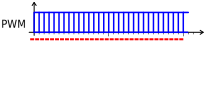
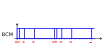

<!-- DIAPORAMA -->

<section class="page_de_garde">

Enseignes et afficheurs à LED

BCM : la modulation codée binaire

Pierre-Yves Rochat

</section>

<section>
<!-- def A -->
<!-- def A -->
<!-- def A -->

<!-- def A -->**Enseignes et afficheurs à LED** | BCM : la modulation codée binaire
<!-- def A -->

<!-- A -->
<h1 class="en_tete">BCM : la modulation codée binaire</h1>

Pierre-Yves Rochat

</section>

<section>
<!-- A -->
<h1 class="en_tete">BCM : la modulation codée binaire</h1>

* PWM sur une matrice
* Tolérance sur la forme
* Principe du BCM
* Avantages et limites du BCM
* Programmation de signaux BCM

</section>

<section>
<!-- A -->
<h1 class="en_tete">PWM sur une matrice</h1>

* Le **PWM** est généralement utilisé pour faire varier l’intensité d’une LED
<!-- 234 -->* Sur un afficheur matriciel, l’intensité de chaque LED doit être **indépendante**
<!-- 34 -->* Pour changer l’état d’une LED, il faut renvoyer l’état de **toutes** les LED

<!-- 4 -->

<!-- 4 -->* Fréquence de rafraîchissement : F~raf~ = F~pwm~ × N~intens~
</section>

<section>
<!-- A -->
<h1 class="en_tete">Tolérance sur la forme</h1>
<!-- 23 -->

* L’intensité perçue par l’œil ne dépend pas de la forme du signal

<!-- 3 -->

<!-- 3 -->* Ces deux signaux donnent la même impression visuelle
<!-- 3 -->

</section>

<section>
<!-- A -->
<h1 class="en_tete">Principe du BCM</h1>
<!-- 23 -->

* Découper la période du signal en tranches dont les durées sont les **poids binaires**

<!-- 3 -->

<!-- 3 -->* Modulation Codée Binaire (*Binary Coded Modulation* BCM)
<!-- 3 -->

</section>

<section>
<!-- A -->
<h1 class="en_tete">Exemples</h1>

* Signaux représentés sur 3 périodes

</section>

<section>
<!-- A -->
<h1 class="en_tete">Avantages et limites du BCM</h1>

* En PWM, pour une résolution de b bits, il faut 2^b^ raffraîchissements des états des LED
<!-- 345 -->* En BCM, il en faut seulement b.

<!-- 345 -->
<!-- 45 -->

<!-- 45 -->* Le temps minimum entre deux raffraîchissements est le même
<!-- 5 -->* Du temps libre se dégage sur les bits de poids fort, utilisable pour calculer l’état suivant
<!-- 45 -->

</section>

<section>
<!-- A -->
<h1 class="en_tete">Programmation de signaux BCM</h1>

~~~~~~~ { .c .numberLines startFrom="8" }
uint8_t Intens[8] = {0, 0, 0, 0, 0, 0, 128, 0};
uint8_t n, b;
uint8_t t = 0;

int main() {
  WDTCTL = WDTPW+WDTHOLD; // stoppe le WatchDog
  BCSCTL1 = CALBC1_16MHZ; DCOCTL = CALDCO_16MHZ;
  P1DIR = 0xFF; // P1 tout en sortie

  while (1) { // Boucle infinie :
    for (n=0; n<BITS_BCM; n++) { // pour une période du BCM
      for (b=0; b<8; b++) { // pour chaque bit de sortie
        if (Intens[b] & (1<<n)) P1OUT|=(1<<b); else P1OUT&=~(1<<b);
      }
      Attente(1<<n);
    }
    // ...calcul des prochaines valeurs des intensités
  }
}
~~~~~~~

~~~~~~~ { .c .numberLines startFrom="1" }
#define BITS_BCM 8

void Attente(uint16_t dur) {
  volatile uint16_t i;
  for (i=0; i<(dur*64); i++) {
  }
}
~~~~~~~

</section>

<section>
<!-- A -->
<h1 class="en_tete">BCM : la modulation codée binaire</h1>

* PWM sur une matrice
* Tolérance sur la forme
* Principe du BCM
* Avantages et limites du BCM
* Programmation de signaux BCM

</section>

