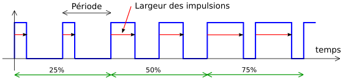

% Binary Coded Modulation
% [Pierre-Yves Rochat](mailto:pyr@pyr.ch), EPFL
% rév 2016/01/30

Version provisoire. Nous travaillons sur ce document, mais les remarques sont les bienvenues !

## PWM sur une matrice ##

La technique classique pour faire varier l’intensité d’une LED est la modulation de largeur d’impulsion *PWM*. Le signal se présente de la manière suivante :

{ width=16.5cm }

Dans un afficheur matriciel, l’intensité de chaque LED doit pouvoir être indépendante. Avec la plupart des schémas utilisés pour un afficheur matriciel, il est nécessaire re renvoyer la valeur de toutes les LED pour changer l’état d’une seule LED. C’est par exemple le cas des afficheurs basés sur des registres série-parallèles.

Si la fréquence du PWM est F~pwm~ et le nombre de valeurs possibles de l’intensité est N~intens~, la fréquence de rafraîchissement sera de F~raf~ = F~pwm × N~raf~

Par exemple, pour une fréquence du PWM de 100 Hz et une intensité sur 8 bits, produisant donc 256 intensités différentes, on devra rafraîchir la matrice à une fréquence de 100 × 256 = 25’600 Hz, ce qui correspond à une période de 39 µs. Si l’afficheur comporte un nombre important de LED, il n’est pas facile de parvenir à ce résultat !

Or la fréquence minimale d’une afficheur est donnée par les propriétés de l’œil humain. Diminuer la fréquence du PWM de dessous de 100 Hz dégradera la qualité visuelle de l’afficheur. Il n’y a pas de marge de manœuvre de ce côté.

## Tolérance sur la forme ##

Par contre, la forme du signal qui parvient à une LED n’a pas beaucoup d’importance. Ce qui va déterminer l’intensité perçue par l’œil, c’est le rapport entre le temps pendant lequel la LED est allumée durant un cycle et le temps total du cycle. Les deux signaux de la figure ci-dessous donnent le même résultat :

{ width=14cm }

Comment produire simplement un signal dont le total du temps actif est un nombre de fois le temps unitaire ? On peut utiliser les poids binaires du nombre. C’est l’idée de la **Modulation Codée Binaire** *Binary Coded Modulation* ou BCM.

Il s’agit de découper la période du PWM en tranches dont les durées sont les poids binaires. Par exemple, un signal dont l’intensité est donnée par un nombre de 4 bits, produisant 16 intensités possibles. Les tranches du BCM auront les valeur 1, 2, 4 et 8, exprimées en seizième de la période du PWM. Pour chaque valeur d’intensité, on active la LED chaque fois que le poids binaire concerné est à 1 dans le nombre.

Voici les signaux pour quelques valeurs de l’intensité :

{ width=14cm }

~~~~~~~ { .c }
 #pragma vector=NUMERO_DU_VECTEUR
 __interrupt void Nom_de_la_routine (void) {
  ...
 }
~~~~~~~

