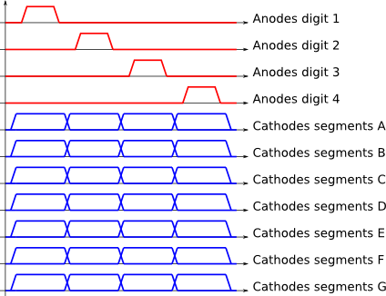
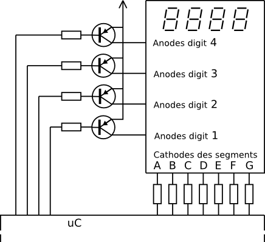

**Le multiplexage temporel**
==================================

## [Pierre-Yves Rochat](mailto:pyr@pyr.ch), EPFL

> Document en cours de relecture, rév du 2015/07/16

##  Commander deux LED indépendantes avec une broche ##

Nous allons nous poser une question un peu curieuse. Est-ce possible de commander deux LED avec une seule broche d’entrée-sortie d’un microcontrôleur ? Bien entendu, il ne s’agit pas ici que les deux LED s’allument et s’éteignent en même temps. On a déjà vu comment commander même des milliers de LED avec une seule broche. On cherche bien ici à les commander indépendamment l’une de l’autre.

En considérant qu’une sortie peut prendre l’état _0_ et l’état _1_, on voit mal comment le faire... Mais souvenons-nous qu’une broche d’un microcontrôleur peut aussi être une entrée. Or une entrée, c’est une broche qui n’impose ni un _0_, ni un _1_. On parle d’une broche à _haute impédance_. On utilise même parfois l’expression _logique à 3 états_ (tri-state): l’état _0_, l’état _1_ et l’état _H_ (haute impédance).

Regardons ce schéma, où une LED est reliée entre la broche et la _Masse_ (avec sa résistance de protection en série) et une autre LED est reliée entre la broche et le _Plus_ (Vcc 3.3V).

Il est possible avec ce montage :

* d’allumer la LED1 (sortie à _1_)
* d’allumer la LED2 (sortie à _0_)
* de n’allumer aucune des deux LED (sortie à haute impédance).

Mais comment allumer les deux LED en même temps ? C’est évidemment impossible !

Notez qu’une contrainte électronique existe avec ce montage. La tension Vcc doit être inférieure à deux fois la tension de seuil des LED utilisées. Il ne fonctionne pas à 5V, les LED s’allumeraient alors en permanence, la tension d’alimentation étant suffisante pour dépasser les seuils des deux LED. Ce montage fonctionne bien à 3.3V, avec des LED vertes ou bleues. La tension de seuil des LED rouges est généralement trop faible.

##  Multiplexage temporel ##
En allumant successivement la LED1 puis la LED2 à une fréquence supérieure à la fréquence maximale de sensibilité de l’œil, on va donner l’impression que les deux LED sont allumées en même temps.

Examinons ce programme :

~~~~~~~ { .c .numberLines startFrom="1" }
#define SORTIE_0 pinMode(P1_4, OUTPUT); digitalWrite(P1_4, 0)
#define SORTIE_1 pinMode(P1_4, OUTPUT); digitalWrite(P1_4, 1)
#define SORTIE_HI_Z pinMode(P1_4, INPUT)

void loop() {
  uint8_t i;
  SORTIE_HI_Z; delay (1000); // LED1 et LED2 éteintes pendant 1 seconde
  SORTIE_1; delay (1000); // LED1 allumée pendant 1 seconde
  SORTIE_0; delay (1000); // LED2 allumée pendant 1 seconde

  for (i=0; i<250; i++) { // 250 x 4ms = 1 s
    SORTIE_1; delay (2); // LED1 allumée
    SORTIE_0; delay (2); // LED2 allumée
  }
}
~~~~~~~
<!-- retour au mode normal pour l'éditeur -->

On voit que tous les états possibles pour 2 LED sont affichés (00, 01, 10, 11). Il a toutefois un défaut : lorsqu’elles sont allumées ensemble, chaque LED donne l’impression d’être allumée plus faiblement. En effet, on a généré un PWM de 50%. Ce défaut peut être corrigé en ne dépassant jamais les 50% pour chaque LED :

~~~~~~~ { .c .numberLines startFrom="6" }
  ...
  SORTIE_HI_Z; delay (1000); // LED1 et LED2 éteintes pendant 1 seconde
  for (i=0; i<250; i++) { // 250 x 4ms = 1 s
    SORTIE_1; delay (2); // LED1 allumée
    SORTIE_HI_Z; delay (2); // LED1 et LED2 éteintes
  }
  ...
~~~~~~~
<!-- retour au mode normal pour l'éditeur -->

L’affaiblissement de l’intensité peut être partiellement compensé dans ce cas. En effet, le courant nominal d’une LED (donné par le fabricant) ne doit pas être dépassé en continu. Mais lorsque l’allumage n’est jamais continu, c’est le courant maximal de la LED (également donné par le fabricant), qui ne doit pas être dépassé. Or le courant maximal (typiquement 20mA) est supérieur au courant nominal (typiquement 10mA). On va donc pouvoir utiliser une résistance de limitation plus petite pour atteindre ce courant maximal, pour autant que la contrainte de ne jamais allumer la LED plus de 50% du temps soit respectée par le programme.

Cette technique a comme principal désavantage la complexité de sa programmation. L’utilisation d’un Timer et d’une interruption va la simplifier. Le sujet sera abordé plus tard dans ce cours.

##  Charlieplexing ##

Une technique similaire peut être utilisée avec un nombre quelconque de LED en plaçant deux LED (une dans chaque sens) entre chaque broche utilisée. On parle alors de _*Charlieplexing*_.
Voici le schéma pour 3 broches, avec 6 LED :

On voit que 3 broches permettent de commander 6 LED. Une résistance de limitation est placée en série avec chaque broche. Sa valeur doit tenir compte du fait que le courant passant dans une LED passe par deux résistances.
Pour allumer une LED, il faut :

* mettre à _1_ la broche qui commande son anode
* mettre à _0_ la broche qui commande sa cathode
* mettre en entrée (sortie à haute impédance) les broches restantes (une seule dans ce cas).

Ce montage est parfait lorsqu’il y a besoin d’allumer une seule LED parmi plusieurs. Si toutes les LED doivent pouvoir être allumées _en même temps_, il faut les allumer successivement à une fréquence suffisante, comme le montre la figure suivante :

C’est le principe même du **multiplexage temporel** !

Remarquez la manière de dessiner. A chaque cycle, chaque LED peut être individuellement allumée ou non. La luminosité va  diminuer par rapport à l’intensité maximale d’une LED. Dans ce cas, ce sera d’un facteur 6, partiellement compensable par l’usage du courant maximal des LED.

##  Usage du multiplexage temporel ##

Si cette technique permettant de commander plusieurs LED avec un petit nombre de broches vous permet de _sauver_ un projet où une broche manque sur votre microcontrôleur, tant mieux. Les amateurs  de prouesses réalisées avec de petits microcontrôleurs à 8 ou même à 6 broches vont se régaler ! Ils vont, par exemple, commander tous les feux tricolores d’un carrefour sur une maquette miniature avec un microcontrôleur à 8 broches. Les familles PIC (Microchip) et les AVR (Atmel) offrent de nombreux microcontrôleurs dans cette gamme. Par exemple, l’ATtiny85 a son fan-club sur Internet.

Beaucoup plus sérieusement, la commande des afficheurs matriciels peut être simplifiée de manière très significative par le multiplexage temporel. Ce sujet sera étudié en détail, tant au niveau de l’architecture matérielle qu’au niveau de la commande logicielle.

##  Afficheurs 7 segments multiplexés ##

Voici encore un usage très pratique du multiplexage temporel : la commande d’afficheurs 7 segments à plusieurs digits. Même sous forme de modules comportant un seul digit, les fabricants choisissent généralement, pour limiter le nombre de broches, de regrouper les anodes (montage à _anode commune_) ou les cathodes (montage à _cathode commune_) :

Sur les modules qui contiennent plusieurs digits, en plus des anodes (ou cathodes) regroupées par digit, les cathodes (ou les anodes) sont regroupées au niveau de chaque  segment pour tous les digits.

Le multiplexage temporel convient très bien pour commander plusieurs digits, sans multiplier le nombre de broches utilisées sur le microcontrôleur. Chaque digit a son anode (commune à tous les segments), chaque segment a sa cathode (commune à tous les digits).

Les résistances de limitation doivent impérativement être placées du côté des segments. En effet, le multiplexage temporel va consister à allumer les segments concernés du premier digit, puis du deuxième, etc. À chaque instant, le courant concernant le digit sélectionné peut correspondre à un nombre compris entre 0 et 7. Par contre, du côté des segments, un seul peut être allumé à un instant donné.

En plaçant une résistance du côté du digit, son courant varierait en fonction du nombre de segments concernés. La chute de tension aux bornes de la résistance serait donc variable, entraînant une luminosité changeante selon le motif affiché (le chiffre 1 serait plus lumineux que le chiffre 8). Par contre, en plaçant une résistance du côté des segments, un seul segment peut être affiché à la fois. Le courant sera donc constant (ou nul si le segment est éteint).

Le programme de commande doit produire des signaux comme le montre la figure suivante :

Remarques :

* Les anodes sont actives à l’état 1.
* Les cathodes sont actives à l’état 0.
* Le courant dans les cathodes est limité au courant d’une LED. Une broche d’un microcontrôleur peut les commander directement.
* Le courant dans les anodes peut atteindre le courant de sept LED à un instant donné. Il faut donc un élément d’amplification. On utilisera généralement un transistor PNP :

Le transistor PNP va conduire et allumer le digit concerné lorsqu’une tension négative est appliquée entre sa base et son collecteur. La commande est donc active à l’état 0.

