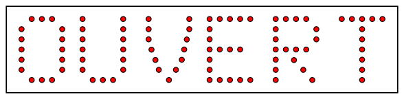

% Séquenceurs à compteurs
% [Yves Tiecoura](mailto:tiecouray@yahoo.fr), INP-HB Yamoussoukro et [Pierre-Yves Rochat](mailto:pyr@pyr.ch), EPFL
% rév 2015/11/11

## Animation d’une enseigne ##

Une enseigne peut être jolie simplement par sa forme et les couleurs des LED. Mais des animations la rendent encore plus attrayante. Une animation, c’est une séquence, ce sont des états qui se succèdent, avec des valeurs pour chaque groupe de LED.

Prenons un exemple : pour attirer l’œil, une enseigne avec le mot OUVERT va être animée avec la séquence dont voici le diagramme des temps :

Une autre manière de représenter cette séquence est un graphe d’état :

Remarquons qu’il n’y a aucune condition pour passer d’un état à l’autre : le  système change d’état à chaque coup d’horloge.

Nous avons volontairement utilisé des durées constantes pour chaque état, pour simplifier la réalisation. Nous remarquons que la séquence choisie a 8 valeurs. Or un compteur binaire de 3 bits passe aussi par 8 valeurs.

## Compteur binaire ##

Un compteur binaire est un système séquentiel qui va fournir sur ses sorties les valeurs binaires successives. Voici le symbole d’un compteur par 8, ou compteur 3 bits.

Les sorties sont notées *Bit 0* pour le bit de poids faible (lsb), *Bit 1* et *Bit 2* pour le bit de poids fort (msb).

Voici son diagramme des temps :

Voici son graphe d’état :

De manière générale, un compteur n bits donne une séquence de 2^n^ valeurs sur ses sorties.

La base d’un compteur binaire est un compteur par deux, facile à réaliser avec une bascule D, dont on relie la sortie inversée à l’entrée.

On peut mettre en cascade plusieurs compteurs par 2 pour réaliser un compteur binaire par 2^n^. On appelle aussi parfois ce type de compteurs un compteur modulo 2^n^, ce qui met en évidence qu’il reprend la valeur zéro après 2^n^-1.

En reliant l’entrée Horloge du compteur à un oscillateur, on obtient 2^n^ temps de même durée. On a donc réalisé la séquence souhaitée, sauf que les valeurs pour chacun des état ne correspondent pas aux valeurs souhaitées pour notre enseigne.

## Logique de décodage pour les séquences ##

Un simple système combinatoire va nous permettre d’obtenir les signaux de commande des groupes de LED :

Voici sa table de vérité :

Il est possible d’obtenir le schéma le plus simple pour cette logique combinatoire par simplification avec des tables de Karnaugh. Mais on voit déjà que le montage résultant sera compliqué. D’autre part, cette solution n’est pas flexible. Tout changement de la séquence va aboutir à une refonte complète du schéma logique. Ce n’est pas la bonne piste...

## Mémoire morte ##

On appelle *mémoire morte* ou ROM (Read Only Memory), un circuit mémoire à contenu fixe. Voici comment elle se présente :

On remarque des entrées, qui sont les adresse ("Address" en anglais), ainsi que des sorties, qui sont les données (*Data* en anglais). Des entrées de sélections sont généralement disponibles, comme le signal OE (*Output Enable* = sélection des sorties). Pour chaque combinaison des adresses, une valeur particulière est présente sur les sorties.

Dans le cas simple de notre enseigne, il faudrait une ROM munie de seulement 3 bits d’adresse et de 6 bits de donnée. Bien entendu, il suffira de laisser à zéro les adresses non utilisées d’une ROM comportant davantage d’adresses.

Voici le schéma complet de notre commande d’enseigne :

## Types de ROM et programmation ##

Faire réaliser une ROM avec un contenu spécifique pour un type d’enseigne est possible, mais n’est intéressant que lorsque la quantité est importante. On utilisera plus souvent des ROM programmables.

Des PROM contenant des fusibles ont été beaucoup utilisées dans les années 1970. Bien qu’existant encore chez certains fabricants, on utilisera plus volontiers des ROM programmables et effaçables : EPROM (Erasable Programmable Read Only Memory).

La technologie des années 1970 et 1980 est encore disponible, avec des mémoires effaçables par ultra violet. Des appareils dédiés permettent l’effacement de la mémoire en une dizaine de minutes. Mais ces mémoires doivent posséder une fenêtre, pour que les UV puissent atteindre la surface du circuit intégré.

Nous avons encore trouvé en 2007 des électroniciens qui utilisaient une EPROM et un compteur binaire C-MOS pour la commande d’enseignes commerciales. C’était à Douala, au Cameroun. Nous ignorons si ces technologies sont encore utilisées actuellement. Le schéma devait être approximativement le suivant :

Pour ne pas devoir utiliser les coûteux boîtiers avec une fenêtre, les fabricants sont parvenus dans les années 1990 à produire des mémoires EEPROM : Electricaly Erasable Programmable Read Only Memory. A noter que cette technologie est souvent présente dans les microcontrôleurs.

## Solution plus simple ##

Aujourd’hui, il est nettement plus simple de réaliser des commandes d’enseignes avec avec un microcontrôleur. Non seulement, le schéma est beaucoup plus simple, basé sur un seul circuit intégré. Mais le coût des composants est nettement plus faible.

D’autre part, un plus grande flexibilité peut être obtenue :

* le temps peut être divisé en durées variables
* la production de signaux PWM permet une variation de l’intensité des LED
* le changement de la séquence se fait par une simple programmation du microcontrôleur

