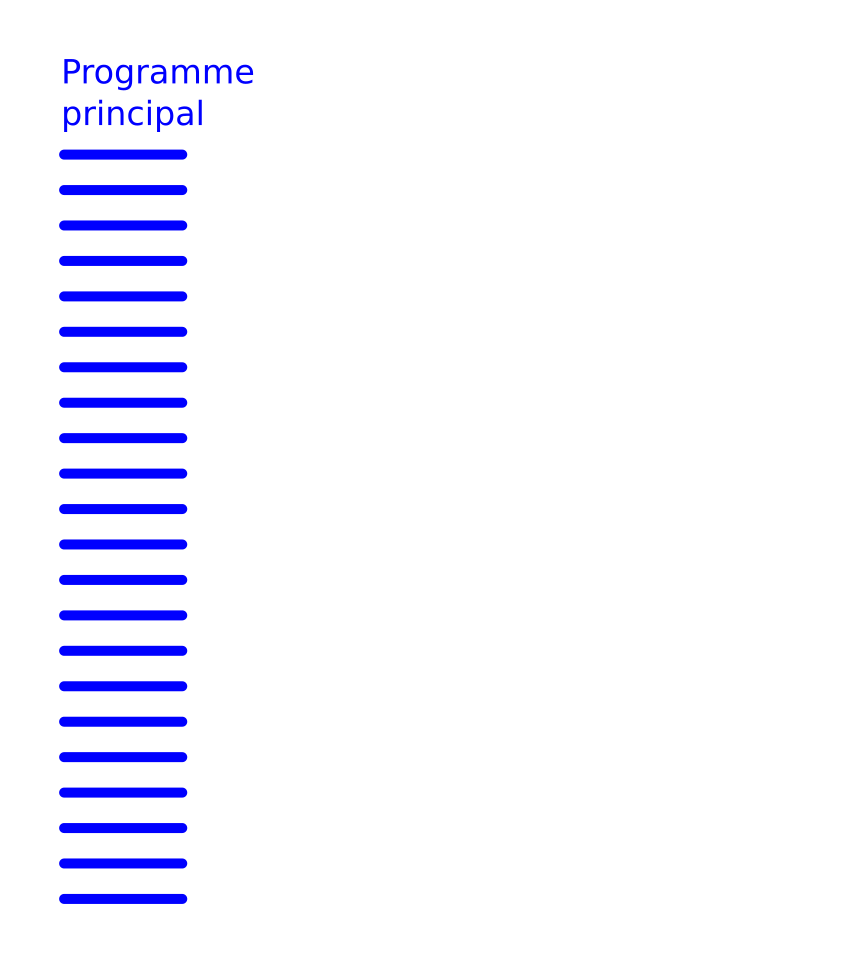
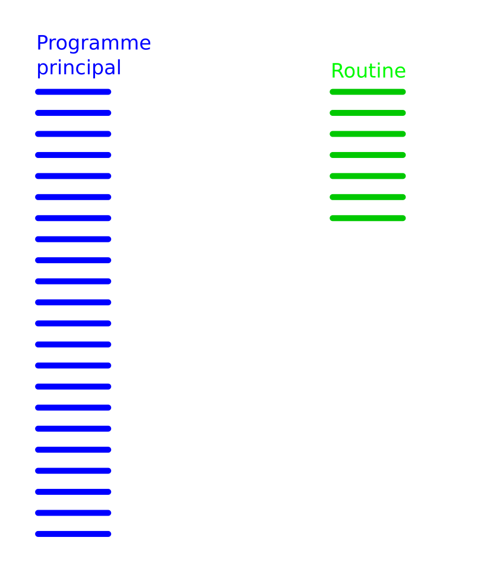
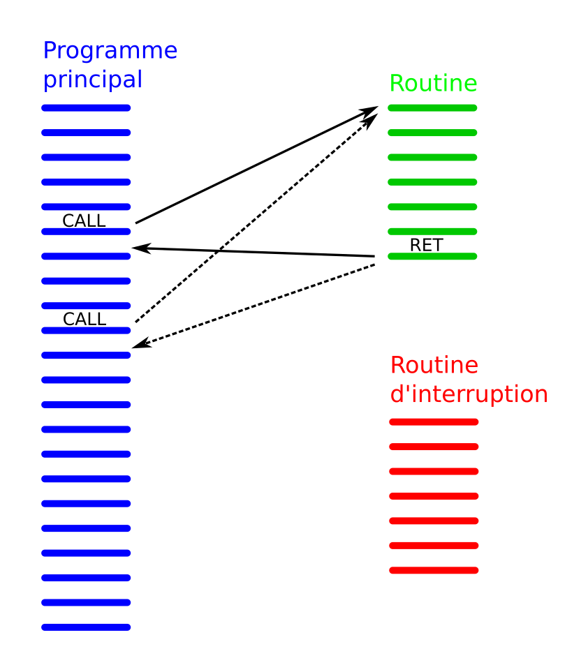
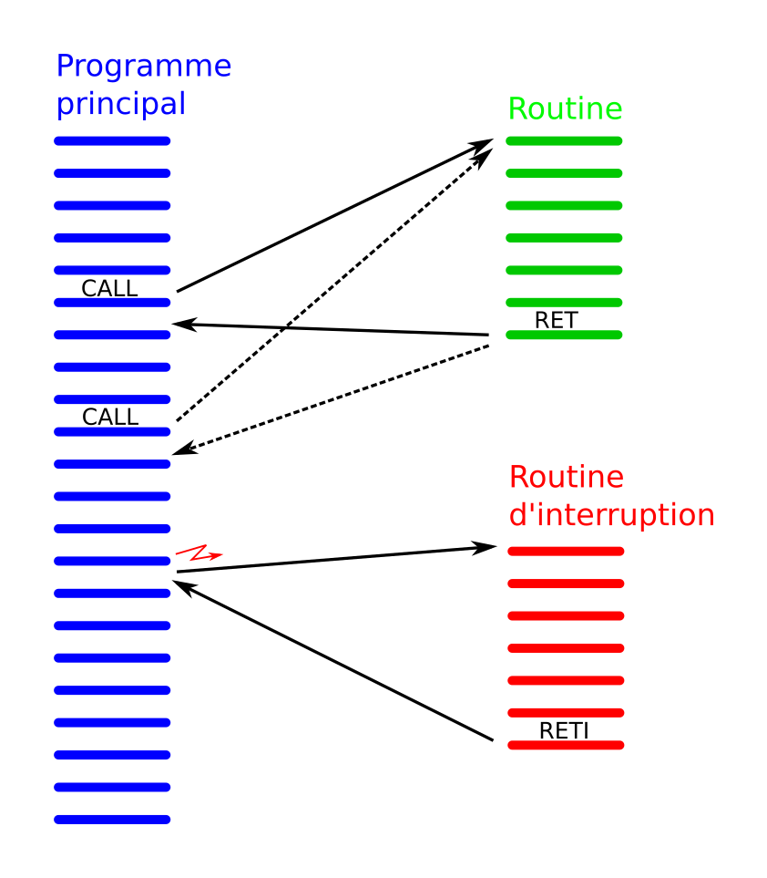

<!-- DIAPORAMA -->

<!-- Page de titre -->
<section class="page_de_garde">

Enseignes et afficheurs à LED

Les interruptions

Dr. Yves Tiecoura

</section>

<!-- Page bienvenue plein écran-->
<section>
<h1 class="en_tete">Les interruptions</h1>
<!-- def A -->
<!-- def A -->
<!-- def A -->

<!-- def A -->**Enseignes et afficheurs à LED** |  Les interruptions
<!-- def A -->

<!-- A -->

Dr. Yves Tiecoura

</section>

<!-- Page bienvenue, demi-->
<section>
<!-- A -->
<h1 class="en_tete">Les interruptions</h1>

* Principe des interruptions
* Événements produisant des interruptions
* Mise en œuvre
* Deux exemples

</section>

<!-- Page Motivation, 9 arrivées-->
<section>
<!-- A -->
<h1 class="en_tete">Motivation des interruptions</h1>

De manière générale un microcontrôleur doit être programmé pour :

<!-- 234567 -->

<!-- 234567 -->* détecter des changements sur ses entrées
<!-- 34567 -->* agir en conséquence sur ses sorties
<!-- 234567 -->

<!-- 4567 -->

<!-- 4567 -->Dans les enseignes et afficheurs à LED :
<!-- 4567 -->

<!-- 567 -->

<!-- 567 -->* Le système n’a souvent que des sorties...
<!-- 67 -->* Dans certains cas, il doit réagir à des entrées (ex : télécommande)
<!-- 7 -->* Il doit exécuter des tâches à des instants précis (ex : matrices multiplexées)
<!-- 567 -->

</section>

<!-- Page définition, n images-->
<section>
<!-- A -->
<h1 class="en_tete">Définition</h1>

On appelle interruption, l’arrêt temporaire d’un programme au profit d’un autre programme, jugé à cet instant plus important.

<!-- 23456 -->

<!-- 23456 -->Dans la vie courante :
<!-- 23456 -->

<!-- 3456 -->

<!-- 3456 -->* Je suis en train de travailler
<!-- 456 -->* Le téléphone sonne
<!-- 56 -->* Je vais répondre au téléphone
<!-- 6 -->* Après la conversation, je reprends mon travail là où je l’avais laissé.
<!-- 3456 -->

<!-- 3456 -->
<!-- 456 -->
<!-- 56 -->
<!-- 6 -->
</section>

<!-- Page routines, n images-->
<section>
<!-- A -->
<h1 class="en_tete">Routine</h1>

<!-- 2 -->
<!-- 3 -->
<!-- 4 -->
</section>

<section>
<!-- A -->
<h1 class="en_tete">Routine d’interruption</h1>

<!-- 2 -->
<!-- 3 -->
</section>

<!-- Page Evénements, 4 entrées-->
<section>
<!-- A -->
<h1 class="en_tete">Événements produisant des interruption</h1>

Deux sortes d’événements produisant des interruptions :

<!-- 234 -->* Les événements __extérieurs__ au microcontrôleur
<!-- 34 -->* Les événements __intérieurs__ au microcontrôleur
<!-- 4 -->
<!-- 4 -->...dont les événements liées aux Timers.

</section>

<!-- Page Discrimination, 4 entrées-->
<section>
<!-- A -->
<h1 class="en_tete">Discrimination des sources d’interruption</h1>

Il y a plusieurs sources d’interruptions sur un microcontrôleur

<!-- 234 -->Le système doit être capable d’en connaître la source
<!-- 234 -->
<!-- 34 -->* En consultant les fanions correspondant à chaque interruption
<!-- 4 -->* Grâce aux __vecteurs d’interruption__ *(interrupt vectors)*

</section>

<!-- Page vecteur -->
<section>
<!-- A -->
<h1 class="en_tete">Vecteurs d’interruption sur un MSP430G</h1>

* 0xFFFE : Reset
* 0xFFFC : NMI
* 0xFFFA : Timer1 CCR0
* 0xFFF8 : Timer1 CCR1, CCR2, TAIFG
* 0xFFF6 : Comparator_A
* 0xFFF4 : Watchdog Timer
* 0xFFF2 : Timer0 CCR0
* 0xFFF0 : Timer0 CCR1, CCR2, TAIFG

* 0xFFEE : USCI status
* 0xFFEC : USCI receive/transmit
* 0xFFEA : ADC10
* 0xFFE8 : -
* 0xFFE6 : Port P2
* 0xFFE4 : Port P1

</section>

<!-- Page Mise en oeuvre, 3 entrées + 1 image -->
<section>
<!-- A -->
<h1 class="en_tete">Mise en œuvre d’une interruption</h1>

Trois étapes pour mettre en œuvre une interruption :

<!-- 2345 -->* Autoriser l’interruption qui nous intéresse
<!-- 345 -->* Préciser comment cette interruption doit fonctionner
<!-- 45 -->* Autoriser globalement les interruptions

<!-- 5 -->
</section>

<!-- Page syntaxe, entrée + soft-->
<section>
<!-- A -->
<h1 class="en_tete">Syntaxe des routines d’interruptions en C</h1>

~~~~~~~ { .c }
 #pragma vector=NUMERO_DU_VECTEUR

 __interrupt void Nom_de_la_routine (void) {

  ...

 }
~~~~~~~

</section>

<!-- Page Inter In, 2 entrée + 2 soft-->
<section>
<!-- A -->
<h1 class="en_tete">Interruption sur une entrée</h1>

* **`P1DIR`** entrée ou sortie
* **`P1OUT`** valeur de sortie
* **`P1IN`** valeur des entrées *(lecture)*
* **`P1REN`** résistance de tirage *(pull-up ou pull-down)*

<!-- 2 -->

<!-- 2 -->* **`P1IE`** *Interrupt Enable* : autorisation de l’interruption
<!-- 2 -->* **`P1IES`** *Interrupt Edge Select* : choix du flanc
<!-- 2 -->* **`P1IFG`** *Interrupt FlaG* : les **fanions d’interruption**
<!-- 2 -->

</section>

<section>
<!-- A -->
<h1 class="en_tete">Interruption sur une entrée</h1>

* **`P1IE`** *Interrupt Enable* : autorisation de l’interruption
* **`P1IES`** *Interrupt Edge Select* : choix du flanc
* **`P1IFG`** *Interrupt FlaG* : les **fanions d’interruption**

>
</section>

<section>
<!-- A -->
<h1 class="en_tete">Interruption sur une entrée</h1>

~~~~~~~~~~~~~~~~~~~~~~~~~~~~~~~~~~~~~~~~~~~~~~~~~~~~~~~ {.C  .numberLines}
 int main() {
   WDTCTL = WDTPW + WDTHOLD; // Stop watchdog timer
   P1DIR |= (1<<6); // Led verte en sortie
   P1OUT |= (1<<3); P1REN |= (1<<3); //pull-up sur l’entrée P1.3

   P1IES |= (1<<3); // Sur le flanc descendant
   P1IE |= (1<<3); // Interruption P1 activée sur le bit 3
   P1IFG &=~(1<<3); // Fanion d’interruption remis à zéro
   __enable_interrupt(); // General Interrupt Enable

   while(1) { // il n’y a rien à faire dans la boucle principale !
   }
 }

~~~~~~~~~~~~~~~~~~~~~~~~~~~~~~~~~~~~~~~~~~~~~~~~~~~~~~~~~~~~~~~~~~~~~~~~~~~~

</section>

<section>
<!-- A -->
<h1 class="en_tete">Interruption sur une entrée</h1>

~~~~~~~~~~~~~~~~~~~~~~~~~~~~~~~~~~~~~~~~~~~~~~~~~~~~~~~ {.C  .numberLines startFrom="14"}
 // Routine d’interruption associée au Port P1

 // Syntaxe spécifique pour les interruptions :
 #pragma vector=PORT1_VECTOR
 __interrupt void Port1_ISR(void) {

   // Fanion d’interruption correspondant au bit 3 remis à 0 :
   P1IFG &= ~(1<<3)

   P1OUT ^= (1<<6); // inverse P1.6 (LED verte)
 }

~~~~~~~~~~~~~~~~~~~~~~~~~~~~~~~~~~~~~~~~~~~~~~~~~~~~~~~~~~~~~~~~~~~~~~~~~~~~

</section>

<!-- Page Inter In2-->
<section>
<!-- A -->
<h1 class="en_tete">Interruption sur deux entrées, avec discrimination</h1>

~~~~~~~~~~~~~~~~~~~~~~~~~~~~~~~~~~~~~~~~~~~~~~~~~~~~~~~ {.C  .numberLines}
 int main() {
   ...
   P1IES &=~((1<<3)|(1<<4)); // Flancs montants
   P1IE |= (1<<3)|(1<<4); // Interruption activée sur 2 entrées
   P1IFG &=~((1<<3)|(1<<4)); // Fanions d’interruption remis à 0
   ...

 #pragma vector=PORT1_VECTOR
 __interrupt void Port1_ISR(void) {
   // discrimination des causes possible de l’interruption :
   if (P1IFG & (1<<3)) { P1IFG &= ~(1<<3); ... ;}
   if (P1IFG & (1<<4)) { P1IFG &= ~(1<<4); ... ;}
 }

~~~~~~~~~~~~~~~~~~~~~~~~~~~~~~~~~~~~~~~~~~~~~~~~~~~~~~~~~~~~~~~~~~~~~~~~~~~~

</section>

<!-- Page ADC, 2 parties -->
<section>
<!-- A -->
<h1 class="en_tete">Interruption sur une fin de conversion AD</h1>

~~~~~~~~~~~~~~~~~~~~~~~~~~~~~~~~~~~~~~~~~~~~~~~~~~~~~~~ {.C  .numberLines}
 int main() {
   WDTCTL = WDTPW + WDTHOLD; // Stop watchdog timer
   P1DIR |= (1<<6); P1OUT &=~(1<<6); // LED verte en sortie
   // Activation du convertisseur ADC 10 bits (ADC10) :
   ADC10CTL0 = ADC10SHT_2 + ADC10ON + ADC10IE; // Interrupt enable
   ADC10CTL1 = INCH_1; // Canal 1 = entrée A1 = P1.1
   ADC10AE0 |= (1<<1); // Autorisation de l’entrée A1
   __enable_interrupt(); // General Interrupt Enable
   ADC10CTL0 |= ENC + ADC10SC; // lance une première conversion

   while(1) { // il n’y a rien à faire dans la boucle principale !
   }
 }

~~~~~~~~~~~~~~~~~~~~~~~~~~~~~~~~~~~~~~~~~~~~~~~~~~~~~~~~~~~~~~~~~~~~~~~~~~~~

</section>

<section>
<!-- A -->
<h1 class="en_tete">Interruption sur une fin de conversion AD</h1>

~~~~~~~~~~~~~~~~~~~~~~~~~~~~~~~~~~~~~~~~~~~~~~~~~~~~~~~ {.C  .numberLines startFrom="14"}
 // Routine d’interruption associée à la fin de conversion ADC
 #pragma vector=ADC10_VECTOR
 __interrupt void ADC10_ISR(void) {

   uint16_t val = ADC10MEM; // lit le résultat de la conversion
   ADC10CTL0 |= ENC + ADC10SC; // lance la conversion suivante

   if (val > 511) { // La LED verte montre si la valeur dépasse Vcc/2
     P1OUT |= (1<<6); // LED verte On
   } else {
     P1OUT &=~(1<<6); // LED verte Off
   }
 }

~~~~~~~~~~~~~~~~~~~~~~~~~~~~~~~~~~~~~~~~~~~~~~~~~~~~~~~~~~~~~~~~~~~~~~~~~~~~

</section>

<!-- Page conclusion, demi-->
<!-- ******************** -->
<section>
<!-- A -->
<h1 class="en_tete">Les interruptions</h1>

* Principe des interruptions
* Événements produisant des interruptions (externes ou internes)
* Mise en œuvre
* Deux exemples (interruption sur une entrée et sur une fin de conversion)

</section>

