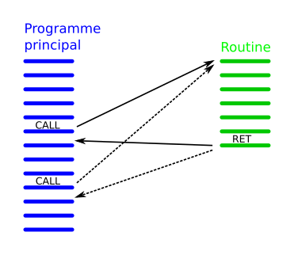
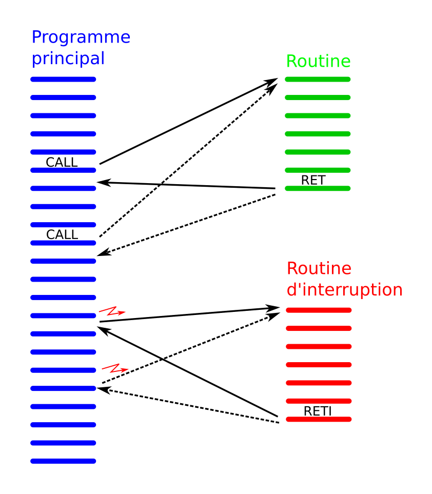

% Les interruptions
% [Yves Tiecoura](mailto:tiecouray@yahoo.fr), INP-HB Yamoussoukro
% rév 2015/12/13

## Motivation ##

Un système à microcontrôleur est généralement pourvu d’entrées et de sorties. Le but premier du programme est souvent de réagir correctement aux changements d’état des entrées, en agissant en conséquence sur les sorties.

Les enseignes et afficheurs à LED sont plutôt une exception dans ce domaine. Beaucoup d’enseignes ou d’afficheurs n’ont aucune entrée et ne font que faire évoluer les sorties selon un ordre prédéfini.

Il existe toutefois des cas où une enseigne ou un afficheur doit réagir à des entrées. Par exemple, une télécommande peut être utilisée pour allumer et éteindre un afficheur, changer sa luminosité ou le texte qu’il doit afficher. Un autre cas où le système doit réagir à un événement est la gestion du temps dans un afficheur multiplexé : à des instants précis, il faut envoyer de nouvelles valeurs sur les LED.

## Définition ##

On appelle **interruption** dans un système informatique l’arrêt temporaire d’un programme au profit d’un autre programme, jugé à cet instant plus important. L’interruption correspond au sens qu’on donne à ce mot dans nos vies courantes. Prenons un exemple : je suis en train de travailler à mon bureau. Le téléphone sonne. Je vais répondre au téléphone. Après la conversation, je reprends mon travail là où je l’avais laissé.

{ width=14cm }

C’est toujours un *événement* qui va produire une interruption. Cet événement a un caractère imprévisible, le programme ne sais pas quand il va se produire.

## Implémentation ##

Pour utiliser les interruptions, il n’est pas indispensable de comprendre en détail le mécanisme qui les rend possibles. C’est comme les procédures ou les fonctions, que nous avons l’habitude d’utiliser sans forcément connaître les mécanismes matériels qui les rendent possibles.

Toutefois, nous allons ici faire une petite incursion dans le monde de la programmation en assembleur, pour mieux comprendre les interruptions. La figure ci-dessous montre un programme, dont les instructions successives sont notées en bleu. Dans le cas où une fraction du programme doit s’exécuter plusieurs fois, on a l’habitude de grouper ses instructions, notées ici en vert. On appelle ce morceau de programme une *routine* ou *sous-routine*. Ce concept correspond aux procédures et aux fonctions dans les langages évolués comme le C.

{ width=7cm }

L’appel de la routine se fait par une instruction **Call** dans le programme principal. A la fin de l’exécution de la routine, une instruction **Ret** (return = retour) permet de revenir au programme appelant, juste après l’instruction *Call*. La routine peut être appelée plusieurs fois dans le programme principal.

Notons que l’adresse de retour doit être mémorisée pour que le retour soit possible. C’est une **pile** (*stack*) en mémoire vive qui est utilisée à cette fin. Nous ne détaillerons pas son mécanisme ici.

Regardons maintenant la figure suivante. Un nouvelle routine, appelée **Routine d’interruption** est représentée en rouge. On voit qu’elle va aussi s’exécuter. Mais son exécution n’est pas la conséquence d’une instruction *Call*.

{ width=7cm }

Rien dans le programme principal ne permet de savoir que cette routine va s’exécuter. C’est un **événement** qui est la cause de son exécution. C’est ce qu’on appelle un interruption.

La routine d’interruption se termine aussi par une instruction de retour, appelée **Reti** (*return from interrupt*). En plus d’effectuer le retour au programme interrompu, elle rétablit le mode de sensibilité aux interruptions qui prévalait avant l’interruption.

## Nature des événements ##

Quels sont ces événements qui vont produire une interruption ? Il en existe principalement deux sortes :

* Les événements **extérieurs** au microcontrôleur. Il s’agit par exemple d’un changement sur une entrée.
* Les événements **intérieurs** au microcontrôleur. Par exemple, beaucoup de microcontrôleurs sont pourvus d’un convertisseur analogique-numérique (*ADC = Analog to Digital Converter*). La conversion est déclenchée par un fanion et dure un certain temps. Plutôt que d’attendre la fin de la conversion, le programme principal peut continuer, puis être interrompu au moment de la fin de la conversion.

Dans cette catégorie des interruptions intérieures au microcontrôleur, les plus importantes sont celle liées aux **Timers**. Ce sujet sera abordé dans un chapitre séparé, vu son importance pour la commande des enseignes et afficheurs à LED.

## Discrimination des sources d’interruption ##

Il existe généralement plusieurs sources interruptions sur un microcontrôleur. Lorsqu’une interruption se produit, le système doit être capable d’en savoir la source. Si rien n’est prévu au niveau matériel, la routine d’interruption doit consulter les registres pour chaque interruption, pour connaître celle qui a été activée.

Les **vecteurs d’interruption** (*interrupt vectors*) permettent d’être plus efficace : une adresse différente est réservée pour le début de la routine de chaque interruption.

Souvent ces deux mécanismes vont être utilisés successivement, comme nous le verrons plus bas lors d’une interruption produite par une entrée sur un MSP430.

Voici la table résumée des vecteurs d’interruption pour un MSP430G, y compris l’adresse pour le Reset :

<!-- NJD ⇒ Transformer cette liste en tableau ??? -->

* 0xFFFE : Reset
* 0xFFFC : NMI
* 0xFFFA : Timer1 CCR0
* 0xFFF8 : Timer1 CCR1, CCR2, TAIFG
* 0xFFF6 : Comparator_A
* 0xFFF4 : Watchdog Timer
* 0xFFF2 : Timer0 CCR0
* 0xFFF0 : Timer0 CCR1, CCR2, TAIFG
* 0xFFEE : USCI status
* 0xFFEC : USCI receive/transmit
* 0xFFEA : ADC10
* 0xFFE8 : -
* 0xFFE6 : Port P2
* 0xFFE4 : Port P1

Les adresses se trouvent en mémoire flash, ce sont les dernières adresses de l’espace d’adressage de 16 bits.

Plusieurs sources d’interruptions nécessitent la scrutation pour déterminer la cause exacte de l’interruption. C’est le cas par exemple des interruptions sur les ports : chaque bit peut produire une interruption. C’est aussi le cas d’une des interruptions des Timers : les registre de comparaison 1 et 2, ainsi que l’interruption générale du Timer sont regroupés sur un vecteur unique.

## Mise en œuvre d’une interruption  ##

Plusieurs étapes sont nécessaire pour mettre en œuvre une routine d’interruption :

1. Enclencher l’interruption qui nous intéresse. Par exemple une interruption sur une entrée.
1. Préciser comment cette interruption doit fonctionner. Par exemple dire sur quel flanc l’interruption doit se produire.
1. Enclencher globalement les interruptions. Les microprocesseurs disposent d’un fanion général qui autorise les interruptions. Il est souvent utilisé pour pouvoir éviter les interruptions dans certaines parties critiques au programme, qui ne doivent pas être interrompues.

Le schéma logique ci-dessous montre la logique qui permet de générer les interruptions et les fanions qu’il faut ajuster.

{ width=17cm }

On y trouve :

* la logique qui permet de saisir un événement
* les fanions qui règlent la manière dont l’événement est décodé
* le fanion qui enclenche cette interruption particulière
* la porte ET associée à ce fanion pour produire cette interruption
* la porte OU qui permet à toutes les interruptions d’être prises en compte
* le fanion général d’autorisation des interruptions
* la porte ET qui produit finalement les interruptions.

## Syntaxe des routines d’interruptions ##

Le langage C ne définit pas la syntaxe des routines d’interruptions. Plusieurs notations sont utilisées, dépendant des compilateurs. Nous présenterons ici une des syntaxe supportée par les compilateurs GCC.

~~~~~~~ { .c }
 #pragma vector=NUMERO_DU_VECTEUR
 __interrupt void Nom_de_la_routine (void) {
  ...
 }
~~~~~~~

La première ligne indique au compilateur à quel vecteur d’interruption la routine sera associée. La seconde ligne est une déclaration de procédure presque habituelle, avec un nom et aucun paramètres d’entrée `(void)`. L’indication `__interrupt` permet au compilateur d’utiliser les instructions correspondant à une routine d’interruption, en particulier le *Reti* final.

## Interruption produite par une entrée ##

Sur les microcontrôleurs MSP430, plusieurs registres permettent de définir la manière dont une broche d’entrée-sortie est utilisée. Ils sont associés à un Port, composé de 8 broches. Sur le MSP430G2553 du Launchpad, deux ports sont disponibles : P1 et P2. On connaît déjà les registres suivant :

* **`P1DIR`** : détermine le rôle de la broche (entrée ou sortie)
* **`P1OUT`** : donne la valeur pour les broches de sortie
* **`P1IN`** : permet de lire la valeur des entrées
* **`P1REN`** : permet d’enclencher une résistance de tirage (pull-up ou pull-down, selon l’état de bit de P1OUT correspondant

Pour mettre en œuvre les interruptions sur des broches du port P1, trois registres supplémentaires sont disponibles :

* **`P1IE`** : (*Interrupt Enable*) permet l’enclenchement de l’interruption pour chaque bit. L’usage habituel est d’écrire dans ce registre pour choisir quels bits vont causer une interruption.
* **`P1IES`** : (*Interrupt Edge Select*) permet de choisir pour chaque bit le flanc qui va produire l’interruption. Lorsque le bit est à 0, l’interruption va se produire lors d’une transition de 0 vers 1 (*low-to-high transition*). L’usage habituel est d’écrire dans ce registre pour choisir quel flanc va causer une interruption, pour chaque bit.
* **`P1IFG`** : (*Interrupt FlaG*) les **fanions d’interruption**. Lorsque qu’un transition telle qu’elle est spécifiée dans un bit de `P1E`, le bit correspondant s’active dans P1IFG. C’est son activation qui produit l’interruption elle-même.

Voici un programme qui met en œuvre une interruption sur l’entrée `P1.3` (le poussoir du Launchpad) et qui change d’état `P1.6` (la LED verte) à chaque flanc descendant.

~~~~~~~ { .c .numberLines startFrom="1" }
int main() {
    WDTCTL = WDTPW + WDTHOLD; // Stop watchdog timer
    P1DIR |= (1<<6); // Led verte en sortie
    P1OUT |= (1<<3); P1REN |= (1<<3); //pull-up sur l’entrée P1.3

    P1IES |= (1<<3); // Mode d’interruption : sur le flanc descendant
    P1IE |= (1<<3); // Interruption P1 activée sur le bit 3
    P1IFG &=~(1<<3); // Fanion d’interruption remis à zéro
    __enable_interrupt(); // General Interrupt Enable

    while(1) { // il n’y a rien à faire dans la boucle principale !
    }
}

// Routine d’interruption associée au Port P1
// Syntaxe spécifique pour les interruptions :
#pragma vector=PORT1_VECTOR
__interrupt void Port1_ISR(void) {
  P1IFG &= ~(1<<3); // Fanion d’interruption correspondant au bit 3 remis à 0
  P1OUT ^= (1<<6); // inverse P1.6 (LED verte)
}
~~~~~~~
<!-- retour au mode normal pour l’éditeur -->

La première remarque, c’est que la boucle principale `while(1)...` ne fait rien ! En plus des initialisations classique des entrées et des sorties, trois instructions ont été ajoutées, correspondant aux étapes de mise en œuvre d’une interruption :

* L’activation d’un bit dans `P1IES` sélectionne le flanc descendant
* L’activation d’un bit dans `P1IE` autorise l’interruption sur l’entrée `P1.3`
* L’appel de la procédure `__enable_interrupt()` autorise globalement les interruptions sélectionnées

La mise à 0 du bit 3 dans le registre des fanions d’interruption `P1IFG` évite qu’un flanc sur l’entrée `P1.3` pouvant s’être produit avant l’autorisation des interruptions ne cause une interruption.

La routine d’interruption a été placée à la suite du programme principal, alors que nous avons l’habitude de placer les procédures avant le programme principal. Cette procédure n’est en effet jamais appelée explicitement.

## Scrutation du bit concerné ##

Dans notre exemple, seul le bit 3 est concerné par les interruptions. Dans la routine d’interruption, il n’y a donc pas besoin de regarder quel bit a produit l’interruption et c’est systématiquement le fanion 3 qui est remis à 0.

Lorsque l’interruption peut provenir de plusieurs entrées, il est alors nécessaire de scruter le registre pour connaître le bit qui a causé l’interruption, comme le montre cet exemple :

~~~~~~~ { .c .numberLines startFrom="1" }
int main() {
  ...
  P1IES &=~((1<<3)|(1<<4)); // interruptions aux flancs montants
  P1IE |= (1<<3)|(1<<4); // Interruption activée sur 2 entrées
  P1IFG &=~((1<<3)|(1<<4)); // Fanions d’interruption remis à zéro
  ...

#pragma vector=PORT1_VECTOR
__interrupt void Port1_ISR(void) {
  // scrutation des causes possible de l’interruption :
  if (P1IFG & (1<<3)) {... ; P1IFG &= ~(1<<3); }
  if (P1IFG & (1<<4)) {... ; P1IFG &= ~(1<<4); }
}
~~~~~~~
<!-- retour au mode normal pour l’éditeur -->

## Interruption de fin de conversion ##

Voici un autre exemple d’interruption, où l’événement est interne au microcontrôleur. L’interruption doit se produire lorsque le convertisseur Analogique-Numérique (ADC) termine sa conversion.

~~~~~~~ { .c .numberLines startFrom="1" }
int main() {
  WDTCTL = WDTPW + WDTHOLD; // Stop watchdog timer
  P1DIR |= (1<<6); P1OUT &=~(1<<6); // LED verte en sortie
  // Activation du convertisseur ADC 10 bits (ADC10) :
  ADC10CTL0 = ADC10SHT_2 + ADC10ON + ADC10IE; // ADC10ON, interrupt enabled
  ADC10CTL1 = INCH_1; // Canal 1 = entrée A1 = P1.1
  ADC10AE0 |= (1<<1); // Enclanchement de l’entrée A1
  __enable_interrupt(); // General Interrupt Enable
  ADC10CTL0 |= ENC + ADC10SC; // lance une première conversion

  while(1) { // il n’y a rien à faire dans la boucle principale !
  }
}

// Routine d’interruption associée à la fin de conversion ADC
#pragma vector=ADC10_VECTOR
__interrupt void ADC10_ISR(void) {
  uint16_t val = ADC10MEM; // lit le résultat de la conversion
  ADC10CTL0 |= ENC + ADC10SC; // lance la conversion suivante
  if (val > 512) { // Montre sur la LED verte si la valeur dépasse Vcc/2
    P1OUT |= (1<<6); // LED verte On
  } else {
    P1OUT &=~(1<<6); // LED verte Off
  }
}
~~~~~~~

