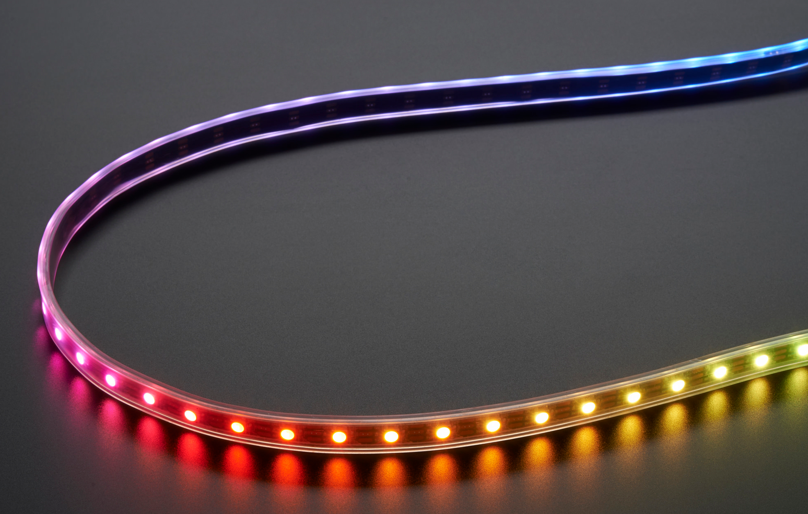

<!-- DIAPORAMA -->

<!-- Page de titre -->
<section class="page_de_garde">

Enseignes et afficheurs à LED

Rubans de LED

Pierre-Yves Rochat

</section>

<section>
<!-- A -->
<h1 class="en_tete">Rubans de LED</h1>

Pierre-Yves Rochat

* Rubans uniformes
* Rubans addressables
* Signaux de commande
* Programmation

</section>

<section>
<!-- A -->
<h1 class="en_tete">Plusieurs sortes de rubans de LED</h1>

</section>

<section>
<!-- A -->
<h1 class="en_tete">Rubans uniformes</h1>

* 32 x 32 pixels => 1024 sorties de registre
<!-- 234567 -->* 128 registres 8 bits 74HC595 et 1024 résistances
<!-- 34567 -->* Trois fois plus pour une matrice RGB !
<!-- 4567 -->* Registres 16 bits à sortie à courant constant SUM2016
<!-- 557 -->* 192 circuits intégrés et 192 résistances

</section>

<section>
<!-- A -->
<h1 class="en_tete">Programmer des animations</h1>

~~~~~~~ { .c .numberLines startFrom="1" }
    temps++; // comptage du temps

    // Clignotement des LED 0 et 30
    if (temps==500) {
        Ruban[30] = Ruban[0] = 0xFFFFFF;
    }
    if (temps==1000) {
        temps=0; Ruban[30] = Ruban[0] = 0;
    }
    // Changement progressif de la couleur de la LED 47
    Ruban[47]++;
~~~~~~~

</section>

