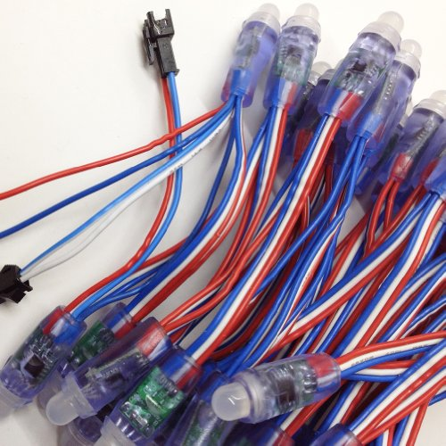
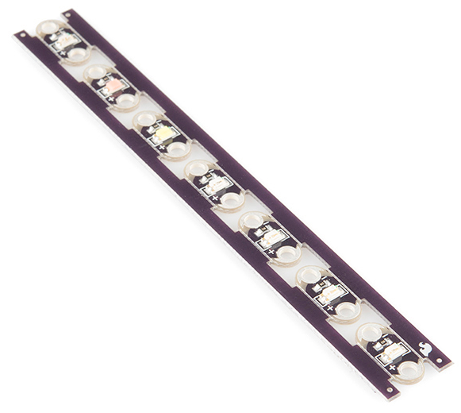
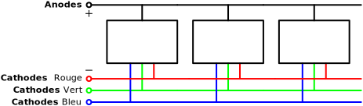
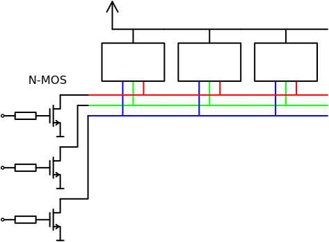
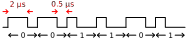

<!-- DIAPORAMA -->

<!-- Page de titre -->
<section class="page_de_garde">

Enseignes et afficheurs à LED

Rubans de LED

Pierre-Yves Rochat

</section>

<section>
<!-- def A -->
<!-- def A -->
<!-- def A -->

<!-- def A -->**Enseignes et afficheurs à LED** | Rubans de LED
<!-- def A -->

<!-- A -->
<h1 class="en_tete">Rubans de LED</h1>

Pierre-Yves Rochat

* Rubans uniformes
* Rubans addressables
* Signaux de commande
* Programmation

</section>

<section>
<!-- A -->
<h1 class="en_tete">Plusieurs sortes de rubans de LED</h1>

* Des formes très différentes
<!-- 2 -->* Uniformes ou adressables

<!-- 2 -->
<!-- 2 -->
</section>

<section>
<!-- A -->
<h1 class="en_tete">Rubans uniformes</h1>

* une seule couleur un seule intensité à un instant-donné, pour toutes les LED

<!-- 2 -->
<!-- 2 -->

<!-- 2 -->* monochrome ou RGB (Rouge Vert Bleu)
<!-- 2 -->

</section>

<section>
<!-- A -->
<h1 class="en_tete">Commande par transistors N-MOS</h1>

</section>

<section>
<!-- A -->
<h1 class="en_tete">Rubans adressables</h1>

* Chaque LED est indépendante pour sa couleur et son intensité
<!-- 234 -->* Rubans adressables *(Addressable strips)*

<!-- 34 -->
<!-- 4 -->

<!-- 4 -->* Horloge asymétrique
<!-- 4 -->

<!-- 4 -->
</section>

<section>
<!-- A -->
<h1 class="en_tete">Registres série-parallèles</h1>

Chaque registre :

- garde la première donnée
- transmet les suivantes

</section>

<section>
<!-- A -->
<h1 class="en_tete">Génération des signaux</h1>

* Le fabricant donne des contraintes sur le *timing* des signaux
<!-- 34 -->* Difficile de tenir les spécifications avec des processeurs dont l'horloge est à 16 MHz
<!-- 4 -->* Plus facile avec un processeurs dont l'horloge est de 48 MHz : **ARM**

<!-- 234 -->
</section>

<section>
<!-- A -->
<h1 class="en_tete">Bit banging</h1>

~~~~~~~ { .c .numberLines startFrom="1" }
#define WS2811_Pin GPIO_PIN_10
#define PORT_WS2811 GPIOA
#define BIT_WS2811 10
#define WS28On (PORT_WS2811->ODR|=(1<<BIT_WS2811))
#define WS28Off (PORT_WS2811->ODR&=~(1<<BIT_WS2811))

#define Un WS28On;WS28On;WS28On;WS28On;WS28On;WS28On;WS28On;WS28Off;
#define Zero WS28On;WS28Off;WS28Off;WS28Off;WS28Off;WS28Off;WS28Off;WS28Off

#define UnCourt WS28On;WS28On;WS28On;WS28On;WS28On;WS28On;WS28Off;
#define ZeroCourt WS28On;WS28Off;WS28Off;WS28Off;WS28Off;WS28Off;WS28Off;
~~~~~~~

</section>

<section>
<!-- A -->
<h1 class="en_tete">Initialisations et variables</h1>

~~~~~~~ { .c .numberLines startFrom="13" }
// Contenu du ruban :
#define LgRuban 50
uint32_t Ruban[LgRuban];

int main(void) {     // Programme principal
  HAL_Init();        // Initialisation de la librairie Hardware Level
  SystemClock_Config(); // Configure l'horloge système
  MX_GPIO_Init();    // Initialise les périphériques
  PORT_WS2811->MODER |= (0b01 << (BIT_WS2811*2)); // broche en sortie

  uint32_t i;
  volatile uint16_t j;
  uint32_t v, idx;
  uint32_t *pt;      // pointeur dans le tableau

  // Initialisation fixe des couleurs
  for (idx=0; idx<LgRuban; idx++) {
    Ruban[idx] = 1<<idx;
  }
~~~~~~~

</section>

<section>
<!-- A -->
<h1 class="en_tete">Boucle critique</h1>

~~~~~~~ { .c .numberLines startFrom="33" }
 while (1) { // boucle principale
    pt = Ruban;
    __ASM volatile ("cpsid i"); // interrupt OFF

    for (idx=0; idx<LgRuban; idx++) {
      v = *pt;
      if (v & (1<<23)) {Un;} else {Zero;}
      if (v & (1<<22)) {Un;} else {Zero;}
      if (v & (1<<21)) {Un;} else {Zero;}
      if (v & (1<<20)) {Un;} else {Zero;}
      if (v & (1<<19)) {Un;} else {Zero;}
      if (v & (1<<18)) {Un;} else {Zero;}
      if (v & (1<<17)) {Un;} else {Zero;}
      if (v & (1<<16)) {Un;} else {Zero;}
      if (v & (1<<15)) {Un;} else {Zero;}
      if (v & (1<<14)) {Un;} else {Zero;}
      if (v & (1<<13)) {Un;} else {Zero;}
      if (v & (1<<12)) {Un;} else {Zero;}
~~~~~~~

</section>

<section>
<!-- A -->
<h1 class="en_tete">Boucle critique</h1>

~~~~~~~ { .c .numberLines startFrom="51" }
      if (v & (1<<11)) {Un;} else {Zero;}
      if (v & (1<<10)) {Un;} else {Zero;}
      if (v & (1<<9)) {Un;} else {Zero;}
      if (v & (1<<8)) {Un;} else {Zero;}
      if (v & (1<<7)) {Un;} else {Zero;}
      if (v & (1<<6)) {Un;} else {Zero;}
      if (v & (1<<5)) {Un;} else {Zero;}
      if (v & (1<<4)) {Un;} else {Zero;}
      if (v & (1<<3)) {Un;} else {Zero;}
      if (v & (1<<2)) {Un;} else {Zero;}
      if (v & (1<<1)) {UnCourt;} else {ZeroCourt;}
      pt++;
      if (v & (1<<0)) {UnCourt;} else {ZeroCourt;}
    }

    __ASM volatile ("cpsie i"); // interrupt ON
    for (j=0; j<500; j++) {     // reset
    }
  }
~~~~~~~

</section>

<section>
<!-- A -->
<h1 class="en_tete">Programmer des animations</h1>

~~~~~~~ { .c .numberLines startFrom="71" }
    temps++; // comptage du temps

    // Clignotement des LED 0 et 30 :
    if (temps==500) {
        Ruban[30] = Ruban[0] = 0xFFFFFF;
    }
    if (temps==1000) {
        temps=0; Ruban[30] = Ruban[0] = 0;
    }
    // Changement progressif de la couleur de la LED 47 :
    Ruban[47]++;
  }
~~~~~~~

</section>

<section>
<!-- A -->
<h1 class="en_tete">Rubans de LED</h1>

* Rubans uniformes
* Rubans addressables
* Signaux de commande
* Programmation

</section>

