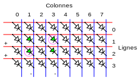

% Afficheurs matriciels multiplexés
% [Pierre-Yves Rochat](mailto:pyr@pyr.ch), EPFL
% rév 2016/07/09

## Afficheur matriciel et schéma de commande ###

Le schéma classique d’un afficheur matriciel nécessite simplement une sortie de registre par LED, comme le rappelle ce schéma :

<!--  20/07/16 Brice ------------------------   Changement de nom pour passer sur Opera (avec bloqueur de pub)   ---------------------------- -->
{ width=95% }

L’envoi des données dans les registres série-parallèle se fait selon le diagramme des temps suivant :

{ width=70% }

## Augmentation du nombre de LED ##

Lorsque le nombre de LED augmente, le nombre de registres augmente aussi. Ainsi un afficheur de 32×32 pixels nécessite 1024 sorties de registre. En utilisant le registre classique 74HC595 qui compte 8 sorties, il faut 1024 / 8 = 128 circuits intégrés et 1 résistance par LED, c’est-à-dire 1024 résistances. Ces nombres sont multipliés par 3 pour un afficheur couleur RGB, où un pixel est formé de trois LED.

Avec l’usage de registres à 16 sorties du type SUM2016, dont les sorties sont à courant constant, une matrice de 32×32 pixels RGB nécessitera tout de même 3x64 = 192 circuits intégrés et 192 résistances.

<!--
2016-07-10 Nico

Je ne comprends pas pourquoi il faut 192 circuits. Je dirais plutôt qu’il faut 1024 / 16 = 64 circuits
où 1024 est le nombre de LED et 16 le nombre de sorties du circuit.

Je devine que si le circuit fournit un courant constant en sortie, il n’y a pas besoin d’ajouter une résistance aux LED. Mais alors à quoi servent les 192 résistances ?

Je n’ai pas trouvé la fiche technique du SUM2016 sur internet. Ça serait bien que tu ajoute une annexe avec les fiches techniques des composants que tu mentionnes dans le cours.
-->

Il existe une solution qui nécessite moins de registres : c’est l’usage du multiplexage temporel. Notons dès maintenant que cette solution aura des conséquences sur la luminosité de l’afficheur.

## Regroupement des anodes et des cathodes par direction ##

Pour simplifier le câblage, examinons la solution qui consiste à regrouper les anodes de LED alignées dans une direction et les cathodes des LED alignées dans l’autre direction. Pour illustrer simplement notre propos, choisissons de réaliser un petit afficheur matriciel de 4 lignes de 8 pixels. Voici comment les LED vont être connectées :

{ width=70% }

## Multiplexage temporel ##

Il est impossible d’allumer en même temps certaines LED sans en allumer d’autres non souhaitées. Dans l’exemple suivant, on souhaite allumer les LED de coordonnées [1,1] et [3,2]. En alimentant les lignes et colonnes correspondantes, on voit qu’on allume aussi les LED [3,1] et [1,2] :

{ width=70% }

<!--
Sur la figure matrice-mux-4x8-2all.svg, ça serait bien de dessiner avec un trait plus épais les 2 lignes bleues et les 2 lignes rouges qui sont utilisées pour l’alimentation des LED qu’on veut allumer.
 -->

Mais il est possible de commander cette matrice de LED selon le principe du multiplexage temporel, présenté dans une leçon précédente. Le multiplexage temporel consiste à afficher successivement certaines parties de l’afficheur, à une vitesse telle que l’œil ne s’en rende pas compte. Voici le diagramme des temps correspondant :

{ width=100% }

ainsi que le schéma correspondant :

<!-- 20/07/16 Brice ------------------------   Changement de nom pour passer sur Opera (avec bloqueur de pub)   ---------------------------- -->
{ width=70% }

Pour un cycle complet de la matrice, le registre série-parallèle doit être chargé pour chacune des lignes, nécessitant chaque fois huit coups d’horloge série et un coup d’horloge parallèle. Une fois les données d’une ligne présentes sur la sortie du registre, les anodes de la ligne correspondante doivent être sélectionnées. Pour un rafraîchissement de la matrice à 100 Hz, il faudra prévoir un temps d’affichage de 100 / 4 = 25 ms pour chacune des quatre lignes.

On voit sur le schéma que le nombre de registres a diminué : dans ce cas, il n’en reste qu’un. Par contre, il est nécessaire de pouvoir sélectionner les lignes séparément. D’autre part, il faut placer un élément d’amplification, pour pouvoir fournir un courant suffisant pour l’ensemble des LED de la ligne. Nous avons utilisé ici un transistor PNP, mais très souvent, c’est un transistor MOS à canal P qui est utilisé.

Notons que dans ce montage, tous les signaux sont actifs à zéro. En effet, c’est bien une tension de 0 V qui permet de faire conduire le transistor PNP, en appliquant une tension négative entre sa base et son émetteur. C’est ainsi une tension nulle à la sortie du registre qui va allumer la LED correspondante sur la ligne sélectionnée.

## Démultiplexeur ou décodeur##

Pour éviter le grand nombre de signaux de sélection des lignes, un *démultiplexeur* est souvent utilisé. Ce circuit combinatoire est aussi appelé *décodeur*. Ses entrées correspondent aux valeurs binaires. Une seule de ses sorties peut être activée à un instant donné. Le circuit intégré 74HC138 est très souvent utilisé :

{ width=40% }

Le fait que les sorties soient actives à zéro convient bien pour la commande des transistors PNP. L’entrée **OE** (*Output Enable*) permet d’activer l’affichage.

## Courant nominal et courant maximal ##

Le multiplexage offre une diminution du nombre de composants nécessaires à l’électronique de commande, mais il diminue l’intensité lumineuse de l’afficheur. Cet effet peut être partiellement compensé en augmentant le courant dans les LED. En effet, on peut jouer sur le fait que le courant nominal des LED peut être dépassé lorsque ce courant n’est pas permanent, ce qui est toujours le cas sur un afficheur multiplexé. Le courant pouvant aller jusqu’à une valeur proche du **courant maximal** accepté par la LED, l’intensité instantanée est sensiblement augmentée. On utilise très souvent 150 % du courant nominal.

Il faudra toutefois être prudent lors de la mise au point logicielle. Une erreur pourrait laisser les LED avec le courant maximal durant un temps trop long, par exemple en permanence. S'il n'est pas possible d'avoir un circuit avec des résistances plus grandes pour la mise au point, on pourra chercher à diminuer la tension d'alimentation, ce qui fera baisser le courant.

## Comparaisons des architectures ##

Un multiplexage par deux ne diminue que très peu l’intensité lumineuse. Il était très souvent utilisé dans les modules constituant les panneaux des écrans vidéos géants. Il divise par deux le nombre de registres, mais nécessite l’usage d’amplificateurs sur les anodes. Avec la baisse du prix des registres, cette solution est de moins en moins utilisée.

Par contre, les valeurs 4, 8 et 16 se rencontrent fréquemment, vu que le prix de revient d’un module diminue lorsque la valeur du multiplexage augmente. Mais il faut bien rester conscient de l’incidence du multiplexage sur la luminosité de l’afficheur, en particulier lorsque celui-ci doit être utilisé à l’extérieur (*outdoor*).

Il faut aussi noter un autre point faible des afficheurs multiplexés. En cas de panne d’une LED, l’affichage peut être affecté sur des LED voisines.

Avec un peu d’habitude, on peut reconnaître la valeur du multiplexage en observant le circuit imprimé d’une matrice à LED. La géométrie de la matrice permet de calculer le nombre de LED présentes, en tenant compte des LED de chaque couleur pour chaque pixel. Le comptage des registres se fera en repérant et en comptant les circuits intégrés. En divisant le nombre de LED par le nombre de sorties de registres, on aura la valeur du multiplexage. Une confirmation pourra être obtenue en observant les amplificateurs qui commandent les anodes, se présentant souvent sous forme de circuits intégrés à 8 broches, contenant chacun deux transistors P-MOS. La présence des décodeurs 74HC138 sera une confirmation supplémentaire du multiplexage. On trouvera en plus très souvent des circuits 74HC245, qui n’ont pas de rôle logique, mais qui servent à amplifier les signaux entre le connecteur d’entrée et le connecteur de sortie. Les signaux sont en effet transmis d’une matrice vers la suivante par ce moyen.

## Programmation ##

La programmation des afficheurs matriciels multiplexés est similaire à celle des afficheurs matriciels non multiplexés. On utilise le principe de génération-rafraîchissement.

Avec un afficheur non multiplexé, il suffit d’attendre pour laisser un motif affiché un certain temps. Par contre, pour un afficheur multiplexé, il est nécessaire d’exécuter des cycles d’affichage en permanence, même si le contenu ne change pas.

Nous pouvons donc centrer notre programme sur une procédure qui effectue un cycle complet d’affichage des lignes de l’afficheur. La durée d’un cycle est constante, par exemple 10 ms pour un rafraîchissement à 100 Hz. Le temps d’exécution de cette procédure peut donc devenir la base de temps pour le séquencement des animations.

Pour faciliter l’écriture du programme, on passe le nombre de cycles à exécuter à la procédure d’affichage :

~~~~~~~ { .c .numberLines startFrom="1" }
uint8_t matrice[4];

void CyclesMatrice(uint16_t nbCycles) {
  uint16_t n, x, y;
  for (n=0; n<nbCycles; n++) {
    for (y=0; y<4; y++) {           // envoi et affichage des 4 lignes
      for (x=0; x<8; x++) {         // envoi des 8 bits d'une ligne
        if (matrice[y] & (1<<x) {
          DataClear;                // un 0 allume les LED
        } else {
          DataSet;
        }
        SerClockSet; SerClockClear; // envoie un coup d'horloge série
      }
      ParClockSet; ParClockClear;   // envoie un coup d'horloge parallèle
      AttenteLigne();               // affichage de la ligne durant 25 ms
    }
  }
}
~~~~~~~
<!-- retour au mode normal pour l'éditeur -->

Pour le reste, la programmation d’un afficheur multiplexé est la même que celle d’un afficheur non multiplexé. Par exemple, la procédure qui affiche un point qui rebondit sur les bords devient la suivante :

~~~~~~~ { .c .numberLines startFrom="1" }
void Ping() {
  int16_t x=0;
  int16_t y=0;
  int8_t sensX=1;
  int8_t sensY=1;
  do {
    AllumePoint(x,y);
    CyclesMatrice(DELAI); // l'affichage fait office de délai
    EteintPoint(x,y);
    x+=sensX;
    if(x==(MaxX-1)) { sensX=(-1); }
    if(x==0) { sensX=1; }
    y+=sensY;
    if(y==(MaxY-1)) { sensY=(-1); }
    if(y==0) { sensY=1; }
  } while (!((x==0)&&(y==0)));
}
~~~~~~~
<!-- retour au mode normal pour l'éditeur -->

Les deux lignes qu’on trouvait dans le programme pour un afficheur non multiplexé :

~~~~~~~ { .c .numberLines startFrom="1" }
    AfficheMatrice();
    Attente(DELAI);
~~~~~~~

sont ici remplacées par :

~~~~~~~ { .c .numberLines startFrom="1" }
    CycleMatrice(DELAI);
~~~~~~~

où la valeur `DELAI` est exprimée en nombre de fois le temps du cycle complet, par exemple 10 ms.

