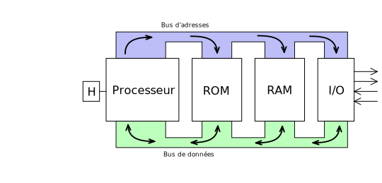
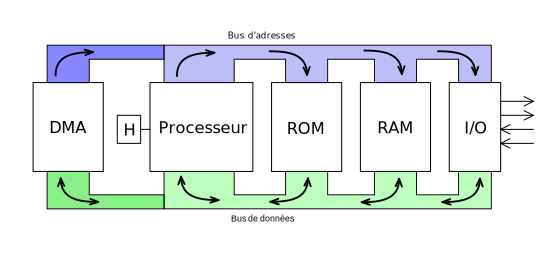

<!-- DIAPORAMA -->

<!-- Page de titre -->
<section class="page_de_garde">

Enseignes et afficheurs à LED

Accès direct en mémoire (DMA)

Pierre-Yves Rochat

</section>

<section>
<!-- def A -->
<!-- def A -->
<!-- def A -->

<!-- def A -->**Enseignes et afficheurs à LED** | Accès direct en mémoire (DMA)
<!-- def A -->

<!-- A -->
<h1 class="en_tete">Accès direct en mémoire (DMA)</h1>

Pierre-Yves Rochat

* Limite du débit d'un microcontrôleur
* Architecture du DMA
* Exemple simple
* Application à une matrice de LED

</section>

<section>
<!-- A -->
<h1 class="en_tete">Limite du débit de sortie d'un microcontrôleur</h1>

* Les matrices comportant beaucoup de LED exigent des vitesses de rafraîchissement élevées
<!-- 23456 -->* Des microcontrôleurs dont la fréquence du processeur est plus élevés peuvent être utilisés
<!-- 3456 -->* La technique de l'accès direct en mémoire repousse un peu la limite

<!-- 456 -->

<!-- 456 -->* **L'idée** : ne pas à avoir exécuter des instructions pour chaque transfert de donnée
<!-- 56 -->* Elle n'est pas nouvelle : le circuit Intel 8253 date de 1981...
<!-- 6 -->* et on en retrouve des traces dans les PC récents !
<!-- 456 -->

</section>

<section>
<!-- A -->
<h1 class="en_tete">Architecture d'un système informatique</h1>

</section>

<section>
<!-- A -->
<h1 class="en_tete">Architecture du DMA</h1>

</section>

<section>
<!-- A -->
<h1 class="en_tete">Programmation</h1>

* Principe simple...
* Documentation complexe
* Très grand nombre de registres

</section>

<section>
<!-- A -->
<h1 class="en_tete">Programme le plus simple possible</h1>

~~~~~~~ { .c .numberLines startFrom="1" }
int main(void) {
	HAL_Init();
	InitGPIOA();
	InitTrame();
	InitDMA();
	InitTimer1();

	while(1) {
	}
}
~~~~~~~

</section>

<section>
<!-- A -->
<h1 class="en_tete">Initialisation du DMA</h1>

~~~~~~~ { .c .numberLines startFrom="1" }
void InitDMA() {
	__HAL_RCC_DMA2_CLK_ENABLE();

	DMA_InitStructure.Channel = DMA_CHANNEL_6;
	DMA_InitStructure.Direction = DMA_MEMORY_TO_PERIPH;
	DMA_InitStructure.MemInc = DMA_MINC_ENABLE;
	DMA_InitStructure.PeriphInc = DMA_PINC_DISABLE;
	DMA_InitStructure.PeriphDataAlignment = DMA_PDATAALIGN_BYTE;
	DMA_InitStructure.MemDataAlignment = DMA_MDATAALIGN_BYTE;
	DMA_InitStructure.Mode = DMA_NORMAL;
	DMA_InitStructure.Priority = DMA_PRIORITY_VERY_HIGH;
	DMA_InitStructure.FIFOMode = DMA_FIFOMODE_DISABLE;
	DMA_InitStructure.MemBurst = DMA_MBURST_SINGLE;
	DMA_InitStructure.PeriphBurst = DMA_PBURST_SINGLE;

	DMA_Handle.Instance =  DMA2_Stream5;
	DMA_Handle.Init = DMA_InitStructure;

	HAL_DMA_Init(&DMA_Handle);
	HAL_DMA_Start(&DMA_Handle, (uint32_t) trame, (uint32_t) &GPIOA->ODR, LG_TRAME );
}
~~~~~~~

</section>

<section>
<!-- A -->
<h1 class="en_tete">Initialisation du timer et association avec le DMA</h1>

~~~~~~~ { .c .numberLines startFrom="1" }
void InitTimer1() {
	__TIM1_CLK_ENABLE();

	TIM_TimeBaseStructure1.Prescaler = 5000;
	TIM_TimeBaseStructure1.CounterMode = TIM_COUNTERMODE_UP;
	TIM_TimeBaseStructure1.Period = 0x00FF;
	TIM_TimeBaseStructure1.ClockDivision = TIM_CLOCKDIVISION_DIV1;
	TIM_TimeBaseStructure1.RepetitionCounter = 0;

	s_TimerInstance1.Init = TIM_TimeBaseStructure1;
	s_TimerInstance1.Instance = TIM1;

	HAL_TIM_Base_Init(&s_TimerInstance1);
	TIM1->DIER =  TIM_DMA_UPDATE;	// DMA Interrupt Enable
	HAL_TIM_Base_Start(&s_TimerInstance1);
}
~~~~~~~

</section>

<section>
<!-- A -->
<h1 class="en_tete">Utilisation du DMA pour piloter des matrices de LED</h1>

* Les registres série-parallèles nécessitent des signaux de données et des horloges
<!-- 2345 -->* Les horloges peuvent être placées en mémoire comme les données
<!-- 345 -->* Certains microcontrôleurs ont des circuits programmables capables de générer de telle horloges 

<!-- 45 -->

<!-- 45 -->* Finalement, on a repoussé avec le DMA la limite d'utilisation des microcontrôleurs
<!-- 5 -->* Pour aller encore plus loin, il faudra des circuits logiques programmables, comme les FPGA
<!-- 45 -->

</section>

<<section>
<!-- A -->
<h1 class="en_tete">Accès direct en mémoire (DMA)</h1>

* Limite du débit d'un microcontrôleur
* DMA, économie des instructions de transfert
* Exemple simple... mais programme complexe
* Application à une matrice de LED
* Génération des horloges

</section>

