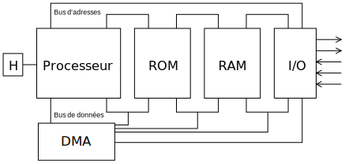

% Dynamic Memory Access
% [Pierre-Yves Rochat](mailto:pyr@pyr.ch), EPFL
% rév 2015/09/18

Auteurs : Pierre-Yves Rochat et Brice Perruche

## Limites du débit de sortie d'un microcontrôleur ##

Les afficheurs matriciels exigent le renvoi périodique des valeurs de chaque LED et les microcontrôleurs montrent leur limite lorsque le nombre de pixels augmentent. L'usage de microcontrôleurs dont la fréquence du processeur est plus élevés ne fera que reporter un peu plus loin le problème. La solution ultime et l'usage de circuits logiques spécilisée, implémentés généralement dans des circuits FPGA.

Mais une solution intéressante pour repousser plus loin les limites du microcontrôleurs pour le raffraîchissement des matrices de LED est l'usage d'une technique bien connue dans les ordinateurs, l'**Accès Direct en Mémoire** (*Direct Memory Access*, **DMA**).

Déjà à la fin des années 1970, le circuit Intel 8237 proposait du DMA compatible avec l'architecture des processeurs de la famille 8085. Quelques années plus tard, ce même circuit équipait les premiers PC d'IBM. On trouve encore aujourd'hui dans les *chip set* des PC modernes des traces de ce circuit.

## Architecture d'un microcontrôleur ##

Un microcontrôleur est composé d’un processeur, de mémoires ROM et RAM, ainsi que de circuits d'entrées-sorties (I/O).
Ces éléments sont reliés entre eux par des bus d’adresse et de données.

{ width=90% }

Le programme suivant, en langage Arduino, prend une valeur en mémoire et l'affiche sur une LED branchée sur un port de sortie.

~~~~~~~ { .c .numberLines startFrom="1" }
  int variable = 1;
  digitalWrite (P2_0, variable);
~~~~~~~

Dans le microcontrôleur, ce programme se déroulera de la manière suivante :

- Le processeur va placer l'adresse de la variable en mémoire sur le bus d'adresses et transférer sa valeur à travers le bus de données pour la mettre dans un de ses registres internes. On parle d'un cycle d'accés à la mémoire.
- dans une seconde étape, le processeur va placer l'adresse du registre de sortie sur le bus d'adresse et transférer la valeur par le bus de données dans le registre de sortie. Il s'agit d'un cycle d'accès aux entrées-sorties. Selon les architectures, les bus mémoires et d'entrées-sorties sont communus ou séparés.

Ces deux étapes ont nécessité également deux autres cycles d'accés à la mémoire, pour aller chercher les instructions correspondantes aux deux transferts réalisée.

Cette façon de faire ne pose pas de problème dans le cas de programmes simples et peu performants. Cependant, un nombre d’opérations d’entrées-sorties plus élevé peut entrainer une saturation du CPU, qui n’aura plus le temps de s’occuper du traitement des données. D’un autre point de vue, dans le monde des systèmes embarqués, on voudra souvent réduire autant que possible l’utilisation du CPU, qui est particulièrement énergivore.

## Se passer du CPU ##

Est-il possible de décharger le processeur de ces tâches ? C'est le but des contrôleurs le DMA. Plusieurs familles de microcontrôleurs en proposent. C'est le cas des microcontrôleurs base de processeurs ARM Cortex M, tels que les MSP432 de Texas Instrument et les STM32 de ST-micro. Certains PIC le proposent aussi (PIC32, PIC24FJ).

Sur d’autres microcontrôleurs moins évolués, tels quecertains PIC18 et MSP430, on peut trouver un périphérique (SPI, ADC) capable de transférer des données en mémoire RAM de maniète autonome. Il ne s'agit alors pas s'un contrôleur DMA à usage gnéral, mais c'est bien de l'accès direct en mémoire qui est effectué.

Voici une figure qui montre comment l'architecture d'un système informatique peut être modifiée pour effectuer du DMA :

{ width=15cm }

Le contrôleur DMA est donc une unité dédiée, reliée au bus de données. Il s’agit en quelque sorte d’un mini-processeur qui va s’occuper exclusivement de transférer les données entre la mémoire et les périphériques. Les transferts peuvent s'effectuer d'une zone mémoire à une autre, entre la mémoire et des périphériques, ou directement entre des périphériques.

Chaque périphérique que nous souhaitons utiliser en DMA doit être conçu pour travailler avec le contrôleur DMA. L’interaction entre les deux se fait via un canal dédié.

## Le canal DMA ##

Il est fréquent que le contrôleur DMA soit relié à plusieurs périphériques à la fois. Comment les sélectionner ? En leur attribuant un numéro. Ainsi fonctionne le contrôleur DMA : Il est équipé de plusieures unités (canaux), chacune reliée à un périphérique, généralement suivant notre volonté. Chaque canal est relié au bus de données.

{ width=15cm }

Le schéma ci-dessus illustre un des deux contrôleurs DMA d'un STM32 F4xx, un microcontrôleur performant dont la sophistication entraîne une certaine complexité.

Son contrôleur DMA est divisé en 8 flux (streams), chaque flux disposant de 8 canaux multiplexés. Les accès à la mémoire et aux périphériques sont assurés respectivement par le port mémoire (Memory port) et le port périphérique (Peripheral port), même si ce dernier à également accès à la mémoire lors des transactions mémoire-mémoire. Ces deux ports sont reliés au bus de données (AHB data bus).

Le transfert de données d'un port à l'autre se fait via un flux. Chaque flux possède une mémoire tampon (buffer FIFO), activé ou non à notre convenance. Enfin, l'arbitre gère la priorité des flux DMA pour chacun des deux ports. Les priorités sont définies librement dans le programme.

## Exemple simple de DMA ##

Les contrôleurs DMA sont complexes, les programme qui les mettent en oeuvre sont souvent assez longs. Ils ne sont pas facile à mettre au point, tant le volume de la documantation est important. Il est souvent préférable de s'inspirer de programmes existant, proposés par les fabricants et de les adapter à notre application.

Nous prendrons ici un programme volontairement le plus simple possible. Il va être capable d'envoyer une séquence de valeurs sur une LED.

Voici le programme complet :

~~~~~~~ { .c .numberLines startFrom="1" }
// Exemple d'utilsation du DMA
// 2016 Brice Perruche, Pierre-Yves Rochat

#include "stm32f4xx.h"
#include "stm32f4xx_nucleo.h"
#include "stm32f4xx_hal_tim.h"
#include "stm32f4xx_hal_dma.h"

#define LG_TRAME 64
uint8_t trame[LG_TRAME];

static TIM_Base_InitTypeDef  TIM_TimeBaseStructure1;
static TIM_HandleTypeDef s_TimerInstance1;

static DMA_InitTypeDef DMA_InitStructure;
static DMA_HandleTypeDef DMA_Handle;

void InitGPIOA() {
	static GPIO_InitTypeDef GPIO_A;
	__HAL_RCC_GPIOA_CLK_ENABLE();
	__GPIOA_CLK_ENABLE();

	GPIO_A.Pin =   GPIO_PIN_5;
	GPIO_A.Mode = GPIO_MODE_OUTPUT_PP;
	GPIO_A.Pull = GPIO_NOPULL;
	GPIO_A.Speed = GPIO_SPEED_FREQ_HIGH;
	HAL_GPIO_Init(GPIOA, &GPIO_A);
}

void InitTrame() {
	for(uint16_t i=0; i<LG_TRAME-8; i+=8) {
		trame[i] = (1<<5); trame[i+1] = 0; trame[i+2] = (1<<5); trame[i+3] = 0;
		trame[i+4] = 0; trame[i+5] = 0; trame[i+6] = 0; trame[i+7] = 0;
	}
}

void InitDMA() {
	__HAL_RCC_DMA2_CLK_ENABLE();

	DMA_InitStructure.Channel = DMA_CHANNEL_6;
	DMA_InitStructure.Direction = DMA_MEMORY_TO_PERIPH;
	DMA_InitStructure.MemInc = DMA_MINC_ENABLE;
	DMA_InitStructure.PeriphInc = DMA_PINC_DISABLE;
	DMA_InitStructure.PeriphDataAlignment = DMA_PDATAALIGN_BYTE;
	DMA_InitStructure.MemDataAlignment = DMA_MDATAALIGN_BYTE;
	DMA_InitStructure.Mode = DMA_NORMAL;
	DMA_InitStructure.Priority = DMA_PRIORITY_VERY_HIGH;
	DMA_InitStructure.FIFOMode = DMA_FIFOMODE_DISABLE;
	DMA_InitStructure.MemBurst = DMA_MBURST_SINGLE;
	DMA_InitStructure.PeriphBurst = DMA_PBURST_SINGLE;

	DMA_Handle.Instance =  DMA2_Stream5;
	DMA_Handle.Init = DMA_InitStructure;

	HAL_DMA_Init(&DMA_Handle);
	HAL_DMA_Start(&DMA_Handle, (uint32_t) trame, (uint32_t) &GPIOA->ODR, LG_TRAME );
}

void InitializeTimer1() {
	__TIM1_CLK_ENABLE();

	TIM_TimeBaseStructure1.Prescaler = 5000;
	TIM_TimeBaseStructure1.CounterMode = TIM_COUNTERMODE_UP;
	TIM_TimeBaseStructure1.Period = 0x00FF;
	TIM_TimeBaseStructure1.ClockDivision = TIM_CLOCKDIVISION_DIV1;
	TIM_TimeBaseStructure1.RepetitionCounter = 0;

	s_TimerInstance1.Init = TIM_TimeBaseStructure1;
	s_TimerInstance1.Instance = TIM1;

	HAL_TIM_Base_Init(&s_TimerInstance1);
	TIM1->DIER =  TIM_DMA_UPDATE;	// DMA Interrupt Enable
	HAL_TIM_Base_Start(&s_TimerInstance1);

}

int main(void) {
	HAL_Init();
	InitGPIOA();
	InitTrame();
	InitDMA();
	InitializeTimer1();

	while(1) {
	}
}

~~~~~~~

à suivre : 

* expliquer le code...
* donner des pistes pour l'utilisation d'une matrice de LED (placer les signaux couleurs et clocks dans la mémoire et lancer le DMA, timer pour les cycles, timer pour l'intensité sur OE).

 

