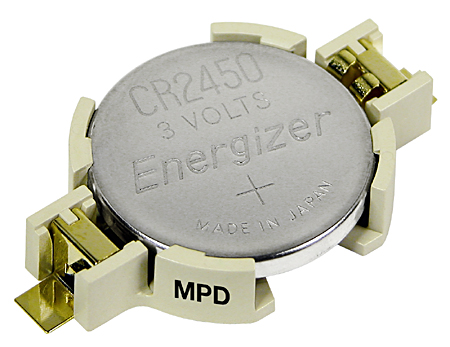
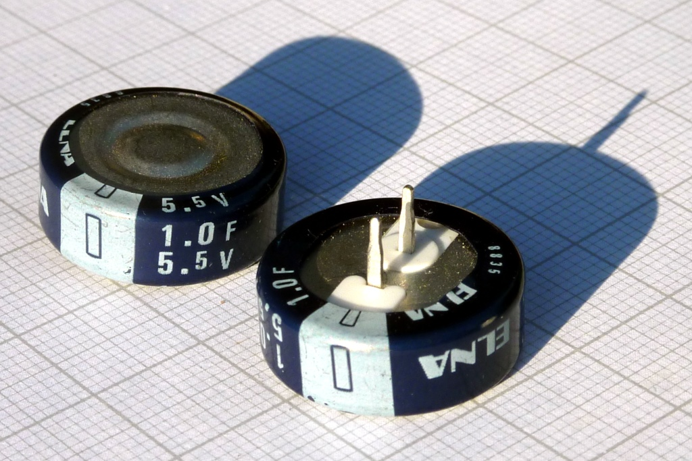
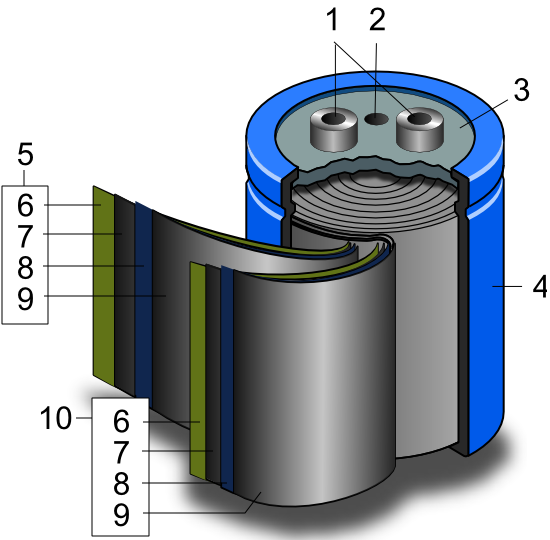

<!-- DIAPORAMA -->

<!-- Page de titre -->
<section class="page_de_garde">

Enseignes et afficheurs à LED

Horloges temps réel

Pierre-Yves Rochat

</section>

<!-- Page bienvenue plein écran-->
<section>
<h1 class="en_tete">Horloges temps réel</h1>
<!-- def A -->
<!-- def A -->
<!-- def A -->

<!-- def A -->**Enseignes et afficheurs à LED** | Horloges temps réel
<!-- def A -->

<!-- A -->

Pierre-Yves Rochat

</section>

<!-- Page bienvenue demi-->
<section>
<!-- A -->
<h1 class="en_tete">Horloges temps réel</h1>

* Principe d’une horloge électronique
* Alimentation permanente
* Programmation avec un microcontrôleur
* Circuits spécialisés
* Horloges internes

</section>

<!-- Page base temps -->
<section>
<!-- A -->
<h1 class="en_tete">Base de temps et division</h1>

* Les montres mécaniques utilisent un **mouvement oscillant** aussi stable que possible
<!-- 23456 -->* Des **engrenages** permettent ensuite d’obtenir les secondes, les minutes et les heures

<!-- 3456 -->

<!-- 3456 -->* Une montre électronique utilise un oscillateur à **quartz** comme base de temps
<!-- 456 -->* Généralement à 32’768 Hz
<!-- 3456 -->

<!-- 56 -->
<!-- 6 -->

<!-- 6 -->* 15 diviseurs par 2 vont permettre d’obtenir un signal de 1 Hz
<!-- 6 -->

</section>

<section>
<!-- A -->
<h1 class="en_tete">Base de temps et division</h1>
<!-- 1 -->
<!-- 2 -->
</section>

<!-- Page alim -->
<section>
<!-- A -->
<h1 class="en_tete">Alimentation</h1>

* Une alimentation doit être prévue lorsque le dispositif n’est pas sous tension
<!-- 234567 -->* On utilise souvent des piles au Lithium
<!-- 576 -->* Des super-condensateurs *Supercap* peuvent aussi être utilisés

<!-- 34 -->
<!-- 4 -->
<!-- 67 -->
<!-- 7 -->
</section>

<!-- Page progr -->
<section>
<!-- A -->
<h1 class="en_tete">Programmation sur un microcontrôleur</h1>

* Beaucoup de microcontrôleurs prévoient l’usage d’un **quartz à 32 kHz**
<!-- 23 -->* Il va falloir mettre le microcontrôleur **en veille** un maximum de temps
<!-- 3 -->* Le code va fortement dépendre de la **famille** du microcontrôleur utilisé

</section>

<section>
<!-- A -->
<h1 class="en_tete">Programme pour un AVR</h1>

~~~~~~~ { .c .numberLines startFrom="1" }
#include <avr/io.h>
#include <avr/interrupt.h>
#include <avr/sleep.h>

volatile uint8_t secondes;

// Il faut un quartz 32 khz sur les broches TOSC1 et TOSC2
ISR (TIMER2_OVF_vect) {
	secondes++;
    ...
}

int main () {
  Temps=0;
  ASSR=(1<<AS2); // oscillateur quartz 32 khz
  TCCR2B=0b101; // prédivision par 128
  TIMSK2=(1<<TOIE2); // interruption Timer2 Overflow autorisée
  sei(); // toutes les interruptions autorisées
  while (1) { // boucle correspondant à tous les réveils dus à l’interruption
    set_sleep_mode(SLEEP_MODE_PWR_SAVE); // mise en veille
    sleep_enable();
    sleep_mode(); // mode normal après un réveil
    sleep_disable();
  }
}
~~~~~~~
<!-- retour au mode normal -->

</section>

<section>
<!-- A -->
<h1 class="en_tete">Programme pour un AVR</h1>

~~~~~~~ { .c .numberLines startFrom="8" }
    ...
	secondes++;
    if (secondes == 60) {
      secondes = 0;
      minutes++;
      if (minutes == 60) {
        minutes = 0;
        heures++;
      if (heures == 24) {
        heures = 0;
        ...
      }
    }
    ...
~~~~~~~
<!-- retour au mode normal -->

</section>

<!-- Page RTC -->
<section>
<!-- A -->
<h1 class="en_tete">Circuits intégrés spécialisés</h1>

* Il existe de nombreux circuits intégrés qui réalisent une horloge temps réel
<!-- 23 -->* DS1307, PCF8523, PCF8563, bq32000, ...

<!-- 3 -->
</section>

<!-- Page RTC interne-->
<section>
<!-- A -->
<h1 class="en_tete">Horloge temps réel interne</h1>

* Certains microcontrôleurs intègrent une **zone séparée** prévue pour une horloge temps réel

<!-- 2 -->
</section>

<!-- Page Conclusion demi-->
<section>
<!-- A -->
<h1 class="en_tete">Horloges temps réel</h1>

* Principe d’une horloge électronique
* Alimentation permanente
* Programmation avec un microcontrôleur
* Circuits spécialisés
* Horloges internes

</section>
