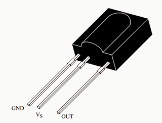
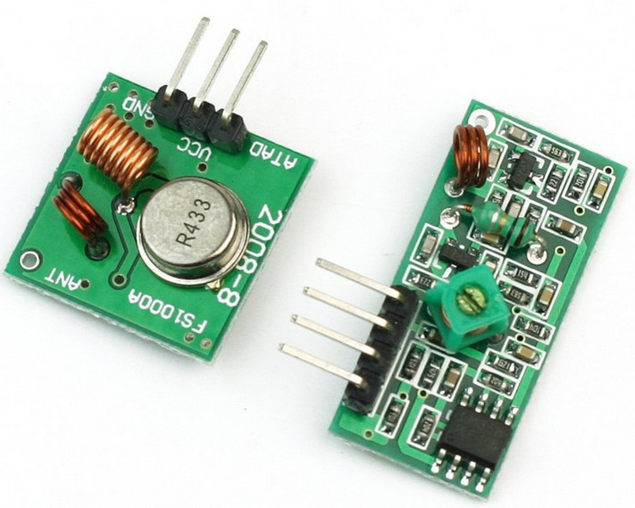
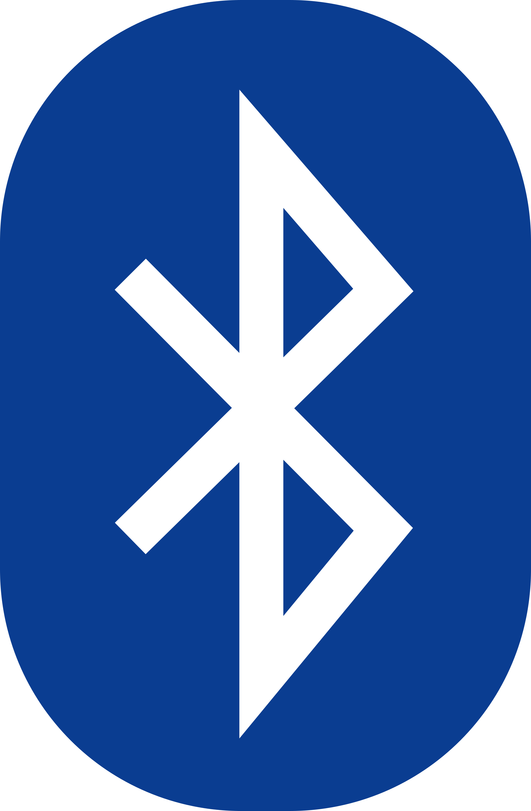
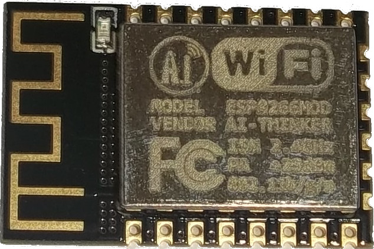
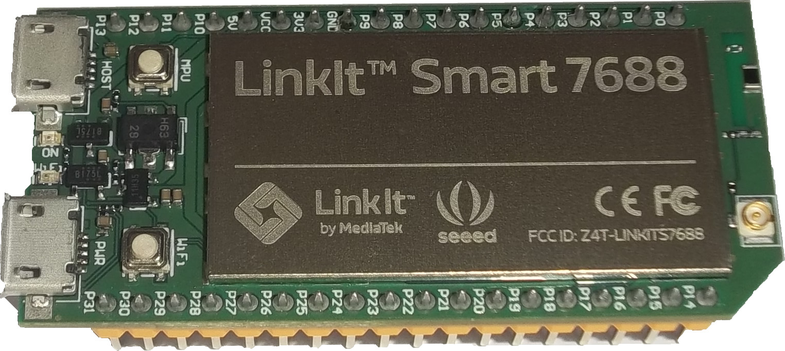
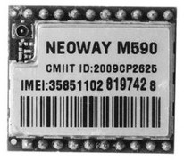

<!-- DIAPORAMA -->

<section class="page_de_garde">

Enseignes et afficheurs à LED

Commande à distance

Pierre-Yves Rochat

</section>

<section>
<!-- def A -->
<!-- def A -->
<!-- def A -->

<!-- def A -->**Enseignes et afficheurs à LED** | Commande à distance
<!-- def A -->

<!-- A -->
<h1 class="en_tete">Commande à distance</h1>

Pierre-Yves Rochat

* Infrarouge
* Modules radio
* Bluetooth
* WiFi
* Internet des objets

</section>

<section>
<!-- A -->
<h1 class="en_tete">Changer le comportement de l’enseigne ou de l’afficheur</h1>

* Changer le mode de fonctionnement d’une enseigne (allumer, éteindre, mode nuit)
<!-- 2345 -->* Changer les textes d’un afficheur

<!-- 345 -->

<!-- 345 -->* Boutons-poussoirs, claviers
<!-- 45 -->* Sans fil ?
<!-- 345 -->

<!-- 5 -->

<!-- 5 -->* Infrarouges
<!-- 5 -->* Radio
<!-- 5 -->

</section>

<section>
<!-- A -->
<h1 class="en_tete">Infrarouge</h1>

* LED infrarouge, signal modulé à 38 kHz
<!-- 2345 -->* Utilisation possible d’une télécommande de téléviseur
<!-- 345 -->* Récepteur avec phototransistor, réglage automatique de gain et filtre 38 kHz

<!-- 345 -->
<!-- 45 -->
<!-- 5 -->

<!-- 5 -->* Décodage par interruption et mesure des temps par un timer
<!-- 5 -->

</section>

<section>
<!-- A -->
<h1 class="en_tete">Ondes radio (RF)</h1>

* Ondes électromagnétiques, de 3 kHz à 300 GHz
<!-- 23456 -->* Respecter la législation de chaque pays !
<!-- 3456 -->* Modules 433 MHz

<!-- 3456 -->
<!-- 456 -->

<!-- 456 -->* Contraintes sur le signal modulant, utilisation de librairies
<!-- 56 -->* Modules plus complexes, gérant les collisions. Ex : modules nRF24L01+
<!-- 6 -->* Des portées de plusieurs km sans augmentation de la puissance : LoRa
<!-- 456 -->

</section>

<section>
<!-- A -->
<h1 class="en_tete">Bluetooth</h1>

* Disponible sur *smartphones*, tablettes et PC
<!-- 234567 -->* Économe en énergie
<!-- 34567 -->* Assure la confidentialité des données

<!-- 4567 -->
<!-- 4567 -->

<!-- 4567 -->* Modules faciles à mettre en oeuvre
<!-- 4567 -->

<!-- 567 -->

<!-- 567 -->* Nécessite une application
<!-- 67 -->* Sur PC : Windows, OS X, Linux
<!-- 7 -->* Sur *smartphones* : Android, Windows 10 (plus difficile sur iOS)
<!-- 567 -->

</section>

<section>
<!-- A -->
<h1 class="en_tete">WiFi</h1>

* Réseau sans fil, protocoles standards (TCP/IP, HTTP, ...)
<!-- 234567 -->* Utilisation d’un navigateur Internet (*web browser*)
<!-- 34567 -->* Pas besoin d’application spécifique

<!-- 4567 -->
<!-- 4567 -->

<!-- 4567 -->* Modules très populaire : ESP8266
<!-- 4567 -->* Programmation par commande “AT”, en mode Arduino, en Lua, ...
<!-- 4567 -->

<!-- 567 -->

<!-- 567 -->* Modules plus puissants, avec Linux
<!-- 67 -->* LinkIt Smart, avec SoC 7688 de MediaTek
<!-- 7 -->* OpenWRT : avec compilateurs, serveurs, outils, ...
<!-- 567 -->

<!-- 67 -->
</section>

<section>
<!-- A -->
<h1 class="en_tete">GSM</h1>

* Réseau téléphonique
<!-- 23456 -->* Couverture universelle des zones habitées
<!-- 3456 -->* Carte SIM, facturation par l’opérateur

<!-- 456 -->
<!-- 456 -->

<!-- 456 -->* Modules à faible coût
<!-- 56 -->* Envoi de SMS
<!-- 6 -->* Commandes “AT”
<!-- 456 -->

</section>

<section>
<!-- A -->
<h1 class="en_tete">Internet des objets</h1>

* Les enseignes et afficheurs à LED deviennent des objet connecté !

<!-- 23456 -->

<!-- 23456 -->Données de maintenance du matériel :
<!-- 23456 -->

<!-- 3456 -->

<!-- 3456 -->* Tensions et courants des alimentations
<!-- 3456 -->* Détection de pannes
<!-- 3456 -->* Heures de fonctionnement
<!-- 3456 -->

<!-- 456 -->

<!-- 456 -->Données de surveillance et de sécurité :
<!-- 456 -->

<!-- 56 -->

<!-- 56 -->* Détections d’intrusions
<!-- 56 -->* Images de l’environnement
<!-- 56 -->

<!-- 6 -->

<!-- 6 -->* Soigner la sécurité et le cryptage des données
<!-- 6 -->

</section>

<section>
<!-- A -->
<h1 class="en_tete">Commande à distance</h1>

* Infrarouge
* Modules radio
* Bluetooth
* WiFi
* Internet des objets

</section>
