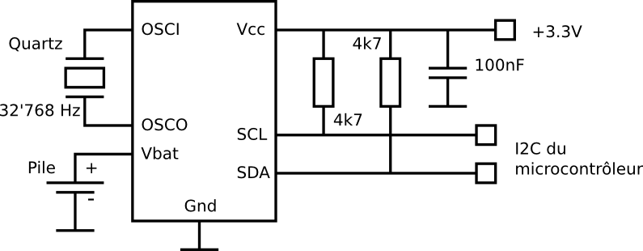

% Horloges temps réel
% [Pierre-Yves Rochat](mailto:pyr@pyr.ch), EPFL
% rév 2015/09/18

## Afficher l’heure ###

Les LED se prêtent très bien à afficher l’heure. Que ce soit pour de petits réveils ou pour des horloges géantes, l’heure est souvent affichée au moyen de LED. Une zone avec une horloge peut très bien être ajoutée à une enseigne à motifs fixes pour la rendre plus attrayante. Un journal lumineux peut compléter les informations qu’il affiche en donnant de temps en temps l’heure et la date.

Encore faut-il que l’heure indiquée soit juste ! Rien de plus désagréable qu’une horloge affichant une heure fausse... Il faut donc disposer d’un moyen de connaître l’heure de manière fiable.

## Base de temps ##

Une montre mécanique est réalisée sur la base d’un mouvement oscillant, dont la fréquence est aussi stable que possible. Une chaîne de diviseurs mécaniques, basés sur des engrenages, permet ensuite d’afficher les secondes, les minutes et les heures au moyen d’aiguilles.

Une montre électronique utilise un principe similaire. La différence est que le système oscillant est un cristal de quartz. La fréquence la plus couramment utilisée est 32’768 Hz. Pourquoi cette valeur ? Parce que c’est une puissance de 2, très exactement 2 à la puissance 15. Il va donc suffire de diviser la fréquence produite par l’oscillateur à quartz par une chaîne de 15 diviseurs par 2 pour obtenir un signal de 1 Hz. Un diviseur par deux, appelé aussi compteur binaire, peut être réalisé avec une bascule, comme le montrent le schéma, les équations et le diagramme des temps de la figure suivante :

Ensuite, des diviseurs successifs vont produire les secondes, les minutes, les heures, etc, comme l’indique la figure ci-dessous :

Les circuits logiques qui composent une horloge électronique s’appellent souvent Real Time Clock, abrégé RTC (Horloge en Temps Réel).

## Pile de secours ##

Il est presque impossible d’assurer qu’un dispositif soit en permanence connecté à un réseau électrique fonctionnel. Dans beaucoup de pays du monde, il est illusoire de vouloir compter sur un approvisionnement électrique sans pannes. De plus, certains dispositifs doivent être parfois déplacés. Il faut donc une source d’énergie de secours, qui assure en permanence le fonctionnement de l’oscillateur à quartz et de la chaîne de division, pour ne pas perdre l’heure. Il est possible d’utiliser pour cela une petite pile.

__*Anecdote :*__ On trouve une telle pile dans tous les ordinateurs. Elle est souvent désignée par l’expression *pile C-MOS*. Est-ce à dire qu’une pile est fabriquée en technologie C-MOS ? Évidemment non ! Cette expression date du temps où les premiers circuits C-MOS étaient utilisés pour réaliser des horloges, qu’il était alors possible de faire fonctionner en permanence grâce à une pile de taille modeste, vu que la technologie C-MOS consomme un minimum de courant. Aujourd’hui, tous les microprocesseurs et microcontrôleurs sont basés sur la technologie C-MOS. Mais l’expression *pile C-MOS* est encore usitée de nos jours.

Les piles utilisées pour maintenir l’heure sont souvent des piles au lithium. Pourquoi les piles rechargeables ne sont-elles que peu utilisées dans ce domaine ? La raison est la suivante : la capacité d’une pile au lithium est suffisante pour maintenir une horloge temps réel pendant environ 10 ans. C’est aussi l’ordre de grandeur de la durée de vie de cette pile. Or les piles rechargeables ont une durée de vie généralement plus faible, elle ne sont donc pas particulièrement intéressantes pour cette application.

## Supercap ##

Il existe un autre système d’accumulation d’énergie, qui peut être utilisé pour des horloges temps réel. Ce sont les *supercap*. Il d’agit de condensateurs électrolytiques basés sur une technologie à double couche électrochimique. Il est courant d’obtenir des capacités de plusieurs Farad, pour une taille similaire à une pile au lithium.

La capacité de la supercap est généralement dimensionnée pour assurer à l’horloge une autonomie de quelques jours ou quelques semaines. Dès que l’appareil est relié au réseau électrique, la supercap est rapidement rechargée. Le nombre de cycles charge-décharge peut être très grand, de l’ordre de 100’000 cycles. Pour comparaison, la durée de vie d’un accumulateur est limité à environ 1’000 cycles. Mais celle d’un condensateur traditionnel, même électrolytique est encore bien supérieure.

## Programmation d’une horloge avec un microcontrôleur ##

La programmation d’une horloge temps réel va beaucoup dépendre du microcontrôleur utilisé pour ce qui concerne la production d’un événement toutes les secondes. Voici un exemple applicable à un ATmega328 :

~~~~~~~ { .c .numberLines startFrom="1" }
#include <avr/io.h>
#include <avr/interrupt.h>
#include <avr/sleep.h>

volatile uint8_t secondes;

// Il faut un quartz 32 khz sur les broches TOSC1 et TOSC2
ISR (TIMER2_OVF_vect) {
	secondes++;
    ...
}

int main () {
  Temps=0;
  ASSR=(1<<AS2); // oscillateur quartz 32 khz
  TCCR2B=0b101; // prédivision par 128
  TIMSK2=(1<<TOIE2); // interruption Timer2 Overflow autorisée
  sei(); // toutes les interruptions autorisées
  while (1) { // boucle correspondant à tous les réveils dus à l'interruption
    set_sleep_mode(SLEEP_MODE_PWR_SAVE); // mise en veille
    sleep_enable();
    sleep_mode(); // mode normal après un réveil
    sleep_disable();
  }
}
~~~~~~~
<!-- retour au mode normal -->

Un quartz va être branché sur les broches prévues à cet effet. L’oscillateur correspondant va être mis en œuvre à l’intérieur du microcontrôleur. Son signal de sortie va actionner directement le Timer2, à travers un pré-diviseur de 128 (7 bits). Le Timer2 est un timer 8 bits, ce qui correspond à un diviseur par 256. Or 128 × 256 est justement égal à 32’768 (15 bits). En autorisant une interruption sur le dépassement de capacité (Overflow) du Timer2, on obtient bien une interruption à chaque seconde.

Au moment de l’interruption, le microcontrôleur va se remettre à fonctionner. Dans la routine d’interruption, il va prendre en compte dans une variable le passage à la seconde suivante. Cette variable sera conservée en mémoire vive : le bon mode de sommeil du microcontrôleur doit être choisi pour cela. Le microcontrôleur va ensuite repasser en mode sommeil (sleep), pour minimiser sa consommation.

La partie qui compte les secondes, les minutes et les heures est par contre applicable à tous microcontrôleurs :

~~~~~~~ { .c .numberLines startFrom="8" }
    ...
	secondes++;
    if (secondes == 60) {
      secondes = 0;
      minutes++;
      if (minutes == 60) {
        minutes = 0;
        heures++;
      if (heures == 24) {
        heures = 0;
        ...
      }
    }
    ...
~~~~~~~
<!-- retour au mode normal -->

## Circuits RTC spécialisés ##

Pour décharger le microcontrôleur de la tâche de maintenir l’horloge temps réel, mais surtout pour éviter de devoir maintenir en fonctionnement le microcontrôleur au moyen d’une pile, on utilise souvent des circuits intégrés spécialisés. Plusieurs fabricants offrent de tels circuit, comme Maxim Integrated avec le DS1307, NXP (anciennement Philips) avec les PFC8523 ou PFC8536 ou encore Texas Instrument avec le bq32000.

Pour communiquer avec un microcontrôleur, ces circuits utilisent généralement les protocoles I2C ou SPI. Voici un schéma de mise en œuvre d’un bq32000 :

## RTC dans le microcontrôleur ##

Certains microcontrôleurs comportent des circuits logiques qui permettent d’avoir très facilement une horloge en temps réel. L’alimentation de cette partie du circuit intégré est complètement séparée du reste du microcontrôleur. Une entrée permet de brancher directement une pile 3 Volt. C’est le cas par exemple du microcontrôleur STM32F051. La figure montre un extrait de son architecture.

Entourée de rouge se trouve une zone isolée, avec son alimentation. Elle comporte une oscillateur à quartz, un diviseur 32 bits, ainsi que quelques positions mémoire RAM, rendues permanentes lorsqu’une pile alimente cette partie du circuit.

## L’heure par Internet ##

Lorsqu’un afficheur est prévu pour être régulièrement connecté à Internet, il n’est plus indispensable d’avoir une pile pour alimenter un circuit qui conserve l’heure. En effet, il est très facile d’obtenir l’heure par Internet.

C’est le Protocole d’Heure Réseau (Network Time Protocol ou NTP) qui est utilisé, ou sa version simplifiée SNTP.

