<!-- DIAPORAMA -->

<section class="page_de_garde">

Enseignes et afficheurs à LED

Murs de LED

Pierre-Yves Rochat

</section>

<section>
<!-- def A -->
<!-- def A -->
<!-- def A -->

<!-- def A -->**Enseignes et afficheurs à LED** | Murs de LED
<!-- def A -->

<!-- A -->
<h1 class="en_tete">Murs de LED</h1>

Pierre-Yves Rochat

* Témoins lumineux... écrans géants
* Millions de LED
* Écran composé de panneaux
* Panneaux composés de modules
* Standards pour les signaux

</section>

<section>
<!-- A -->
<h1 class="en_tete">Des témoins lumineux aux écrans géants</h1>

* Dans les années 1960 et 1970, les LED étaient utilisées comme témoins lumineux
<!-- 23456 -->* Avec la baisse des prix, les premiers journaux lumineux sont apparus
<!-- 23456 -->

<!-- 23456 -->
<!-- 3456 -->

<!-- 3456 -->* Peu après, les LED vertes ont aussi été fabriquées en grandes séries
<!-- 456 -->* Mais les LED bleues ne sont arrivées que dans les années 1990
<!-- 3456 -->

<!-- 56 -->

<!-- 56 -->* 3 LED : rouge, vert et bleu (LED RGB)
<!-- 6 -->* Toutes les couleurs possibles en variant l'intensité de chaque LED
<!-- 56 -->

</section>

<section>
<!-- A -->
<h1 class="en_tete">Écrans géants</h1>

<!-- 234 -->* Publicité
<!-- 34 -->* Spectacles
<!-- 4 -->* Manifestations sportives

</section>

<section>
<!-- A -->
<h1 class="en_tete">Des millions de LED</h1>

* _**Pitch**_ : distance entre deux pixels, en mm

<!-- 23456789 -->

<!-- 23456789 -->Afficheur 16 par 9 mètres, pitch 6 mm :
<!-- 23456789 -->

<!-- 3456789 -->

<!-- 3456789 -->* 1'000 / 6 = 166 pixels par mètre
<!-- 456789 -->* 166 × 166 = 27'556 pixels par mètre carré
<!-- 56789 -->* nombre de pixels pour l’afficheur : 16 × 9 × 27'556 = 3'968'064
<!-- 6789 -->* avec 3 LED par pixel (rouge, vert, bleu) : 3 × 3'968'064 = 11'904'192 LED
<!-- 3456789 -->

<!-- 789 -->

<!-- 789 -->* Période de rafraîchissement : 1 / 100 Hz = 10 ms
<!-- 89 -->* Intensité la plus faible :  1 / 256 pour 8 bits
<!-- 9 -->* Durée d’affichage de l’intensité la plus faible : 10 ms / 256 = 39 μs
<!-- 789 -->

</section>

<section>
<!-- A -->
<h1 class="en_tete">Des millions de LED</h1>

* Microcontrôleur ?
<!-- 23 -->* DMA
<!-- 3 -->* FPGA

</section>

<section>
<!-- A -->
<h1 class="en_tete">Écran composé de panneaux</h1>

<!-- 2345 -->

<!-- 2345 -->* Ex : 64 × 64 pixels
<!-- 2345 -->* P12 : ~ 77 × 77 cm
<!-- 2345 -->* P10 : 64 × 64 cm
<!-- 2345 -->

<!-- 345 -->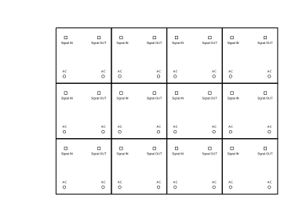
<!-- 45 -->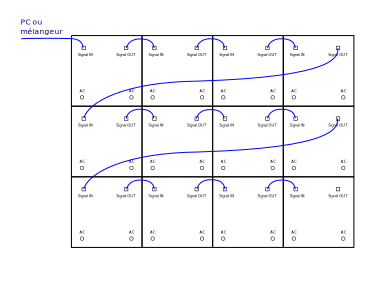
<!-- 5 -->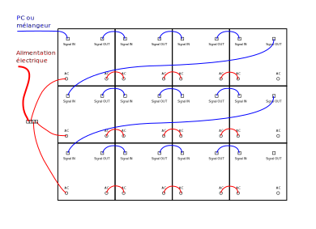
</section>

<section>
<!-- A -->
<h1 class="en_tete">Écran composé de panneaux</h1>
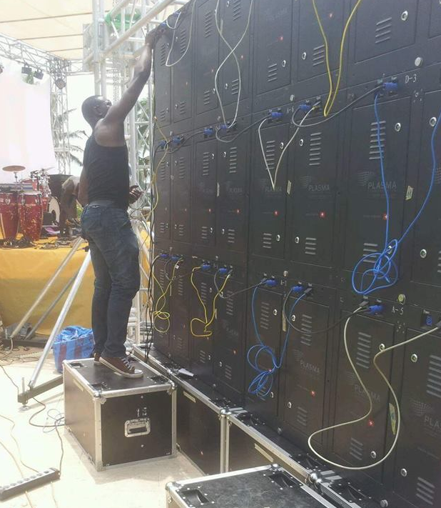
</section>

<section>
<!-- A -->
<h1 class="en_tete">Panneaux composés de modules</h1>
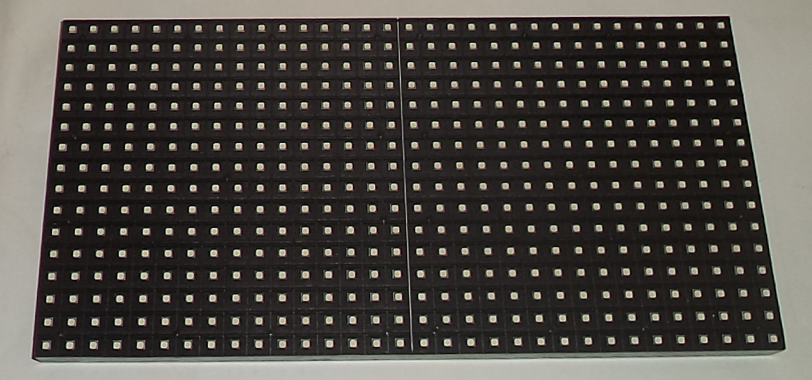
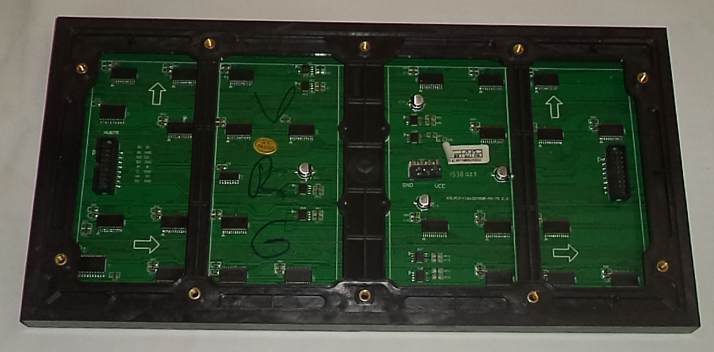

* P10
<!-- 234 -->* 32 × 16 pixels
<!-- 34 -->* Multiplexé par 8
<!-- 4 -->* Registres 16 bits à courant constant

<!-- 4 -->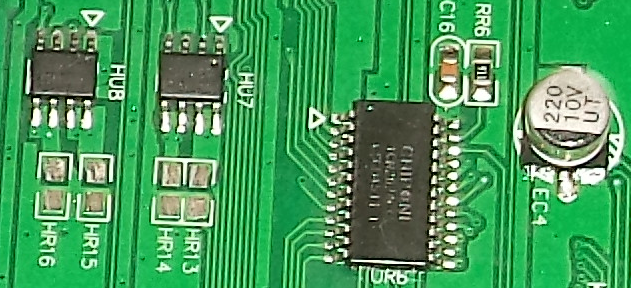
</section>

<section>
<!-- A -->
<h1 class="en_tete">Panneaux composés de modules</h1>

* Exemple : 16 × 16 pixels

<!-- 2 -->
</section>

<section>
<!-- A -->
<h1 class="en_tete">Panneaux composés de modules</h1>

* Exemple : 16 × 16 pixels
<!-- 23 -->* Alimentation : 5 V et Gnd
<!-- 23 -->* Modules en série
<!-- 3 -->* Groupes en parallèle

<!-- 23 -->
<!-- 3 -->
</section>

<section>
<!-- A -->
<h1 class="en_tete">Standards pour les signaux</h1>
<!-- 23456 -->

<!-- 23456 -->* Signal pour les panneaux : Ethernet, RJ45
<!-- 23456 -->

<!-- 3456 -->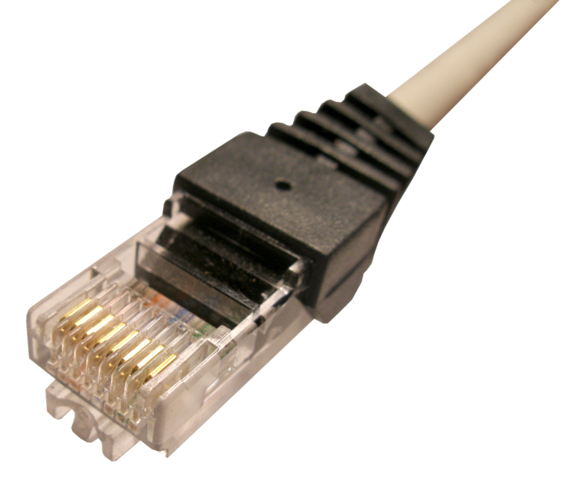
<!-- 3456 -->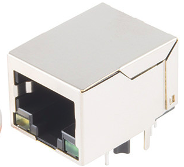
<!-- 456 -->

<!-- 456 -->* Signaux pour les modules :
<!-- 56 -->* Câbles plats, HUBxx
<!-- 456 -->

<!-- 56 -->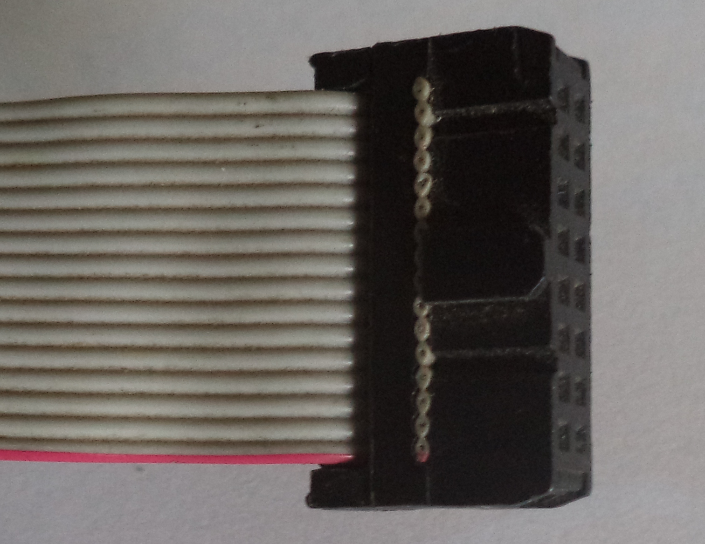
<!-- 6 -->

<!-- 6 -->* HUB75 :
<!-- 6 -->

<!-- 6 -->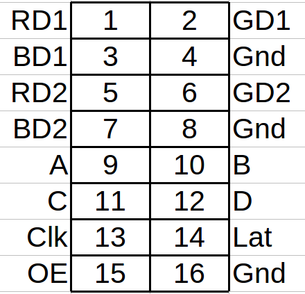
</section>

<section>
<!-- A -->
<h1 class="en_tete">Murs de LED</h1>

* Témoins lumineux... écrans géants
* Millions de LED : signaux rapides
* Écran composé de panneaux
* Panneaux composés de modules
* Standards pour les signaux : HUB75

</section>

