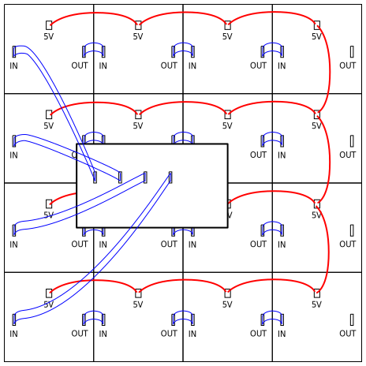

% Murs de LED
% [Pierre-Yves Rochat](mailto:pyr@pyr.ch), EPFL
% rév 2016/10/04

## Des témoins lumineux aux écrans géants ##

Des LED rouges ont commencé à être fabriquées en série à la fin des années 1960. Leur caractéristiques et leur prix en limitaient l'usage à des témoins lumineux. Leur luminosité n’a fait qu’augmenter depuis cette époque, principalement par l'augmentation de leur rendement.

Parallèlement, le prix des LED n’a fait que baisser, rendant possible financièrement l’usage de LED en nombre important. C’est à ce moment que sont apparus les premiers afficheurs matriciels à LED. Il s'agissait alors de simples journaux lumineux monochromes. Leur taille n’a fait qu’augmenter depuis.

Si des LED vertes ont suivi les LED rouges déjà dans les années 1970, il a fallu attendre les années 1990 pour que des LED bleues utilisables soient produites en quantité. Il devenait alors possible de réaliser des afficheurs multicolores, avec des pixels construits au moyen de trois LED : une rouge, une verte et une bleue. Avec un nombre suffisant de pixels, de véritables écrans vidéos ont pu être réalisés. On les appelle écrans géants ou murs de LED.

{ width=80% }

Actuellement, le plus long afficheur de ce type mesure 500 m et utilise 20 millions de LED. Couramment, des écrans de plusieurs dizaines de mètre carrés sont très souvent utilisés lors de spectacles, ainsi que pour la publicité dans les villes.

Nous allons voir comment ils sont réalisés.

## Des millions de LED ##

Le nombre de LED d’un afficheur dépend de sa taille et de l’espacement entre les LED. La distance entre deux LED, exprimée en mm, est souvent appelée le _**Pitch**_ d’un afficheur.

Prenons un exemple et calculons le nombre de LED d’un afficheur de 16 par 9 m avec un pitch de 6 mm :

* nombre de pixels par mètre : 1'000 / 6 = 166 pixels par mètre
* nombre de pixels par mètre carré : 166 × 166 = 27'556
* nombre de pixels pour l’afficheur : 16 × 9 × 27'556 = 3'968'064
* avec 3 LED par pixel (rouge, vert, bleu) : 3 × 3'968'064 = 11'904'192 LED

L’affichage d’une image vidéo sur un tel afficheur nécessite l’envoi d’une valeur d’intensité variable sur chaque LED. Cette intensité va changer au rythme des images successives de la vidéo, par exemple 25 fois par seconde.

Pour produire une intensité variable, une modulation du type PWM ou BCM est utilisée. Quelle que soit la modulation, le temps entre l’allumage et l’extinction d’une LED peut être calculé en fonction de la fréquence de rafraîchissement et du nombre de bits de l’intensité. Prenons l’exemple d’un rafraîchissement de 100 Hz et de 8 bits d’intensité.

* Période de rafraîchissement : 1 / 100 Hz = 10 ms
* Fraction du temps utilisé pour l’affichage de l’intensité la plus faible : 8 bits correspondent à 256 valeur, la fraction est donc de 1 / 256.
* Durée d’affichage de l’intensité la plus faible : 10 ms / 256 = 39 μs

Dans notre mur de LED, il faut donc être capable d’envoyer une nouvelle valeur à environ 12 millions de LED en un temps de 39 us.
Seule une organisation hiérarchique du mur de LED associée à des circuits logiques programmables rapides permet une telle performance.

## Écran composé de panneaux ##

Les écrans géants sont généralement composés de **panneaux**. Chaque panneau doit être couvert de LED jusqu’à son bord pour assurer une continuité de l’image. La taille des panneaux est liée au *pitch*, parce que le nombre de LED est généralement une puissance de 2.

Par exemple, les panneaux d'un écran P10 (*pitch* de 10 mm) ont souvent une taille de 64 cm, chaque panneau comportant 64 × 64 LED.

{ width=100% }

{ width=70% }

Les panneaux se fixent les uns aux autres par des fixations mécaniques adéquates.

Tous les panneaux reçoivent un signal contenant les pixels de tout l’écran. Chaque panneau doit connaître sa position dans l’ensemble de l’écran. Il extrait du signal la partie de l’image qui le concerne et la mémorise. Cette fonction est assurée par une carte électronique, comportant en général une FPGA (circuit logique programmable).

## Panneaux composés de modules ##

Chaque panneau est constitué de **modules** carrés ou rectangulaires. On trouve souvent 4 rangées de 4 modules chacune. Chacun des module est principalement composé d’un circuit imprimé, comportant d’un côté les LED et de l’autre les circuits de commande. Les modules non multiplexés comportent principalement des registres. Pour les modules multiplexés, il s'agit d'un ensemble de registres, de décodeurs  et d’amplificateurs.

Par exemple, les modules d'un écran P10 (*pitch* de 10 mm) ont souvent une taille de 16 cm, chaque module comportant 16 × 16 LED. Le panneaux est alors composé de 4 × 4 modules.

{ width=100% }

Le circuit situé sur chaque panneau qui extrait sa partie de l'image est aussi responsable d'envoyer cette image sur les registres des modules. C'est encore la FPGA qui s'en occupe. Dans l'exemple d'un panneau organisé en 64 pixels, s'il y a 4 lignes sur un même registre, il pouvoir envoyer 4 × 64 valeurs binaires en 39 μs, ce qui nécessite une horloge de 4 × 64 / 39 μs = 6.5 MHz.

## Standards pour les signaux ##

Plusieurs fabricants proposent des standards pour le transfert des données aux écrans. Ce sont généralement des standards propriétaires dont il est difficile de trouver la documentation.

Pour le signal de tout l'écran, distribué aux différents panneaux, le standard électrique des réseaux Ethernet est souvent utilisé, avec des câbles munis de paires torsadées et des connecteurs RJ45.

{ width=25% }

{ width=25% }

Mais les données ne sont pas organisées en paquets IP, mais selon une définition spécifique.

Entre la carte de commande du panneau et les modules, des câbles plats sont généralement utilisés. Plusieurs standards existent, dont le nom est souvent précédé par le mot *HUB*. Voici par exemple la définition des signaux du HUB75 :

{ width=30% }

